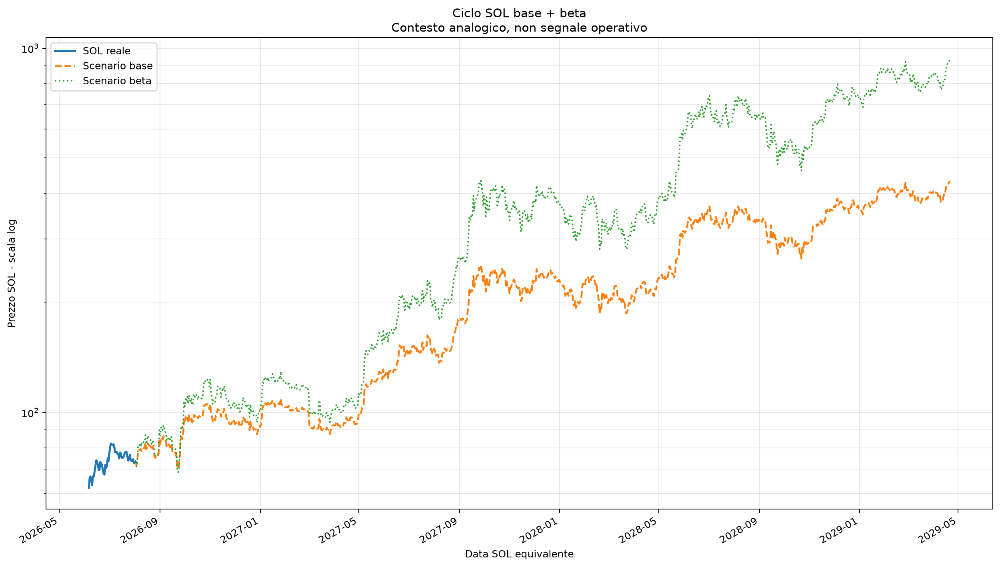
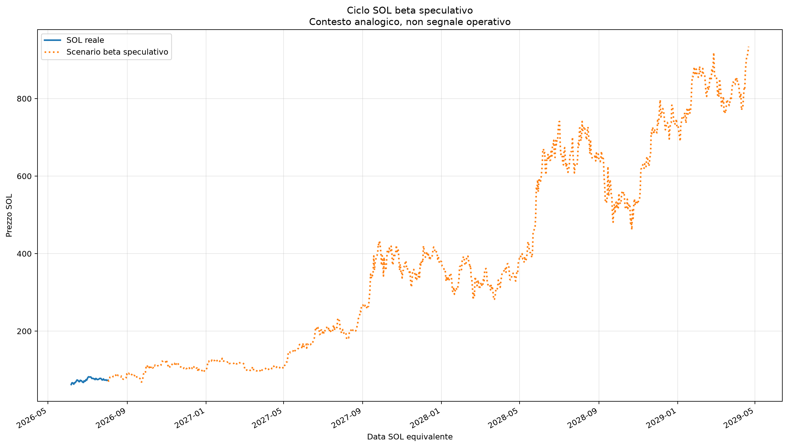

# Frattale mirato: BTC novembre 2022 vs SOL giugno 2026

Generato: **2026-08-02 07:14:43 CEST**  
UTC: **2026-08-02 05:14:43 UTC**

Ultima candela SOL usata: **2 agosto 2026**

Correzione metodologica: questo report separa **somiglianza strutturale** e **aderenza reale del prezzo**.
Un 70% di forma simile non significa che il prezzo sia vicino al percorso BTC scalato.

## Verdetto diretto

**SOL sta seguendo BTC 2022?**

### ANALOGIA DEBOLE / SCENARIO SECONDARIO

**Sintesi:** Esistono alcuni elementi comuni, ma non abbastanza per una conferma.

**Somiglianza strutturale:** +58,00%

**Aderenza prezzo live:** +69,69%

**Errore medio live:** +15,16%

**Gap corrente:** -11,92%

**Fase attuale:** FRATTALE SOLO DI CONTESTO

**Lettura fase:** Il paragone non ha ancora forza operativa.

**Rischio fase:** ALTO

**Prossimo step:** Proiezione condizionale, non conferma operativa: **Spinta rialzista abbastanza pulita.** Zona bassa **71,78 $** intorno al **3 agosto 2026**; zona alta **82,49 $** intorno al **14 agosto 2026**; fine step circa **80,28 $** entro il **16 agosto 2026**.

**Cosa fare:** Osserva soltanto; non usarlo per leva o decisioni principali.

**Affidabilità:** BASSA

### Perché

- Somiglianza strutturale +58,00%.
- Aderenza prezzo live +69,69%.
- Errore medio live +15,16%.
- Gap corrente SOL vs BTC scalato -11,92%.

### Livelli pratici

| Livello | Prezzo / soglia | Significato |
| --- | --- | --- |
| Rientro gap | entro ±12% | Condizione necessaria per tornare operativo. |
| Prima conferma prezzo | 82,49 $ | Rottura iniziale, da accompagnare al rientro del gap. |
| Seconda conferma | 95,15 $ | Scenario più credibile. |
| Invalidazione soft | 69,75 $ | Il setup si indebolisce. |
| Invalidazione forte | 62,19 $ | Il paragone è quasi rotto. |

Per tornare operativo non basta salire: il gap rispetto al BTC scalato deve rientrare circa entro ±12%. La prima conferma di prezzo è 82,49 $, mentre l'invalidazione soft è 69,75 $.

## Somiglianza prima e dopo inizio programma

Questa sezione separa la somiglianza della forma dall'aderenza reale del prezzo.

- **Inizio programma/scanner:** 3 luglio 2026
- **Prima del programma** = backtest retroattivo.
- **Da inizio programma** = verifica live: è la parte più importante per l'uso operativo.

| Periodo | Date | Giorni | Aderenza prezzo | Errore medio | Gap ultimo | Stato |
| --- | --- | --- | --- | --- | --- | --- |
| Prima del programma | 6 giugno 2026 -> 2 luglio 2026 | 27 | +87,95% | +6,02% | +21,89% | ABBASTANZA ALLINEATO |
| Da inizio programma | 3 luglio 2026 -> 2 agosto 2026 | 31 | +69,69% | +15,16% | -11,92% | STACCATO / NON ADERENTE |
| Totale dal bottom | 6 giugno 2026 -> 2 agosto 2026 | 58 | +78,19% | +10,91% | -11,92% | DEVIAZIONE MODERATA |

Nota: un frattale può avere una forma simile ma un prezzo distante. In quel caso non è operativo finché il gap non rientra.

## Lettura operativa

Il frattale non deve generare acquisti o leva adesso. La forma è un contesto, ma l'aderenza live del prezzo è insufficiente.

| Voce | Risposta | Perché |
| --- | --- | --- |
| Uso operativo | NO | Il frattale vale 0 punti operativi finché il prezzo resta non aderente. |
| Aderenza live | +69,69% | Errore medio live +15,16%. |
| Gap corrente | -11,92% | Deve rientrare circa entro ±12%. |
| Prima conferma prezzo | 82,49 $ | Serve anche miglioramento del gap, non solo una candela sopra il livello. |
| Seconda conferma | 95,15 $ | Rende più credibile il percorso, ma non sostituisce l'aderenza. |
| Invalidazione soft | 69,75 $ | Sotto questa zona il quadro peggiora. |
| Invalidazione forte | 62,19 $ | Sotto il bottom il paragone è quasi rotto. |

## Tracking giornaliero

**Stato struttura:** STRUTTURA STABILE

Variazione strutturale -1,65%.

| Data | Prezzo SOL | Struttura | Aderenza live | Gap | Verdetto |
| --- | --- | --- | --- | --- | --- |
| 2026-07-27 | 76,32 $ | +64,77% | +66,66% | +8,03% | ANALOGIA DEBOLE / SCENARIO SECONDARIO |
| 2026-07-28 | 73,28 $ | +64,21% | +67,56% | -1,41% | ANALOGIA DEBOLE / SCENARIO SECONDARIO |
| 2026-07-29 | 73,47 $ | +60,46% | +68,64% | -6,32% | ANALOGIA DEBOLE / SCENARIO SECONDARIO |
| 2026-07-30 | 73,43 $ | +59,87% | +68,94% | -11,13% | ANALOGIA DEBOLE / SCENARIO SECONDARIO |
| 2026-07-31 | 74,00 $ | +59,58% | +69,33% | -10,04% | ANALOGIA DEBOLE / SCENARIO SECONDARIO |
| 2026-08-01 | 73,12 $ | +59,64% | +69,63% | -12,32% | ANALOGIA DEBOLE / SCENARIO SECONDARIO |
| 2026-08-02 | 73,42 $ | +58,00% | +69,69% | -11,92% | ANALOGIA DEBOLE / SCENARIO SECONDARIO |

## Grafici

### Frattale sovrapposto

### Proiezione condizionale SOL

### Ciclo base fino al top BTC 2025

### Base + beta in scala logaritmica

### Beta speculativo separato

### Tracking struttura vs aderenza

## Proiezione fino al top BTC 2025

| Voce | Valore | Lettura |
| --- | --- | --- |
| Stato | CONTESTO MACRO, NON OPERATIVO | Non è un segnale d'ingresso. |
| Top BTC 2025 usato | 6 ottobre 2025 - 124.753 $ | Massimo close BTC nella finestra 2025. |
| Data SOL equivalente | 21 aprile 2029 | Data analogica, non previsione certa. |
| Target base dal bottom | 491,43 $ | Scenario base. |
| Target base da oggi | 432,83 $ | Scenario condizionale dal prezzo corrente. |
| Massimo percorso base | 432,83 $ (21 aprile 2029) | Massimo base nel percorso. |
| Massimo beta | 933,95 $ (21 aprile 2029) | Scenario speculativo, non target principale. |

## Prossimi step condizionali

| Step | Date SOL | BTC fine | SOL fine base | Zona bassa | Zona alta | Lettura |
| --- | --- | --- | --- | --- | --- | --- |
| Step 1 - prossime 2 settimane | 2 agosto 2026 -> 16 agosto 2026 | +9,35% | 80,28 $ | 71,78 $ (3 agosto 2026) | 82,49 $ (14 agosto 2026) | Spinta rialzista abbastanza pulita. |
| Step 2 - primo mese | 17 agosto 2026 -> 1 settembre 2026 | +11,63% | 81,96 $ | 75,12 $ (26 agosto 2026) | 84,34 $ (31 agosto 2026) | Spinta rialzista abbastanza pulita. |
| Step 3 - secondo mese | 2 settembre 2026 -> 1 ottobre 2026 | +27,43% | 93,56 $ | 70,04 $ (23 settembre 2026) | 95,15 $ (30 settembre 2026) | Prima retest / debolezza, poi recupero. |
| Step 4 - terzo mese | 2 ottobre 2026 -> 31 ottobre 2026 | +39,14% | 102,16 $ | 94,16 $ (10 ottobre 2026) | 105,77 $ (28 ottobre 2026) | Spinta rialzista abbastanza pulita. |
| Step 5 - quarto mese | 1 novembre 2026 -> 30 novembre 2026 | +29,47% | 95,06 $ | 92,93 $ (26 novembre 2026) | 105,46 $ (1 novembre 2026) | Spinta rialzista abbastanza pulita. |
| Step 6 - estensione 6 mesi | 1 dicembre 2026 -> 29 gennaio 2027 | +42,94% | 104,95 $ | 87,17 $ (28 dicembre 2026) | 109,21 $ (26 gennaio 2027) | Spinta rialzista abbastanza pulita. |

## Proiezione standard a giorni fissi

Queste proiezioni partono dal prezzo SOL attuale e replicano i movimenti futuri del BTC equivalente. Non dimostrano che il frattale sia valido.

| Orizzonte | Data SOL | Data BTC eq. | BTC fece | SOL base | SOL beta | Min percorso | Max percorso |
| --- | --- | --- | --- | --- | --- | --- | --- |
| 7 giorni | 9 agosto 2026 | 2023-01-24 | +6,97% | 78,54 $ | 80,87 $ | 71,78 $ | 79,57 $ |
| 14 giorni | 16 agosto 2026 | 2023-01-31 | +9,35% | 80,28 $ | 83,45 $ | 71,78 $ | 82,49 $ |
| 30 giorni | 1 settembre 2026 | 2023-02-16 | +11,63% | 81,96 $ | 85,97 $ | 71,78 $ | 84,34 $ |
| 60 giorni | 1 ottobre 2026 | 2023-03-18 | +27,43% | 93,56 $ | 103,92 $ | 70,04 $ | 95,15 $ |
| 90 giorni | 31 ottobre 2026 | 2023-04-17 | +39,14% | 102,16 $ | 117,89 $ | 70,04 $ | 105,77 $ |
| 120 giorni | 30 novembre 2026 | 2023-05-17 | +29,47% | 95,06 $ | 106,32 $ | 70,04 $ | 105,77 $ |
| 180 giorni | 29 gennaio 2027 | 2023-07-16 | +42,94% | 104,95 $ | 122,53 $ | 70,04 $ | 109,21 $ |
| 365 giorni | 2 agosto 2027 | 2024-01-17 | +101,98% | 148,30 $ | 201,13 $ | 70,04 $ | 162,96 $ |

## Dati base

| Voce | Data | Valore |
| --- | --- | --- |
| BTC bottom usato | 2022-11-21 | 15.787 $ |
| SOL bottom usato | 2026-06-06 | 62,19 $ |
| Prezzo SOL attuale | 73,42 $ | 73,42 $ |
| Giorni SOL dal bottom | - | 57 |
| Data BTC equivalente | 2023-01-17 | - |
| BTC normalizzato equivalente | - | 134,04 |
| SOL normalizzato oggi | - | 118,06 |
| Gap SOL vs BTC equivalente | - | -11,92% |
| Lettura gap | - | SOL è sotto il percorso BTC equivalente. |
| Somiglianza forma prezzo | - | +53,10% |
| Somiglianza ritmo/rendimenti | - | +40,62% |
| Somiglianza RSI | - | +76,20% |
| Somiglianza medie | - | +80,83% |
| Somiglianza strutturale | - | +58,00% |
| Beta volatilità SOL/BTC | - | 1,43 |

## Regola di lettura

- **Struttura alta + aderenza alta** = frattale utile.
- **Struttura alta + aderenza bassa** = forma simile, ma non conferma operativa.
- **Gap oltre ±15/18%** = il prezzo è troppo staccato per assegnare punti al Global.
- **Rientro del gap entro circa ±12%** = primo requisito per rivalutare il frattale.
