<!-- COMPACT_REPORT_HEADER_START -->
> **Vista compatta:** Decisione operativa, Global Confluence e cambiamenti giornalieri restano aperti. Tocca il titolo di una sezione per mostrare o nascondere i dettagli.  
> Tutte le tabelle e tutti i dati restano nel file: copiando il Markdown raw viene copiato tutto.
<!-- COMPACT_REPORT_HEADER_END -->

<!-- COMPACT_SECTION_START:decision -->

<strong>🧭 Decisione operativa — da leggere per prima</strong>

<!-- DECISION_REPORT_START -->

# Decisione operativa sintetica

Generato: 2026-07-22 05:14 UTC

Report separato completo: [decision_report.md](decision_report.md)

Sintesi automatica dello scanner: l'azione spot viene copiata direttamente dal Global Confluence; long, short e rischio restano filtri separati e più prudenti.

| Asset | Global | Direzione | Spot | Long leva | Short leva | Max long | Max short | Rischio |
| --- | --- | --- | --- | --- | --- | --- | --- | --- |
| BTC | +2 | NEUTRALE / COSTRUTTIVO | HOLD / ATTESA CONFERME | NO LONG A LEVA / ATTENDI SOPRA 67.248 $ | NO SHORT | nessuna | nessuna | MEDIO / ALTO |
| SOL | -3 | LEGGERMENTE BEARISH | TAKE PROFIT SU SPIKE / NON INSEGUIRE | NO LONG A LEVA | NO SHORT | nessuna | nessuna | MOLTO ALTO |
| DOGE | -5 | BEARISH | STAI FUORI / VENDI PARZIALE; SHORT SOLO DOPO SPIKE | NO LONG A LEVA | SHORT SOLO DOPO SPIKE | nessuna | max 1x-2x isolated | MOLTO ALTO |

## Lettura immediata

- **BTC**: Global = **+2**, spot = **HOLD / ATTESA CONFERME**, long = **NO LONG A LEVA / ATTENDI SOPRA 67.248 $**, short = **NO SHORT**, rischio = **MEDIO / ALTO**.
- **SOL**: Global = **-3**, spot = **TAKE PROFIT SU SPIKE / NON INSEGUIRE**, long = **NO LONG A LEVA**, short = **NO SHORT**, rischio = **MOLTO ALTO**.
- **DOGE**: Global = **-5**, spot = **STAI FUORI / VENDI PARZIALE; SHORT SOLO DOPO SPIKE**, long = **NO LONG A LEVA**, short = **SHORT SOLO DOPO SPIKE**, rischio = **MOLTO ALTO**.

## Dettaglio logica

### BTC

- Global Confluence: **+2**
- Confluenza: **MISTA / PARZIALE**
- Bias Global: **Neutrale / misto**
- Direzione decisionale: **NEUTRALE / COSTRUTTIVO**
- Azione spot dal Global: **HOLD / ATTESA CONFERME**
- Long leva: **NO LONG A LEVA / ATTENDI SOPRA 67.248 $**
- Short leva: **NO SHORT**
- Rischio: **MEDIO / ALTO**
- Conferme: Prima resistenza sopra 67.248; conferma del doppio minimo sopra 67.248.
- Invalidazioni: Sotto 57.748 il quadro tecnico peggiora.

### SOL

- Global Confluence: **-3**
- Confluenza: **DEBOLE / FRAGILE**
- Bias Global: **Fragile**
- Direzione decisionale: **LEGGERMENTE BEARISH**
- Azione spot dal Global: **TAKE PROFIT SU SPIKE / NON INSEGUIRE**
- Long leva: **NO LONG A LEVA**
- Short leva: **NO SHORT**
- Rischio: **MOLTO ALTO**
- Conferme: Doppio minimo maturo finché mantiene 75,94; nuova conferma tecnica sopra 78,88; milestone analogiche 104,13 / 114,01, valide soltanto se rientra anche il gap frattale.
- Invalidazioni: Allarmi sotto 73,95 / 73,40 / 62,19.

### DOGE

- Global Confluence: **-5**
- Confluenza: **NEGATIVA**
- Bias Global: **Ribassista**
- Direzione decisionale: **BEARISH**
- Azione spot dal Global: **STAI FUORI / VENDI PARZIALE; SHORT SOLO DOPO SPIKE**
- Long leva: **NO LONG A LEVA**
- Short leva: **SHORT SOLO DOPO SPIKE**
- Rischio: **MOLTO ALTO**
- Conferme: Sopra 0.07923 migliora; sopra 0.07966 viene invalidato il pattern ribassista dominante.
- Invalidazioni: Sotto 0.07097 il rischio ribassista aumenta.

## Nota semplice

- **Spot** = usa la stessa azione del Global Confluence, senza una seconda mappatura che possa produrre frasi diverse.
- **Zona alta storica** = zona dove non inseguire troppo; può essere zona da prendere profitto.
- **Zona bassa storica** = zona di rischio; con leva la liquidazione non dovrebbe stare lì vicino.
- **BTC leva** = nessun long a leva finché il prezzo snapshot non supera **67.248 $**; sotto quella soglia resta solo l'azione spot indicata dal Global.
- **Lifecycle EMA200** = per SOL resta solo contesto, peso Global 0; score interno 4; EMA200 circa 112,78 $; upside verso EMA200 +44,96%. Non autorizza leva e non aggiunge punti automatici.
- **NO LONG** non significa automaticamente **SHORT**. Lo short ha senso solo se il quadro è bearish o se lo spike viene spesso scaricato.
- Per SOL, se il Global è da **+3 in su**, la decisione non deve diventare bearish solo perché lo scanner grezzo a 30 giorni è incerto.

<!-- DECISION_REPORT_END -->

<!-- PAPER_TRADING_START -->
# Paper trading automatico KuCoin

Generato: 2026-07-22T05:15:00+00:00

<!-- DIRECT_REPORT_LINK -->
Report separato completo: [paper_trading_report.md](paper_trading_report.md)

## Configurazione attiva

- Capitale iniziale della simulazione: **€10.000,00**
- Capitale indicato nel file di configurazione: **€10.000,00**
- Obiettivo mensile monitorato: **€3.000,00**
- Compounding: **ATTIVO**
- Reinvestimento dei profitti: **100,00%**
- Politica target: **solo monitoraggio; il bot non aumenta il rischio per inseguirlo**
- Snapshot prezzi usato: **2026-07-22T05:08:24+00:00**; stato dati: **FRESH**; età: **0,0 min**; conversione EUR/USDT: **CONFIG_FALLBACK**
- Dashboard intraday: [apri la pagina live](https://github.com/eddyhardscit/crypto-fractal-scanner/blob/paper-trading-live/reports/paper_trading_live.md)

## Freschezza dati di mercato

| Stato | Fonte | Snapshot mercato | Controllato | Età | Limite | Nuove entrate |
| --- | --- | --- | --- | --- | --- | --- |
| FRESH | KUCOIN_PUBLIC_API | 2026-07-22T05:08:24+00:00 | 2026-07-22T05:08:24+00:00 | 0,0 min | 25,0 min | ABILITATE |

| TF | Asset con dati | Candela più recente | Candela più vecchia | Ritardo dopo chiusura | Tolleranza | Stato |
| --- | --- | --- | --- | --- | --- | --- |
| 15m | 12 | 2026-07-22T04:45:00+00:00 | 2026-07-22T04:45:00+00:00 | 8,5 min | 25,0 min | OK |
| 60m | 12 | 2026-07-22T04:00:00+00:00 | 2026-07-22T04:00:00+00:00 | 8,5 min | 45,0 min | OK |
| 240m | 12 | 2026-07-22T00:00:00+00:00 | 2026-07-22T00:00:00+00:00 | 1,14 h | 1,00 h | STALE_CANDLE |

## Segnali quasi entrati / motivi di esclusione

| Portafoglio | Asset | TF | Lato | Score | Soglia | Manca | Stato | Ritardo chiusura | RSI D/W (peso 0) | Motivo |
| --- | --- | --- | --- | --- | --- | --- | --- | --- | --- | --- |
| Principale 4H | ONDO | 240m | LONG | 7,36 | 6,00 | 0,00 | STALE_CANDLE | 1,14 h | D: n/a | W: n/a | peso 0 | Segnale arrivato troppo tardi: candela chiusa da 68.5 minuti; tolleranza 60 minuti. |
| Principale 4H | HYPE | 240m | SHORT | -6,43 | 6,00 | 0,00 | STALE_CANDLE | 1,14 h | D: n/a | W: n/a | peso 0 | Segnale arrivato troppo tardi: candela chiusa da 68.5 minuti; tolleranza 60 minuti. |
| Principale 4H | ETH | 240m | LONG | 6,25 | 6,00 | 0,00 | STALE_CANDLE | 1,14 h | D: n/a | W: n/a | peso 0 | Segnale arrivato troppo tardi: candela chiusa da 68.5 minuti; tolleranza 60 minuti. |
| Principale 4H | XRP | 240m | LONG | 5,85 | 6,00 | 0,15 | STALE_CANDLE | 1,14 h | D: n/a | W: n/a | peso 0 | Segnale arrivato troppo tardi: candela chiusa da 68.5 minuti; tolleranza 60 minuti. |
| Principale 4H | ADA | 240m | LONG | 5,74 | 6,00 | 0,26 | STALE_CANDLE | 1,14 h | D: n/a | W: n/a | peso 0 | Segnale arrivato troppo tardi: candela chiusa da 68.5 minuti; tolleranza 60 minuti. |
| Principale 4H | BTC | 240m | LONG | 4,75 | 6,00 | 1,25 | STALE_CANDLE | 1,14 h | D: Bullish regolare [CONFERMATA] | W: Bullish regolare [CONFERMATA] | peso 0 | Segnale arrivato troppo tardi: candela chiusa da 68.5 minuti; tolleranza 60 minuti. |
| Principale 4H | BANK | 240m | LONG | 4,25 | 6,00 | 1,75 | STALE_CANDLE | 1,14 h | D: n/a | W: n/a | peso 0 | Segnale arrivato troppo tardi: candela chiusa da 68.5 minuti; tolleranza 60 minuti. |
| Principale 4H | DOGE | 240m | SHORT | -3,65 | 6,00 | 2,35 | STALE_CANDLE | 1,14 h | D: Hidden bearish [CONFERMATA] | W: Hidden bullish [IN_FORMAZIONE] | peso 0 | Segnale arrivato troppo tardi: candela chiusa da 68.5 minuti; tolleranza 60 minuti. |
| Principale 4H | SOL | 240m | LONG | 2,89 | 6,00 | 3,11 | STALE_CANDLE | 1,14 h | D: Conferma ribassista [CONTESTO] | W: Hidden bearish [CONFERMATA] | peso 0 | Segnale arrivato troppo tardi: candela chiusa da 68.5 minuti; tolleranza 60 minuti. |
| Principale 4H | AKE | 240m | LONG | 2,75 | 6,00 | 3,25 | STALE_CANDLE | 1,14 h | D: n/a | W: n/a | peso 0 | Segnale arrivato troppo tardi: candela chiusa da 68.5 minuti; tolleranza 60 minuti. |
| Principale 4H | ZEC | 240m | SHORT | -2,38 | 6,00 | 3,62 | STALE_CANDLE | 1,14 h | D: n/a | W: n/a | peso 0 | Segnale arrivato troppo tardi: candela chiusa da 68.5 minuti; tolleranza 60 minuti. |
| Principale 4H | PEPE | 240m | LONG | 1,12 | 6,00 | 4,88 | STALE_CANDLE | 1,14 h | D: n/a | W: n/a | peso 0 | Segnale arrivato troppo tardi: candela chiusa da 68.5 minuti; tolleranza 60 minuti. |
| Bilanciata 1H V2 | ONDO | 60m | LONG | 7,75 | 5,50 | 0,00 | STRATEGY_FILTER | 8,5 min | D: n/a | W: n/a | peso 0 | Filtro V2 non superato: regime, EMA, ritorni e RSI; per Rapida V2 servono anche breakout reale, volume e ADX. |
| Rapida 1H V1 | ONDO | 60m | LONG | 7,75 | 4,50 | 0,00 | STRATEGY_FILTER | 8,5 min | D: n/a | W: n/a | peso 0 | Filtro momentum: serve breakout UP oppure movimento breve ≥1,5%; breakout=NONE, movimento=+0.65%. |
| 1H Fast Score 6 75 V1 | ONDO | 60m | LONG | 7,75 | 6,00 | 0,00 | STRATEGY_FILTER | 8,5 min | D: n/a | W: n/a | peso 0 | Filtro momentum: serve breakout UP oppure movimento breve ≥1,5%; breakout=NONE, movimento=+0.65%. |
| 1H Fast Nohigh Cap75 V1 | ONDO | 60m | LONG | 7,75 | 4,50 | 0,00 | STRATEGY_FILTER | 8,5 min | D: n/a | W: n/a | peso 0 | Filtro momentum: serve breakout UP oppure movimento breve ≥1,5%; breakout=NONE, movimento=+0.65%. |
| 1H Fast Long Btc 1 3 Cap75 V1 | ONDO | 60m | LONG | 7,75 | 4,50 | 0,00 | STRATEGY_FILTER | 8,5 min | D: n/a | W: n/a | peso 0 | Filtro momentum: serve breakout UP oppure movimento breve ≥1,5%; breakout=NONE, movimento=+0.65%. |
| 1H Fast No Pepe V1 | ONDO | 60m | LONG | 7,75 | 4,50 | 0,00 | STRATEGY_FILTER | 8,5 min | D: n/a | W: n/a | peso 0 | Filtro momentum: serve breakout UP oppure movimento breve ≥1,5%; breakout=NONE, movimento=+0.65%. |
| 1H Fast Tp2 V1 | ONDO | 60m | LONG | 7,75 | 4,50 | 0,00 | STRATEGY_FILTER | 8,5 min | D: n/a | W: n/a | peso 0 | Filtro momentum: serve breakout UP oppure movimento breve ≥1,5%; breakout=NONE, movimento=+0.65%. |
| Rapida 1H V2 | ONDO | 60m | LONG | 7,75 | 5,00 | 0,00 | STRATEGY_FILTER | 8,5 min | D: n/a | W: n/a | peso 0 | Filtro V2 non superato: regime, EMA, ritorni e RSI; per Rapida V2 servono anche breakout reale, volume e ADX. |

**Manca** indica quanti punti servivano per raggiungere la soglia. `STRATEGY_FILTER` significa che lo score bastava, ma mancava breakout, momentum o forza relativa. `ALREADY_PROCESSED` significa che la stessa candela era già stata esaminata.

## Portafoglio principale — Principale 4H

| Equity | Rendimento | P&L mese | Target | Progresso | Aperte | Chiuse | Win rate | PF | Max DD |
| --- | --- | --- | --- | --- | --- | --- | --- | --- | --- |
| €9.832,12 | -1,68% | €-167,88 | €3.000,00 | -5,60% | 4 | 17 | 29,41% | 0,73 | 4,26% |

## Stato del campione statistico

| Principale 4H — eventi indip. | Sistema eventi indip. | Stato | Prossima soglia |
| --- | --- | --- | --- |
| 17 | 300 | CAMPIONE INSUFFICIENTE | 30 (mancano 13) |

- Trade del Principale 4H chiusi: **17**; win rate **29,41%**; profit factor **0,73**.
- Expectancy: **€-8,97** per trade; P&L netto: **€-152,45**; max drawdown: **4,26%**.
- Valutazione: **Servono altri eventi indipendenti prima di trarre conclusioni.**
- Soglie automatiche Telegram: **30, 100, 200 e 300 eventi indipendenti chiusi del portafoglio principale**.
- Una soglia richiede una valutazione; non attiva automaticamente il trading reale.

## Capitale impegnato e rischio

| Tipo | Portafoglio | Posizioni | Equity | Margine impegnato | Esposizione con leva | Rischio agli stop | P&L aperto |
| --- | --- | --- | --- | --- | --- | --- | --- |
| PRINCIPALE | Principale 4H | 4 | €9.832,12 | €1.512,92 | €4.538,75 | €196,71 | €-15,56 |
| TEST | Scanner Top 5 Long 1H | 3 | €10.565,56 | €3.774,91 | €7.549,81 | €157,90 | €-58,18 |
| TEST | Scanner Top 5 + forza BTC 1H | 3 | €10.462,09 | €4.324,05 | €8.648,09 | €156,62 | €-6,78 |
| TEST | Combo Adaptive | 3 | €10.301,73 | €2.939,66 | €5.879,32 | €154,36 | €-39,65 |
| TEST | Bilanciata 1H V3 Filtered | 4 | €10.300,67 | €2.442,27 | €7.326,82 | €154,18 | €14,24 |
| TEST | Bilanciata 1H V1 | 4 | €10.201,94 | €2.639,56 | €7.918,67 | €203,34 | €37,31 |
| TEST | Combo Mean Reversion | 1 | €10.198,70 | €1.289,42 | €2.578,84 | €50,98 | €5,12 |
| TEST | Benchmark Donchian breakout 1H | 2 | €10.191,24 | €2.352,79 | €4.705,59 | €101,96 | €-17,73 |
| TEST | Forza relativa 1H V2 | 4 | €10.156,40 | €2.419,26 | €4.838,52 | €151,48 | €-4,64 |
| TEST | Benchmark Bollinger mean reversion 1H | 1 | €10.124,69 | €1.683,41 | €3.366,81 | €51,04 | €-30,43 |
| TEST | Combo Trend | 3 | €10.104,36 | €1.639,93 | €3.279,86 | €100,58 | €48,99 |
| TEST | Btc Bollinger 1H | 1 | €10.096,11 | €1.398,43 | €4.195,29 | €50,34 | €31,08 |
| TEST | Ampia 4H | 4 | €10.070,36 | €2.235,83 | €4.471,66 | €201,27 | €-16,55 |
| TEST | Scanner Top5 Btc Runner25 V1 | 3 | €10.055,97 | €3.180,38 | €6.360,76 | €150,87 | €-32,25 |
| TEST | Scanner Top5 Btc Tp3 V1 | 3 | €10.055,97 | €3.180,38 | €6.360,76 | €150,87 | €-32,25 |
| TEST | Btc Ema 4H | 1 | €10.029,13 | €1.105,63 | €2.211,26 | €50,00 | €28,21 |
| TEST | Btc Donchian 4H | 1 | €10.029,13 | €1.105,63 | €2.211,26 | €50,00 | €28,21 |
| TEST | Scalp RSI Short 75 · €50 · 15x | 0 | €10.028,40 | €0,00 | €0,00 | €0,00 | €0,00 |
| TEST | Scanner Top5 Btc Btc Le3 V1 | 3 | €10.025,02 | €3.682,97 | €7.365,95 | €150,16 | €-29,03 |
| TEST | Scanner Top5 Btc Btc 2 3 V1 | 3 | €10.025,02 | €3.682,97 | €7.365,95 | €150,16 | €-29,03 |
| TEST | Rapida 1H V3 Filtered | 4 | €10.024,89 | €3.285,85 | €9.857,56 | €148,99 | €43,19 |
| TEST | Forza relativa 1H V1 | 4 | €10.020,60 | €3.216,05 | €6.432,10 | €150,91 | €-66,19 |
| TEST | Eth Bollinger 1H | 0 | €10.015,45 | €0,00 | €0,00 | €0,00 | €0,00 |
| TEST | Sol Bollinger 4H | 1 | €10.013,85 | €968,56 | €1.937,11 | €50,00 | €15,22 |
| TEST | Btc Bollinger 4H | 1 | €10.011,45 | €1.313,84 | €2.627,69 | €50,00 | €13,56 |
| TEST | Scalp RSI Long 25 · €50 · 15x | 0 | €10.006,57 | €0,00 | €0,00 | €0,00 | €0,00 |
| TEST | Scalp RSI Long 25 · prudente · 5x | 0 | €10.005,77 | €0,00 | €0,00 | €0,00 | €0,00 |
| TEST | Scalp RSI Short 75 · €10 · 15x | 0 | €10.005,68 | €0,00 | €0,00 | €0,00 | €0,00 |
| TEST | Scanner Top5 Btc Mfe V1 | 3 | €10.005,37 | €3.423,40 | €6.846,81 | €150,29 | €-18,84 |
| TEST | Rapida 1H V2 | 0 | €10.004,31 | €0,00 | €0,00 | €0,00 | €0,00 |
| TEST | Btc Adaptive 4H | 1 | €10.002,18 | €1.047,40 | €2.094,81 | €50,00 | €2,32 |
| TEST | Scalp RSI Long 25 · €10 · 15x | 0 | €10.001,31 | €0,00 | €0,00 | €0,00 | €0,00 |
| TEST | Sol Ema 1H | 1 | €10.000,01 | €1.001,44 | €3.004,32 | €49,95 | €10,79 |
| TEST | 1H Fast Long Btc 1 3 Cap75 V1 | 0 | €10.000,00 | €0,00 | €0,00 | €0,00 | €0,00 |
| TEST | Scalp RSI Long 15 · €10 · 15x | 0 | €10.000,00 | €0,00 | €0,00 | €0,00 | €0,00 |
| TEST | Scalp RSI Long 20 · €10 · 15x | 0 | €10.000,00 | €0,00 | €0,00 | €0,00 | €0,00 |
| TEST | Scalp RSI Long 15 · €50 · 15x | 0 | €10.000,00 | €0,00 | €0,00 | €0,00 | €0,00 |
| TEST | Scalp RSI Long 20 · €50 · 15x | 0 | €10.000,00 | €0,00 | €0,00 | €0,00 | €0,00 |
| TEST | Scalp RSI Long 15 · prudente · 5x | 0 | €10.000,00 | €0,00 | €0,00 | €0,00 | €0,00 |
| TEST | Scalp RSI Long 20 · prudente · 5x | 0 | €10.000,00 | €0,00 | €0,00 | €0,00 | €0,00 |
| TEST | Scalp RSI Short 85 · €10 · 15x | 0 | €10.000,00 | €0,00 | €0,00 | €0,00 | €0,00 |
| TEST | Scalp RSI Short 80 · €10 · 15x | 0 | €10.000,00 | €0,00 | €0,00 | €0,00 | €0,00 |
| TEST | Scalp RSI Short 85 · €50 · 15x | 0 | €10.000,00 | €0,00 | €0,00 | €0,00 | €0,00 |
| TEST | Scalp RSI Short 80 · €50 · 15x | 0 | €10.000,00 | €0,00 | €0,00 | €0,00 | €0,00 |
| TEST | Scalp RSI Short 85 · prudente · 5x | 0 | €10.000,00 | €0,00 | €0,00 | €0,00 | €0,00 |
| TEST | Scalp RSI Short 80 · prudente · 5x | 0 | €10.000,00 | €0,00 | €0,00 | €0,00 | €0,00 |
| TEST | Doge Bollinger 1H | 0 | €10.000,00 | €0,00 | €0,00 | €0,00 | €0,00 |
| TEST | Eth Ema 4H | 1 | €9.997,78 | €883,93 | €1.767,86 | €50,00 | €-0,90 |
| TEST | Sol Donchian 1H | 0 | €9.997,37 | €0,00 | €0,00 | €0,00 | €0,00 |
| TEST | Combo Scanner | 2 | €9.992,91 | €1.836,68 | €3.673,37 | €100,00 | €-21,26 |
| TEST | 1H Fast No Pepe V1 | 4 | €9.991,25 | €3.498,52 | €10.495,56 | €148,51 | €-1,23 |
| TEST | Sol Adaptive 1H | 1 | €9.990,71 | €1.000,51 | €3.001,52 | €49,91 | €10,78 |
| TEST | Btc Adaptive 1H | 0 | €9.988,26 | €0,00 | €0,00 | €0,00 | €0,00 |
| TEST | Sol Adaptive 4H | 1 | €9.985,88 | €807,13 | €1.614,26 | €50,00 | €-13,32 |
| TEST | Sol Ema 4H | 1 | €9.984,60 | €880,51 | €1.761,01 | €50,00 | €-14,53 |
| TEST | Sol Donchian 4H | 1 | €9.984,60 | €880,51 | €1.761,01 | €50,00 | €-14,53 |
| TEST | Eth Donchian 1H | 0 | €9.982,54 | €0,00 | €0,00 | €0,00 | €0,00 |
| TEST | 1H Fast V3 Long Only V1 | 1 | €9.976,56 | €1.498,33 | €4.495,00 | €50,34 | €-20,93 |
| TEST | 1H Fast Tp2 V1 | 4 | €9.970,98 | €3.548,00 | €10.644,01 | €198,50 | €-26,37 |
| TEST | Doge Donchian 1H | 0 | €9.968,98 | €0,00 | €0,00 | €0,00 | €0,00 |
| TEST | Btc Ema 1H | 1 | €9.964,99 | €1.155,97 | €3.467,90 | €49,94 | €-21,37 |
| TEST | Scalp RSI Short 75 · prudente · 5x | 0 | €9.964,86 | €0,00 | €0,00 | €0,00 | €0,00 |
| TEST | Eth Adaptive 1H | 0 | €9.962,36 | €0,00 | €0,00 | €0,00 | €0,00 |
| TEST | Combo Adaptive Runner25 V1 | 3 | €9.958,48 | €4.110,62 | €8.221,24 | €149,28 | €-14,61 |
| TEST | Combo Adaptive Tp3 V1 | 3 | €9.958,48 | €4.110,62 | €8.221,24 | €149,28 | €-14,61 |
| TEST | Bilanciata 1H V2 | 3 | €9.950,43 | €848,57 | €2.545,72 | €99,11 | €0,00 |
| TEST | Doge Ema 1H | 0 | €9.948,28 | €0,00 | €0,00 | €0,00 | €0,00 |
| TEST | Sol Bollinger 1H | 0 | €9.944,21 | €0,00 | €0,00 | €0,00 | €0,00 |
| TEST | Btc Donchian 1H | 0 | €9.937,58 | €0,00 | €0,00 | €0,00 | €0,00 |
| TEST | Combo Adaptive Long Only V1 | 2 | €9.930,69 | €2.802,01 | €5.604,02 | €100,01 | €-41,28 |
| TEST | Benchmark trend following EMA 1H | 3 | €9.921,08 | €3.814,18 | €7.628,36 | €148,75 | €1,47 |
| TEST | Combo Adaptive Quality7 V1 | 2 | €9.909,86 | €1.926,74 | €3.853,48 | €99,62 | €-34,92 |
| TEST | Combo Adaptive Quality7 Regime V1 | 2 | €9.899,19 | €1.931,86 | €3.863,72 | €99,61 | €-45,58 |
| TEST | Combo Adaptive Quality7 Regime Partial 1R V1 | 2 | €9.899,19 | €1.931,86 | €3.863,72 | €99,61 | €-45,58 |
| TEST | 1H Fast V3 Long Nohigh Cap75 V1 | 0 | €9.897,23 | €0,00 | €0,00 | €0,00 | €0,00 |
| TEST | Rapida 1H V1 | 4 | €9.894,29 | €3.041,12 | €9.123,37 | €195,34 | €-4,92 |
| TEST | 1H Fast V3 Cap75 V1 | 4 | €9.889,85 | €4.227,81 | €12.683,44 | €148,64 | €15,36 |
| TEST | 1H Fast V3 No Esports V1 | 4 | €9.889,85 | €4.227,81 | €12.683,44 | €148,64 | €15,36 |
| TEST | 1H Fast Score 6 75 V1 | 3 | €9.887,99 | €3.539,21 | €10.617,62 | €99,28 | €15,08 |
| TEST | Master Adaptive Strict3 V1 | 3 | €9.887,09 | €4.527,63 | €9.055,25 | €149,65 | €-51,44 |
| TEST | Eth Ema 1H | 1 | €9.882,54 | €1.144,65 | €3.433,94 | €49,45 | €-5,14 |
| TEST | Combo Adaptive Partial 1R V1 | 3 | €9.882,34 | €4.117,58 | €8.235,15 | €148,26 | €-8,36 |
| TEST | Scanner Top5 Btc Guard Btc Le3 V1 | 1 | €9.878,89 | €871,05 | €1.742,11 | €49,41 | €-1,48 |
| TEST | Scanner Top5 Btc Guard Btc Le3 Mfe V1 | 1 | €9.878,89 | €871,05 | €1.742,11 | €49,41 | €-1,48 |
| TEST | Combo Adaptive Regime V1 | 3 | €9.877,26 | €3.175,32 | €6.350,65 | €148,29 | €12,28 |
| TEST | 1H Fast V3 Long Nohigh Cap75 Lock V1 | 0 | €9.856,85 | €0,00 | €0,00 | €0,00 | €0,00 |
| TEST | Master Adaptive V1 | 3 | €9.844,24 | €3.622,85 | €7.245,70 | €148,79 | €-42,44 |
| TEST | Master Adaptive No Alt V1 | 3 | €9.844,24 | €3.622,85 | €7.245,70 | €148,79 | €-42,44 |
| TEST | Master Adaptive Expanded V1 | 3 | €9.844,24 | €3.622,85 | €7.245,70 | €148,79 | €-42,44 |
| TEST | Master Adaptive Runner25 V1 | 3 | €9.844,24 | €3.622,85 | €7.245,70 | €148,79 | €-42,44 |
| TEST | 1H Fast V3 Nohigh V1 | 3 | €9.832,08 | €2.729,57 | €8.188,70 | €98,57 | €37,45 |
| TEST | Scanner Top5 Btc Guard Mfe V1 | 2 | €9.809,14 | €1.811,39 | €3.622,78 | €98,52 | €-10,93 |
| TEST | 1H Fast Nohigh Cap75 V1 | 3 | €9.793,59 | €2.736,40 | €8.209,19 | €98,21 | €41,55 |
| TEST | Scanner Top5 Btc Guard V1 | 3 | €9.787,51 | €3.518,03 | €7.036,06 | €147,68 | €-34,95 |
| TEST | Global Confluence puro 1H | 0 | €9.773,98 | €0,00 | €0,00 | €0,00 | €0,00 |
| TEST | Master Adaptive Gb20 V1 | 3 | €9.769,97 | €3.634,80 | €7.269,59 | €148,51 | €-61,33 |
| TEST | Scanner Bottom 5 Short 1H | 3 | €9.741,50 | €1.440,21 | €2.880,42 | €97,68 | €-11,78 |
| TEST | Combo Adaptive Mfe Trail | 3 | €9.622,22 | €2.314,06 | €4.628,12 | €96,32 | €31,34 |

**Importante:** ogni riga è un conto virtuale separato da €10.000. I margini dei diversi portafogli non vanno sommati come se appartenessero a un unico conto.

**Rischio agli stop** è la perdita residua stimata usando gli stop correnti. Se uno stop protegge già un profitto, il rischio residuo viene mostrato come €0.

## Legenda portafogli

| Tipo | Nome leggibile | Metodo | Significato |
| --- | --- | --- | --- |
| PRINCIPALE | Principale 4H | Confluenza trend | Riferimento principale: confluenza di trend su 4 ore, soglia più selettiva. |
| TEST | Bilanciata 1H V1 | Confluenza trend | Versione originale V1 a 1 ora basata sulla confluenza di trend. |
| TEST | Bilanciata 1H V2 | Confluenza trend V2 | Versione V2 selettiva: esclude i regimi storicamente peggiori, richiede trend e ritorni coerenti e limita i segnali correlati. |
| TEST | Bilanciata 1H V3 Filtered | Confluenza trend V3 Filtered | Versione V3 derivata dalla V1: accetta soltanto score assoluti da 6,0 a meno di 7,5, cioè la fascia BUONA risultata migliore nel confronto Paper vs Shadow. |
| TEST | Rapida 1H V1 | Momentum / breakout | Versione originale V1 a 1 ora che cerca momentum e breakout. |
| TEST | Rapida 1H V2 | Momentum / breakout V2 | Versione V2 selettiva: richiede vero breakout, volume, ADX, trend tecnico coerente e limita i segnali correlati. |
| TEST | Rapida 1H V3 Filtered | Momentum / breakout V3 Filtered | Versione V3 derivata dalla V1: mantiene la logica momentum originale ma esclude i segnali con score assoluto da 5,0 a meno di 6,0, fascia risultata negativa nel confronto Paper vs Shadow. |
| TEST | Ampia 4H | Confluenza trend | Test a 4 ore con stop più ampio, leva inferiore e durata maggiore. |
| TEST | Forza relativa 1H V1 | Forza relativa vs BTC V1 | Versione originale V1 a 1 ora basata sulla forza o debolezza rispetto a Bitcoin. |
| TEST | Forza relativa 1H V2 | Forza relativa vs BTC V2 | Versione V2 più selettiva: forza vs BTC, trend USDT, RSI, ADX, regime e massimo due segnali per direzione nella stessa candela. |
| TEST | Scalp RSI Long 15 · €10 · 15x | Inversione RSI estrema 15m | Scalp long 15m: RSI scende fino a 15 e conferma il recupero verso 20. Margine fisso €10, leva paper 15x. |
| TEST | Scalp RSI Long 20 · €10 · 15x | Inversione RSI estrema 15m | Scalp long 15m: RSI scende fino a 20 e conferma il recupero verso 25. Margine fisso €10, leva paper 15x. |
| TEST | Scalp RSI Long 25 · €10 · 15x | Inversione RSI estrema 15m | Scalp long 15m: RSI scende fino a 25 e conferma il recupero verso 30. Margine fisso €10, leva paper 15x. |
| TEST | Scalp RSI Long 15 · €50 · 15x | Inversione RSI estrema 15m | Scalp long 15m: RSI scende fino a 15 e conferma il recupero verso 20. Margine fisso €50, leva paper 15x. |
| TEST | Scalp RSI Long 20 · €50 · 15x | Inversione RSI estrema 15m | Scalp long 15m: RSI scende fino a 20 e conferma il recupero verso 25. Margine fisso €50, leva paper 15x. |
| TEST | Scalp RSI Long 25 · €50 · 15x | Inversione RSI estrema 15m | Scalp long 15m: RSI scende fino a 25 e conferma il recupero verso 30. Margine fisso €50, leva paper 15x. |
| TEST | Scalp RSI Long 15 · prudente · 5x | Inversione RSI estrema 15m | Scalp long 15m: RSI scende fino a 15 e conferma il recupero verso 20. Versione prudente, leva 5x e rischio ridotto. |
| TEST | Scalp RSI Long 20 · prudente · 5x | Inversione RSI estrema 15m | Scalp long 15m: RSI scende fino a 20 e conferma il recupero verso 25. Versione prudente, leva 5x e rischio ridotto. |
| TEST | Scalp RSI Long 25 · prudente · 5x | Inversione RSI estrema 15m | Scalp long 15m: RSI scende fino a 25 e conferma il recupero verso 30. Versione prudente, leva 5x e rischio ridotto. |
| TEST | Scalp RSI Short 85 · €10 · 15x | Inversione RSI estrema 15m | Scalp short 15m: RSI sale fino a 85 e conferma il rientro verso 80. Margine fisso €10, leva paper 15x. |
| TEST | Scalp RSI Short 80 · €10 · 15x | Inversione RSI estrema 15m | Scalp short 15m: RSI sale fino a 80 e conferma il rientro verso 75. Margine fisso €10, leva paper 15x. |
| TEST | Scalp RSI Short 75 · €10 · 15x | Inversione RSI estrema 15m | Scalp short 15m: RSI sale fino a 75 e conferma il rientro verso 70. Margine fisso €10, leva paper 15x. |
| TEST | Scalp RSI Short 85 · €50 · 15x | Inversione RSI estrema 15m | Scalp short 15m: RSI sale fino a 85 e conferma il rientro verso 80. Margine fisso €50, leva paper 15x. |
| TEST | Scalp RSI Short 80 · €50 · 15x | Inversione RSI estrema 15m | Scalp short 15m: RSI sale fino a 80 e conferma il rientro verso 75. Margine fisso €50, leva paper 15x. |
| TEST | Scalp RSI Short 75 · €50 · 15x | Inversione RSI estrema 15m | Scalp short 15m: RSI sale fino a 75 e conferma il rientro verso 70. Margine fisso €50, leva paper 15x. |
| TEST | Scalp RSI Short 85 · prudente · 5x | Inversione RSI estrema 15m | Scalp short 15m: RSI sale fino a 85 e conferma il rientro verso 80. Versione prudente, leva 5x e rischio ridotto. |
| TEST | Scalp RSI Short 80 · prudente · 5x | Inversione RSI estrema 15m | Scalp short 15m: RSI sale fino a 80 e conferma il rientro verso 75. Versione prudente, leva 5x e rischio ridotto. |
| TEST | Scalp RSI Short 75 · prudente · 5x | Inversione RSI estrema 15m | Scalp short 15m: RSI sale fino a 75 e conferma il rientro verso 70. Versione prudente, leva 5x e rischio ridotto. |
| TEST | Benchmark Donchian breakout 1H | Donchian breakout 20 barre | Benchmark puro: breakout o breakdown dei massimi/minimi delle 20 barre precedenti, con filtro ADX. |
| TEST | Benchmark Bollinger mean reversion 1H | Bollinger mean reversion | Benchmark puro: ritorno verso la media dopo uscita dalle Bollinger e conferma RSI estrema. |
| TEST | Benchmark trend following EMA 1H | Trend following EMA | Benchmark puro: trend following con prezzo, EMA20, EMA50 e filtro ADX. |
| TEST | Scanner Top 5 Long 1H | Scanner Top 5 Long | Opera long solo sulle cinque crypto più forti della classifica live KuCoin, con conferma tecnica. |
| TEST | Scanner Bottom 5 Short 1H | Scanner Bottom 5 Short | Opera short solo sulle cinque crypto più deboli della classifica live KuCoin, con conferma tecnica. |
| TEST | Scanner Top 5 + forza BTC 1H | Scanner Top 5 + forza BTC | Top 5 live KuCoin con conferma tecnica e forza relativa positiva contro Bitcoin. |
| TEST | Global Confluence puro 1H | Global Confluence puro | Opera soltanto quando Global Confluence, dati exchange e struttura tecnica sono allineati. |
| TEST | Combo Trend | Combo Trend | Portafoglio sperimentale separato. |
| TEST | Combo Mean Reversion | Combo Mean Reversion | Portafoglio sperimentale separato. |
| TEST | Combo Scanner | Combo Scanner | Portafoglio sperimentale separato. |
| TEST | Combo Adaptive | Combo Adaptive | Portafoglio sperimentale separato. |
| TEST | Combo Adaptive Mfe Trail | Combo Adaptive | Portafoglio sperimentale separato. |
| TEST | Btc Ema 1H | Trend following EMA | Portafoglio sperimentale separato. |
| TEST | Btc Ema 4H | Trend following EMA | Portafoglio sperimentale separato. |
| TEST | Btc Donchian 1H | Donchian breakout 20 barre | Portafoglio sperimentale separato. |
| TEST | Btc Donchian 4H | Donchian breakout 20 barre | Portafoglio sperimentale separato. |
| TEST | Btc Bollinger 1H | Bollinger mean reversion | Portafoglio sperimentale separato. |
| TEST | Btc Bollinger 4H | Bollinger mean reversion | Portafoglio sperimentale separato. |
| TEST | Btc Adaptive 1H | Combo Adaptive | Portafoglio sperimentale separato. |
| TEST | Btc Adaptive 4H | Combo Adaptive | Portafoglio sperimentale separato. |
| TEST | Sol Ema 1H | Trend following EMA | Portafoglio sperimentale separato. |
| TEST | Sol Ema 4H | Trend following EMA | Portafoglio sperimentale separato. |
| TEST | Sol Donchian 1H | Donchian breakout 20 barre | Portafoglio sperimentale separato. |
| TEST | Sol Donchian 4H | Donchian breakout 20 barre | Portafoglio sperimentale separato. |
| TEST | Sol Bollinger 1H | Bollinger mean reversion | Portafoglio sperimentale separato. |
| TEST | Sol Bollinger 4H | Bollinger mean reversion | Portafoglio sperimentale separato. |
| TEST | Sol Adaptive 1H | Combo Adaptive | Portafoglio sperimentale separato. |
| TEST | Sol Adaptive 4H | Combo Adaptive | Portafoglio sperimentale separato. |
| TEST | Eth Ema 1H | Trend following EMA | Portafoglio sperimentale separato. |
| TEST | Eth Ema 4H | Trend following EMA | Portafoglio sperimentale separato. |
| TEST | Eth Donchian 1H | Donchian breakout 20 barre | Portafoglio sperimentale separato. |
| TEST | Eth Bollinger 1H | Bollinger mean reversion | Portafoglio sperimentale separato. |
| TEST | Eth Adaptive 1H | Combo Adaptive | Portafoglio sperimentale separato. |
| TEST | Doge Ema 1H | Trend following EMA | Portafoglio sperimentale separato. |
| TEST | Doge Donchian 1H | Donchian breakout 20 barre | Portafoglio sperimentale separato. |
| TEST | Doge Bollinger 1H | Bollinger mean reversion | Portafoglio sperimentale separato. |

## Confronto risultati

| Tipo | Portafoglio | Strategia | Equity | P&L chiuso | Trade | Eventi indip. | Win rate | PF | Expectancy | Max DD |
| --- | --- | --- | --- | --- | --- | --- | --- | --- | --- | --- |
| PRINCIPALE | Principale 4H | Confluenza trend | €9.832,12 | €-152,45 | 17 | 17 | 29,41% | 0,73 | €-8,97 | 4,26% |
| TEST | Scanner Top 5 Long 1H | Scanner Top 5 Long | €10.565,56 | €627,36 | 26 | 26 | 53,85% | 2,50 | €24,13 | 2,70% |
| TEST | Scanner Top 5 + forza BTC 1H | Scanner Top 5 + forza BTC | €10.462,09 | €474,06 | 19 | 19 | 52,63% | 2,68 | €24,95 | 1,62% |
| TEST | Combo Adaptive | Combo Adaptive | €10.301,73 | €345,41 | 17 | 17 | 47,06% | 2,52 | €20,32 | 1,27% |
| TEST | Bilanciata 1H V3 Filtered | Confluenza trend V3 Filtered | €10.300,67 | €290,85 | 26 | 26 | 46,15% | 1,45 | €11,19 | 2,20% |
| TEST | Bilanciata 1H V1 | Confluenza trend | €10.201,94 | €169,06 | 25 | 25 | 48,00% | 1,38 | €6,76 | 1,81% |
| TEST | Combo Mean Reversion | Combo Mean Reversion | €10.198,70 | €195,13 | 7 | 7 | 57,14% | 2,81 | €27,88 | 0,59% |
| TEST | Benchmark Donchian breakout 1H | Donchian breakout 20 barre | €10.191,24 | €212,08 | 16 | 16 | 50,00% | 1,63 | €13,26 | 1,98% |
| TEST | Forza relativa 1H V2 | Forza relativa vs BTC V2 | €10.156,40 | €164,02 | 18 | 18 | 33,33% | 1,33 | €9,11 | 2,48% |
| TEST | Benchmark Bollinger mean reversion 1H | Bollinger mean reversion | €10.124,69 | €157,30 | 17 | 17 | 47,06% | 1,68 | €9,25 | 2,06% |
| TEST | Combo Trend | Combo Trend | €10.104,36 | €57,96 | 15 | 15 | 33,33% | 1,15 | €3,86 | 2,19% |
| TEST | Btc Bollinger 1H | Bollinger mean reversion | €10.096,11 | €68,69 | 1 | 1 | 100,00% | ∞ | €68,69 | 0,31% |
| TEST | Ampia 4H | Confluenza trend | €10.070,36 | €88,72 | 12 | 12 | 25,00% | 1,27 | €7,39 | 2,22% |
| TEST | Scanner Top5 Btc Runner25 V1 | Scanner Top 5 + forza BTC | €10.055,97 | €92,80 | 4 | 4 | 75,00% | 2,74 | €23,20 | 1,53% |
| TEST | Scanner Top5 Btc Tp3 V1 | Scanner Top 5 + forza BTC | €10.055,97 | €92,80 | 4 | 4 | 75,00% | 2,74 | €23,20 | 1,53% |
| TEST | Btc Ema 4H | Trend following EMA | €10.029,13 | €0,00 | 0 | 0 | 0,00% | 0,00 | €0,00 | 0,20% |
| TEST | Btc Donchian 4H | Donchian breakout 20 barre | €10.029,13 | €0,00 | 0 | 0 | 0,00% | 0,00 | €0,00 | 0,20% |
| TEST | Scalp RSI Short 75 · €50 · 15x | Inversione RSI estrema 15m | €10.028,40 | €28,40 | 6 | 6 | 33,33% | 1,98 | €4,73 | 0,25% |
| TEST | Scanner Top5 Btc Btc Le3 V1 | Scanner Top 5 + forza BTC | €10.025,02 | €58,86 | 1 | 1 | 100,00% | ∞ | €58,86 | 1,33% |
| TEST | Scanner Top5 Btc Btc 2 3 V1 | Scanner Top 5 + forza BTC | €10.025,02 | €58,86 | 1 | 1 | 100,00% | ∞ | €58,86 | 1,33% |
| TEST | Rapida 1H V3 Filtered | Momentum / breakout V3 Filtered | €10.024,89 | €-12,79 | 43 | 43 | 34,88% | 0,99 | €-0,30 | 2,89% |
| TEST | Forza relativa 1H V1 | Forza relativa vs BTC V1 | €10.020,60 | €91,78 | 18 | 18 | 33,33% | 1,35 | €5,10 | 2,29% |
| TEST | Eth Bollinger 1H | Bollinger mean reversion | €10.015,45 | €15,45 | 1 | 1 | 100,00% | ∞ | €15,45 | 0,51% |
| TEST | Sol Bollinger 4H | Bollinger mean reversion | €10.013,85 | €0,00 | 0 | 0 | 0,00% | 0,00 | €0,00 | 0,18% |
| TEST | Btc Bollinger 4H | Bollinger mean reversion | €10.011,45 | €0,00 | 0 | 0 | 0,00% | 0,00 | €0,00 | 0,19% |
| TEST | Scalp RSI Long 25 · €50 · 15x | Inversione RSI estrema 15m | €10.006,57 | €6,57 | 1 | 1 | 100,00% | ∞ | €6,57 | 0,04% |
| TEST | Scalp RSI Long 25 · prudente · 5x | Inversione RSI estrema 15m | €10.005,77 | €5,77 | 1 | 1 | 100,00% | ∞ | €5,77 | 0,05% |
| TEST | Scalp RSI Short 75 · €10 · 15x | Inversione RSI estrema 15m | €10.005,68 | €5,68 | 6 | 6 | 33,33% | 1,98 | €0,95 | 0,05% |
| TEST | Scanner Top5 Btc Mfe V1 | Scanner Top 5 + forza BTC | €10.005,37 | €28,33 | 3 | 3 | 33,33% | 4,03 | €9,44 | 1,23% |
| TEST | Rapida 1H V2 | Momentum / breakout V2 | €10.004,31 | €4,31 | 3 | 2 | 33,33% | 1,07 | €1,44 | 0,93% |
| TEST | Btc Adaptive 4H | Combo Adaptive | €10.002,18 | €0,00 | 0 | 0 | 0,00% | 0,00 | €0,00 | 0,19% |
| TEST | Scalp RSI Long 25 · €10 · 15x | Inversione RSI estrema 15m | €10.001,31 | €1,31 | 1 | 1 | 100,00% | ∞ | €1,31 | 0,01% |
| TEST | Sol Ema 1H | Trend following EMA | €10.000,01 | €-9,16 | 2 | 2 | 50,00% | 0,83 | €-4,58 | 0,98% |
| TEST | 1H Fast Long Btc 1 3 Cap75 V1 | Momentum / breakout | €10.000,00 | €0,00 | 0 | 0 | 0,00% | 0,00 | €0,00 | 0,00% |
| TEST | Scalp RSI Long 15 · €10 · 15x | Inversione RSI estrema 15m | €10.000,00 | €0,00 | 0 | 0 | 0,00% | 0,00 | €0,00 | 0,00% |
| TEST | Scalp RSI Long 20 · €10 · 15x | Inversione RSI estrema 15m | €10.000,00 | €0,00 | 0 | 0 | 0,00% | 0,00 | €0,00 | 0,00% |
| TEST | Scalp RSI Long 15 · €50 · 15x | Inversione RSI estrema 15m | €10.000,00 | €0,00 | 0 | 0 | 0,00% | 0,00 | €0,00 | 0,00% |
| TEST | Scalp RSI Long 20 · €50 · 15x | Inversione RSI estrema 15m | €10.000,00 | €0,00 | 0 | 0 | 0,00% | 0,00 | €0,00 | 0,00% |
| TEST | Scalp RSI Long 15 · prudente · 5x | Inversione RSI estrema 15m | €10.000,00 | €0,00 | 0 | 0 | 0,00% | 0,00 | €0,00 | 0,00% |
| TEST | Scalp RSI Long 20 · prudente · 5x | Inversione RSI estrema 15m | €10.000,00 | €0,00 | 0 | 0 | 0,00% | 0,00 | €0,00 | 0,00% |
| TEST | Scalp RSI Short 85 · €10 · 15x | Inversione RSI estrema 15m | €10.000,00 | €0,00 | 0 | 0 | 0,00% | 0,00 | €0,00 | 0,00% |
| TEST | Scalp RSI Short 80 · €10 · 15x | Inversione RSI estrema 15m | €10.000,00 | €0,00 | 0 | 0 | 0,00% | 0,00 | €0,00 | 0,00% |
| TEST | Scalp RSI Short 85 · €50 · 15x | Inversione RSI estrema 15m | €10.000,00 | €0,00 | 0 | 0 | 0,00% | 0,00 | €0,00 | 0,00% |
| TEST | Scalp RSI Short 80 · €50 · 15x | Inversione RSI estrema 15m | €10.000,00 | €0,00 | 0 | 0 | 0,00% | 0,00 | €0,00 | 0,00% |
| TEST | Scalp RSI Short 85 · prudente · 5x | Inversione RSI estrema 15m | €10.000,00 | €0,00 | 0 | 0 | 0,00% | 0,00 | €0,00 | 0,00% |
| TEST | Scalp RSI Short 80 · prudente · 5x | Inversione RSI estrema 15m | €10.000,00 | €0,00 | 0 | 0 | 0,00% | 0,00 | €0,00 | 0,00% |
| TEST | Doge Bollinger 1H | Bollinger mean reversion | €10.000,00 | €0,00 | 0 | 0 | 0,00% | 0,00 | €0,00 | 0,00% |
| TEST | Eth Ema 4H | Trend following EMA | €9.997,78 | €0,00 | 0 | 0 | 0,00% | 0,00 | €0,00 | 0,26% |
| TEST | Sol Donchian 1H | Donchian breakout 20 barre | €9.997,37 | €-2,63 | 2 | 2 | 50,00% | 0,41 | €-1,31 | 0,55% |
| TEST | Combo Scanner | Combo Scanner | €9.992,91 | €17,16 | 19 | 19 | 42,11% | 1,03 | €0,90 | 2,18% |
| TEST | 1H Fast No Pepe V1 | Momentum / breakout | €9.991,25 | €-3,90 | 8 | 8 | 25,00% | 0,97 | €-0,49 | 2,00% |
| TEST | Sol Adaptive 1H | Combo Adaptive | €9.990,71 | €-18,45 | 2 | 2 | 50,00% | 0,67 | €-9,23 | 0,99% |
| TEST | Btc Adaptive 1H | Combo Adaptive | €9.988,26 | €-11,74 | 2 | 2 | 50,00% | 0,78 | €-5,87 | 0,89% |
| TEST | Sol Adaptive 4H | Combo Adaptive | €9.985,88 | €0,00 | 0 | 0 | 0,00% | 0,00 | €0,00 | 0,18% |
| TEST | Sol Ema 4H | Trend following EMA | €9.984,60 | €0,00 | 0 | 0 | 0,00% | 0,00 | €0,00 | 0,20% |
| TEST | Sol Donchian 4H | Donchian breakout 20 barre | €9.984,60 | €0,00 | 0 | 0 | 0,00% | 0,00 | €0,00 | 0,20% |
| TEST | Eth Donchian 1H | Donchian breakout 20 barre | €9.982,54 | €-17,46 | 3 | 3 | 33,33% | 0,84 | €-5,82 | 1,38% |
| TEST | 1H Fast V3 Long Only V1 | Momentum / breakout V3 Filtered | €9.976,56 | €-1,94 | 6 | 6 | 16,67% | 0,97 | €-0,32 | 1,17% |
| TEST | 1H Fast Tp2 V1 | Momentum / breakout | €9.970,98 | €0,88 | 7 | 7 | 28,57% | 1,00 | €0,13 | 2,01% |
| TEST | Doge Donchian 1H | Donchian breakout 20 barre | €9.968,98 | €-31,02 | 2 | 2 | 50,00% | 0,46 | €-15,51 | 0,93% |
| TEST | Btc Ema 1H | Trend following EMA | €9.964,99 | €-12,46 | 3 | 3 | 33,33% | 0,89 | €-4,15 | 1,56% |
| TEST | Scalp RSI Short 75 · prudente · 5x | Inversione RSI estrema 15m | €9.964,86 | €-35,14 | 6 | 6 | 16,67% | 0,18 | €-5,86 | 0,36% |
| TEST | Eth Adaptive 1H | Combo Adaptive | €9.962,36 | €-37,64 | 3 | 3 | 66,67% | 0,31 | €-12,55 | 1,02% |
| TEST | Combo Adaptive Runner25 V1 | Combo Adaptive | €9.958,48 | €-22,11 | 4 | 4 | 50,00% | 0,79 | €-5,53 | 1,41% |
| TEST | Combo Adaptive Tp3 V1 | Combo Adaptive | €9.958,48 | €-22,11 | 4 | 4 | 50,00% | 0,79 | €-5,53 | 1,41% |
| TEST | Bilanciata 1H V2 | Confluenza trend V2 | €9.950,43 | €-48,22 | 17 | 15 | 47,06% | 0,89 | €-2,84 | 2,75% |
| TEST | Doge Ema 1H | Trend following EMA | €9.948,28 | €-51,72 | 4 | 4 | 50,00% | 0,54 | €-12,93 | 1,27% |
| TEST | Sol Bollinger 1H | Bollinger mean reversion | €9.944,21 | €-55,79 | 1 | 1 | 0,00% | 0,00 | €-55,79 | 0,62% |
| TEST | Btc Donchian 1H | Donchian breakout 20 barre | €9.937,58 | €-62,42 | 3 | 3 | 33,33% | 0,43 | €-20,81 | 1,49% |
| TEST | Combo Adaptive Long Only V1 | Combo Adaptive | €9.930,69 | €-25,20 | 3 | 3 | 33,33% | 0,79 | €-8,40 | 1,58% |
| TEST | Benchmark trend following EMA 1H | Trend following EMA | €9.921,08 | €-76,19 | 11 | 11 | 27,27% | 0,76 | €-6,93 | 2,25% |
| TEST | Combo Adaptive Quality7 V1 | Combo Adaptive | €9.909,86 | €-52,59 | 1 | 1 | 0,00% | 0,00 | €-52,59 | 1,18% |
| TEST | Combo Adaptive Quality7 Regime V1 | Combo Adaptive | €9.899,19 | €-52,59 | 1 | 1 | 0,00% | 0,00 | €-52,59 | 1,29% |
| TEST | Combo Adaptive Quality7 Regime Partial 1R V1 | Combo Adaptive | €9.899,19 | €-52,59 | 1 | 1 | 0,00% | 0,00 | €-52,59 | 1,29% |
| TEST | 1H Fast V3 Long Nohigh Cap75 V1 | Momentum / breakout V3 Filtered | €9.897,23 | €-102,77 | 6 | 6 | 16,67% | 0,40 | €-17,13 | 1,38% |
| TEST | Rapida 1H V1 | Momentum / breakout | €9.894,29 | €-95,42 | 50 | 50 | 34,00% | 0,92 | €-1,91 | 5,79% |
| TEST | 1H Fast V3 Cap75 V1 | Momentum / breakout V3 Filtered | €9.889,85 | €-120,42 | 10 | 10 | 20,00% | 0,53 | €-12,04 | 2,11% |
| TEST | 1H Fast V3 No Esports V1 | Momentum / breakout V3 Filtered | €9.889,85 | €-120,42 | 10 | 10 | 20,00% | 0,53 | €-12,04 | 2,11% |
| TEST | 1H Fast Score 6 75 V1 | Momentum / breakout | €9.887,99 | €-122,84 | 11 | 11 | 18,18% | 0,53 | €-11,17 | 2,00% |
| TEST | Master Adaptive Strict3 V1 | Master Adaptive Consensus | €9.887,09 | €-54,91 | 1 | 1 | 0,00% | 0,00 | €-54,91 | 1,88% |
| TEST | Eth Ema 1H | Trend following EMA | €9.882,54 | €-110,26 | 5 | 5 | 40,00% | 0,33 | €-22,05 | 1,59% |
| TEST | Combo Adaptive Partial 1R V1 | Combo Adaptive | €9.882,34 | €-104,88 | 6 | 6 | 33,33% | 0,54 | €-17,48 | 2,05% |
| TEST | Scanner Top5 Btc Guard Btc Le3 V1 | Scanner Top 5 + forza BTC | €9.878,89 | €-118,58 | 2 | 2 | 0,00% | 0,00 | €-59,29 | 1,21% |
| TEST | Scanner Top5 Btc Guard Btc Le3 Mfe V1 | Scanner Top 5 + forza BTC | €9.878,89 | €-118,58 | 2 | 2 | 0,00% | 0,00 | €-59,29 | 1,21% |
| TEST | Combo Adaptive Regime V1 | Combo Adaptive | €9.877,26 | €-131,16 | 5 | 5 | 20,00% | 0,42 | €-26,23 | 2,18% |
| TEST | 1H Fast V3 Long Nohigh Cap75 Lock V1 | Momentum / breakout V3 Filtered | €9.856,85 | €-143,15 | 6 | 6 | 33,33% | 0,35 | €-23,86 | 1,88% |
| TEST | Master Adaptive V1 | Master Adaptive Consensus | €9.844,24 | €-109,50 | 2 | 2 | 0,00% | 0,00 | €-54,75 | 2,05% |
| TEST | Master Adaptive No Alt V1 | Master Adaptive Consensus | €9.844,24 | €-109,50 | 2 | 2 | 0,00% | 0,00 | €-54,75 | 2,05% |
| TEST | Master Adaptive Expanded V1 | Master Adaptive Consensus | €9.844,24 | €-109,50 | 2 | 2 | 0,00% | 0,00 | €-54,75 | 2,05% |
| TEST | Master Adaptive Runner25 V1 | Master Adaptive Consensus | €9.844,24 | €-109,50 | 2 | 2 | 0,00% | 0,00 | €-54,75 | 2,05% |
| TEST | 1H Fast V3 Nohigh V1 | Momentum / breakout V3 Filtered | €9.832,08 | €-200,85 | 12 | 12 | 25,00% | 0,51 | €-16,74 | 2,96% |
| TEST | Scanner Top5 Btc Guard Mfe V1 | Scanner Top 5 + forza BTC | €9.809,14 | €-177,58 | 4 | 4 | 0,00% | 0,00 | €-44,39 | 2,33% |
| TEST | 1H Fast Nohigh Cap75 V1 | Momentum / breakout | €9.793,59 | €-243,42 | 13 | 13 | 23,08% | 0,46 | €-18,72 | 2,83% |
| TEST | Scanner Top5 Btc Guard V1 | Scanner Top 5 + forza BTC | €9.787,51 | €-172,80 | 3 | 3 | 0,00% | 0,00 | €-57,60 | 2,54% |
| TEST | Global Confluence puro 1H | Global Confluence puro | €9.773,98 | €-226,02 | 7 | 7 | 28,57% | 0,17 | €-32,29 | 2,46% |
| TEST | Master Adaptive Gb20 V1 | Master Adaptive Consensus | €9.769,97 | €-164,86 | 5 | 5 | 20,00% | 0,06 | €-32,97 | 2,72% |
| TEST | Scanner Bottom 5 Short 1H | Scanner Bottom 5 Short | €9.741,50 | €-245,04 | 16 | 16 | 25,00% | 0,48 | €-15,31 | 4,68% |
| TEST | Combo Adaptive Mfe Trail | Combo Adaptive | €9.622,22 | €-406,49 | 25 | 25 | 24,00% | 0,29 | €-16,26 | 4,11% |

**Eventi indip.** conta gli eventi di mercato distinti; varianti dello stesso movimento restano collegate allo stesso evento sperimentale.

## Posizioni aperte

| Portafoglio | Asset | Lato | Metodo | TF | Leva | Entry | Mark | Stop | Liquidazione | Target | Margine | Esposizione | Rischio stop | P&L |
| --- | --- | --- | --- | --- | --- | --- | --- | --- | --- | --- | --- | --- | --- | --- |
| Principale 4H | DOGE | SHORT | Confluenza trend | 240m | 3,0x | 0,07292 | 0,07325 | 0,07500 | 0,09686 | 0,06875 | €574,44 | €1.723,33 | €49,28 | €-7,91 |
| Principale 4H | LAB | SHORT | Confluenza trend | 240m | 3,0x | 0,17841 | 0,17841 | 0,19982 | 0,23699 | 0,13559 | €136,26 | €408,77 | €49,05 | €-0,00 |
| Principale 4H | SUI | LONG | Confluenza trend | 240m | 3,0x | 0,76296 | 0,76296 | 0,73998 | 0,51245 | 0,80891 | €547,52 | €1.642,56 | €49,46 | €0,00 |
| Principale 4H | ONDO | LONG | Confluenza trend | 240m | 3,0x | 0,40344 | 0,39940 | 0,37762 | 0,27098 | 0,45509 | €254,70 | €764,09 | €48,91 | €-7,66 |
| Bilanciata 1H V1 | LAB | SHORT | Confluenza trend | 60m | 3,0x | 0,18667 | 0,18667 | 0,20845 | 0,24796 | 0,14311 | €143,84 | €431,52 | €50,35 | €-0,00 |
| Bilanciata 1H V1 | HYPE | SHORT | Confluenza trend | 60m | 3,0x | 60,62787 | 60,10400 | 61,73069 | 80,53402 | 58,42224 | €940,38 | €2.821,13 | €51,32 | €24,38 |
| Bilanciata 1H V1 | ONDO | LONG | Confluenza trend | 60m | 3,0x | 0,39694 | 0,39940 | 0,38539 | 0,26661 | 0,42004 | €581,76 | €1.745,29 | €50,78 | €10,83 |
| Bilanciata 1H V1 | ADA | LONG | Confluenza trend | 60m | 3,0x | 0,17389 | 0,17402 | 0,17086 | 0,11680 | 0,17996 | €973,58 | €2.920,73 | €50,89 | €2,10 |
| Bilanciata 1H V2 | LAB | SHORT | Confluenza trend V2 | 60m | 3,0x | 0,18667 | 0,18667 | 0,20845 | 0,24796 | 0,14311 | €139,69 | €419,08 | €48,90 | €-0,00 |
| Bilanciata 1H V2 | GRAM | SHORT | Confluenza trend V2 | 60m | 3,0x | 1,49240 | 1,49240 | 1,53621 | 1,98241 | 1,40478 | €570,19 | €1.710,58 | €50,21 | €-0,00 |
| Bilanciata 1H V2 | ESPORTS | SHORT | Confluenza trend V2 | 60m | 3,0x | 0,02164 | 0,02164 | 0,02164 | 0,02874 | 0,01644 | €138,69 | €416,06 | €0,00 | €-0,00 |
| Bilanciata 1H V3 Filtered | ESPORTS | SHORT | Confluenza trend V3 Filtered | 60m | 3,0x | 0,02126 | 0,02126 | 0,02126 | 0,02823 | 0,01615 | €141,51 | €424,52 | €0,00 | €-0,00 |
| Bilanciata 1H V3 Filtered | ADA | LONG | Confluenza trend V3 Filtered | 60m | 3,0x | 0,17417 | 0,17402 | 0,17046 | 0,11699 | 0,18161 | €799,70 | €2.399,09 | €51,19 | €-2,13 |
| Bilanciata 1H V3 Filtered | HYPE | SHORT | Confluenza trend V3 Filtered | 60m | 3,0x | 60,62787 | 60,10400 | 61,73069 | 80,53402 | 58,42224 | €943,48 | €2.830,45 | €51,49 | €24,46 |
| Bilanciata 1H V3 Filtered | ONDO | LONG | Confluenza trend V3 Filtered | 60m | 3,0x | 0,40134 | 0,39940 | 0,38898 | 0,26957 | 0,42605 | €557,59 | €1.672,77 | €51,50 | €-8,09 |
| Rapida 1H V1 | ESPORTS | SHORT | Momentum / breakout | 60m | 3,0x | 0,01984 | 0,01984 | 0,02222 | 0,02635 | 0,01627 | €129,65 | €388,96 | €46,68 | €-0,00 |
| Rapida 1H V1 | SUI | LONG | Momentum / breakout | 60m | 3,0x | 0,76416 | 0,76416 | 0,75422 | 0,51326 | 0,77907 | €1.284,19 | €3.852,58 | €50,12 | €0,00 |
| Rapida 1H V1 | ADA | LONG | Momentum / breakout | 60m | 3,0x | 0,17438 | 0,17402 | 0,17128 | 0,11713 | 0,17904 | €919,27 | €2.757,80 | €49,11 | €-5,77 |
| Rapida 1H V1 | ONDO | LONG | Momentum / breakout | 60m | 3,0x | 0,39924 | 0,39940 | 0,38995 | 0,26816 | 0,41318 | €708,01 | €2.124,02 | €49,43 | €0,85 |
| 1H Fast Score 6 75 V1 | BTC | LONG | Momentum / breakout | 60m | 3,0x | 66554,96833 | 66245,00000 | 65809,55269 | 44702,75373 | 67673,09180 | €1.485,18 | €4.455,53 | €49,90 | €-20,75 |
| 1H Fast Score 6 75 V1 | HYPE | SHORT | Momentum / breakout | 60m | 3,0x | 60,84083 | 60,10400 | 60,84083 | 80,81690 | 59,54085 | €1.161,85 | €3.485,54 | €0,00 | €42,21 |
| 1H Fast Score 6 75 V1 | ZEC | SHORT | Momentum / breakout | 60m | 3,0x | 521,71564 | 522,96000 | 531,34084 | 693,01227 | 507,27783 | €892,18 | €2.676,55 | €49,38 | €-6,38 |
| 1H Fast Nohigh Cap75 V1 | ONDO | LONG | Momentum / breakout | 60m | 3,0x | 0,39924 | 0,39940 | 0,38995 | 0,26816 | 0,41318 | €704,39 | €2.113,17 | €49,18 | €0,85 |
| 1H Fast Nohigh Cap75 V1 | HYPE | SHORT | Momentum / breakout | 60m | 3,0x | 60,91282 | 60,10400 | 60,91282 | 80,91252 | 59,60809 | €1.146,17 | €3.438,50 | €0,00 | €45,66 |
| 1H Fast Nohigh Cap75 V1 | ZEC | SHORT | Momentum / breakout | 60m | 3,0x | 521,98558 | 522,96000 | 531,61577 | 693,37085 | 507,54030 | €885,84 | €2.657,52 | €49,03 | €-4,96 |
| 1H Fast No Pepe V1 | BTC | LONG | Momentum / breakout | 60m | 3,0x | 66554,96833 | 66245,00000 | 65809,55269 | 44702,75373 | 67673,09180 | €1.486,49 | €4.459,46 | €49,95 | €-20,77 |
| 1H Fast No Pepe V1 | AKE | SHORT | Momentum / breakout | 60m | 3,0x | 0,00160 | 0,00171 | 0,00179 | 0,00212 | 0,00131 | €135,40 | €406,19 | €48,74 | €-27,65 |
| 1H Fast No Pepe V1 | ONDO | LONG | Momentum / breakout | 60m | 3,0x | 0,39924 | 0,39940 | 0,38995 | 0,26816 | 0,41318 | €713,68 | €2.141,05 | €49,83 | €0,86 |
| 1H Fast No Pepe V1 | HYPE | SHORT | Momentum / breakout | 60m | 3,0x | 60,91282 | 60,10400 | 60,91282 | 80,91252 | 59,60809 | €1.162,96 | €3.488,87 | €0,00 | €46,33 |
| 1H Fast Tp2 V1 | BTC | LONG | Momentum / breakout | 60m | 3,0x | 66554,96833 | 66245,00000 | 65809,55269 | 44702,75373 | 68045,79962 | €1.486,49 | €4.459,46 | €49,95 | €-20,77 |
| 1H Fast Tp2 V1 | AKE | SHORT | Momentum / breakout | 60m | 3,0x | 0,00160 | 0,00171 | 0,00179 | 0,00212 | 0,00121 | €135,40 | €406,19 | €48,74 | €-27,65 |
| 1H Fast Tp2 V1 | HYPE | SHORT | Momentum / breakout | 60m | 3,0x | 60,45591 | 60,10400 | 61,28705 | 80,30560 | 58,79362 | €1.213,20 | €3.639,60 | €50,04 | €21,19 |
| 1H Fast Tp2 V1 | ONDO | LONG | Momentum / breakout | 60m | 3,0x | 0,39924 | 0,39940 | 0,38995 | 0,26816 | 0,41782 | €712,92 | €2.138,77 | €49,77 | €0,86 |
| Rapida 1H V3 Filtered | ESPORTS | SHORT | Momentum / breakout V3 Filtered | 60m | 3,0x | 0,01977 | 0,01977 | 0,02214 | 0,02626 | 0,01621 | €137,70 | €413,09 | €49,57 | €-0,00 |
| Rapida 1H V3 Filtered | SUI | LONG | Momentum / breakout V3 Filtered | 60m | 3,0x | 0,76416 | 0,76416 | 0,75422 | 0,51326 | 0,77907 | €1.267,97 | €3.803,92 | €49,49 | €0,00 |
| Rapida 1H V3 Filtered | ONDO | LONG | Momentum / breakout V3 Filtered | 60m | 3,0x | 0,39924 | 0,39940 | 0,38995 | 0,26816 | 0,41318 | €715,14 | €2.145,42 | €49,93 | €0,86 |
| Rapida 1H V3 Filtered | HYPE | SHORT | Momentum / breakout V3 Filtered | 60m | 3,0x | 60,84083 | 60,10400 | 60,84083 | 80,81690 | 59,54085 | €1.165,04 | €3.495,13 | €0,00 | €42,33 |
| 1H Fast V3 Cap75 V1 | BTC | LONG | Momentum / breakout V3 Filtered | 60m | 3,0x | 66554,96833 | 66245,00000 | 65809,55269 | 44702,75373 | 67673,09180 | €1.485,18 | €4.455,53 | €49,90 | €-20,75 |
| 1H Fast V3 Cap75 V1 | ONDO | LONG | Momentum / breakout V3 Filtered | 60m | 3,0x | 0,39924 | 0,39940 | 0,38995 | 0,26816 | 0,41318 | €712,28 | €2.136,85 | €49,73 | €0,86 |
| 1H Fast V3 Cap75 V1 | HYPE | SHORT | Momentum / breakout V3 Filtered | 60m | 3,0x | 60,84083 | 60,10400 | 60,84083 | 80,81690 | 59,54085 | €1.144,77 | €3.434,32 | €0,00 | €41,59 |
| 1H Fast V3 Cap75 V1 | ZEC | SHORT | Momentum / breakout V3 Filtered | 60m | 3,0x | 521,71564 | 522,96000 | 531,34084 | 693,01227 | 507,27783 | €885,58 | €2.656,73 | €49,01 | €-6,34 |
| 1H Fast V3 Nohigh V1 | ONDO | LONG | Momentum / breakout V3 Filtered | 60m | 3,0x | 0,39924 | 0,39940 | 0,38995 | 0,26816 | 0,41318 | €707,41 | €2.122,22 | €49,39 | €0,85 |
| 1H Fast V3 Nohigh V1 | HYPE | SHORT | Momentum / breakout V3 Filtered | 60m | 3,0x | 60,84783 | 60,10400 | 60,84783 | 80,82620 | 59,54769 | €1.133,62 | €3.400,85 | €0,00 | €41,57 |
| 1H Fast V3 Nohigh V1 | ZEC | SHORT | Momentum / breakout V3 Filtered | 60m | 3,0x | 521,98558 | 522,96000 | 531,61577 | 693,37085 | 507,54030 | €888,54 | €2.665,63 | €49,18 | €-4,98 |
| 1H Fast V3 Long Only V1 | BTC | LONG | Momentum / breakout V3 Filtered | 60m | 3,0x | 66554,96833 | 66245,00000 | 65809,55269 | 44702,75373 | 67673,09180 | €1.498,33 | €4.495,00 | €50,34 | €-20,93 |
| 1H Fast V3 No Esports V1 | BTC | LONG | Momentum / breakout V3 Filtered | 60m | 3,0x | 66554,96833 | 66245,00000 | 65809,55269 | 44702,75373 | 67673,09180 | €1.485,18 | €4.455,53 | €49,90 | €-20,75 |
| 1H Fast V3 No Esports V1 | ONDO | LONG | Momentum / breakout V3 Filtered | 60m | 3,0x | 0,39924 | 0,39940 | 0,38995 | 0,26816 | 0,41318 | €712,28 | €2.136,85 | €49,73 | €0,86 |
| 1H Fast V3 No Esports V1 | HYPE | SHORT | Momentum / breakout V3 Filtered | 60m | 3,0x | 60,84083 | 60,10400 | 60,84083 | 80,81690 | 59,54085 | €1.144,77 | €3.434,32 | €0,00 | €41,59 |
| 1H Fast V3 No Esports V1 | ZEC | SHORT | Momentum / breakout V3 Filtered | 60m | 3,0x | 521,71564 | 522,96000 | 531,34084 | 693,01227 | 507,27783 | €885,58 | €2.656,73 | €49,01 | €-6,34 |
| Ampia 4H | DOGE | SHORT | Confluenza trend | 240m | 2,0x | 0,07237 | 0,07325 | 0,07515 | 0,10819 | 0,06457 | €649,49 | €1.298,97 | €50,00 | €-15,86 |
| Ampia 4H | ZEC | LONG | Confluenza trend | 240m | 2,0x | 522,36445 | 522,96000 | 483,09844 | 263,79405 | 632,30930 | €332,53 | €665,06 | €49,99 | €0,76 |
| Ampia 4H | PEPE | LONG | Confluenza trend | 240m | 2,0x | 0,00000 | 0,00000 | 0,00000 | 0,00000 | 0,00000 | €497,18 | €994,35 | €50,70 | €-0,68 |
| Ampia 4H | ETH | LONG | Confluenza trend | 240m | 2,0x | 1933,63665 | 1932,65000 | 1869,00475 | 976,48651 | 2114,60597 | €756,64 | €1.513,28 | €50,58 | €-0,77 |
| Forza relativa 1H V1 | ESPORTS | SHORT | Forza relativa vs BTC V1 | 60m | 2,0x | 0,02126 | 0,02126 | 0,02126 | 0,03178 | 0,01564 | €208,05 | €416,10 | €0,00 | €-0,00 |
| Forza relativa 1H V1 | PEPE | LONG | Forza relativa vs BTC V1 | 60m | 2,0x | 0,00000 | 0,00000 | 0,00000 | 0,00000 | 0,00000 | €986,47 | €1.972,93 | €50,47 | €-32,16 |
| Forza relativa 1H V1 | NIGHT | SHORT | Forza relativa vs BTC V1 | 60m | 2,0x | 0,02031 | 0,02031 | 0,02210 | 0,03036 | 0,01637 | €285,91 | €571,83 | €50,45 | €-0,00 |
| Forza relativa 1H V1 | XRP | LONG | Forza relativa vs BTC V1 | 60m | 2,0x | 1,15268 | 1,14138 | 1,13608 | 0,58210 | 1,18920 | €1.735,62 | €3.471,23 | €49,99 | €-34,03 |
| Forza relativa 1H V2 | LAB | SHORT | Forza relativa vs BTC V2 | 60m | 2,0x | 0,18833 | 0,18833 | 0,20950 | 0,28155 | 0,14176 | €222,78 | €445,56 | €50,08 | €-0,00 |
| Forza relativa 1H V2 | GRAM | SHORT | Forza relativa vs BTC V2 | 60m | 2,0x | 1,47771 | 1,47771 | 1,52060 | 2,20918 | 1,38336 | €871,54 | €1.743,07 | €50,59 | €-0,00 |
| Forza relativa 1H V2 | ESPORTS | SHORT | Forza relativa vs BTC V2 | 60m | 2,0x | 0,02126 | 0,02126 | 0,02126 | 0,03178 | 0,01564 | €215,33 | €430,67 | €0,00 | €-0,00 |
| Forza relativa 1H V2 | ADA | LONG | Forza relativa vs BTC V2 | 60m | 2,0x | 0,17438 | 0,17402 | 0,17039 | 0,08806 | 0,18317 | €1.109,61 | €2.219,23 | €50,81 | €-4,64 |
| Benchmark Donchian breakout 1H | SUI | LONG | Donchian breakout 20 barre | 60m | 2,0x | 0,76606 | 0,76606 | 0,75182 | 0,38686 | 0,80165 | €1.377,00 | €2.754,00 | €51,18 | €0,00 |
| Benchmark Donchian breakout 1H | ADA | LONG | Donchian breakout 20 barre | 60m | 2,0x | 0,17562 | 0,17402 | 0,17105 | 0,08869 | 0,18704 | €975,80 | €1.951,59 | €50,78 | €-17,73 |
| Benchmark Bollinger mean reversion 1H | HYPE | LONG | Bollinger mean reversion | 60m | 2,0x | 60,65213 | 60,10400 | 59,73275 | 30,62932 | 62,03120 | €1.683,41 | €3.366,81 | €51,04 | €-30,43 |
| Benchmark trend following EMA 1H | ADA | LONG | Trend following EMA | 60m | 2,0x | 0,17417 | 0,17402 | 0,17005 | 0,08796 | 0,18326 | €1.046,69 | €2.093,39 | €49,63 | €-1,86 |
| Benchmark trend following EMA 1H | BTC | LONG | Trend following EMA | 60m | 2,0x | 66805,45842 | 66245,00000 | 65736,57109 | 33736,75650 | 69157,01056 | €1.553,66 | €3.107,32 | €49,72 | €-26,07 |
| Benchmark trend following EMA 1H | HYPE | SHORT | Trend following EMA | 60m | 2,0x | 60,84083 | 60,10400 | 62,07891 | 90,95704 | 58,11705 | €1.213,82 | €2.427,65 | €49,40 | €29,40 |
| Scanner Top 5 Long 1H | ADA | LONG | Scanner Top 5 Long | 60m | 2,0x | 0,17562 | 0,17402 | 0,17150 | 0,08869 | 0,18384 | €1.118,38 | €2.236,77 | €52,38 | €-20,32 |
| Scanner Top 5 Long 1H | BTC | LONG | Scanner Top 5 Long | 60m | 2,0x | 66805,45842 | 66245,00000 | 65843,45982 | 33736,75650 | 68729,45562 | €1.827,61 | €3.655,23 | €52,64 | €-30,67 |
| Scanner Top 5 Long 1H | ONDO | LONG | Scanner Top 5 Long | 60m | 2,0x | 0,40114 | 0,39940 | 0,38834 | 0,20258 | 0,42673 | €828,91 | €1.657,82 | €52,88 | €-7,19 |
| Scanner Bottom 5 Short 1H | ESPORTS | SHORT | Scanner Bottom 5 Short | 60m | 2,0x | 0,02150 | 0,02150 | 0,02150 | 0,03214 | 0,01634 | €207,40 | €414,80 | €0,00 | €-0,00 |
| Scanner Bottom 5 Short 1H | AKE | SHORT | Scanner Bottom 5 Short | 60m | 2,0x | 0,00168 | 0,00171 | 0,00188 | 0,00251 | 0,00127 | €203,54 | €407,07 | €48,85 | €-6,87 |
| Scanner Bottom 5 Short 1H | ZEC | SHORT | Scanner Bottom 5 Short | 60m | 2,0x | 521,71564 | 522,96000 | 534,09090 | 779,96488 | 496,96511 | €1.029,27 | €2.058,54 | €48,83 | €-4,91 |
| Scanner Top 5 + forza BTC 1H | SOL | LONG | Scanner Top 5 + forza BTC | 60m | 2,0x | 77,70854 | 77,84300 | 76,45304 | 39,24281 | 80,47063 | €1.614,82 | €3.229,64 | €52,18 | €5,59 |
| Scanner Top 5 + forza BTC 1H | XRP | LONG | Scanner Top 5 + forza BTC | 60m | 2,0x | 1,14884 | 1,14138 | 1,13230 | 0,58016 | 1,18523 | €1.810,65 | €3.621,30 | €52,15 | €-23,51 |
| Scanner Top 5 + forza BTC 1H | ONDO | LONG | Scanner Top 5 + forza BTC | 60m | 2,0x | 0,39694 | 0,39940 | 0,38539 | 0,20045 | 0,42235 | €898,57 | €1.797,15 | €52,29 | €11,15 |
| Scanner Top5 Btc Mfe V1 | SUI | LONG | Scanner Top 5 + forza BTC | 60m | 2,0x | 0,76776 | 0,76776 | 0,75508 | 0,38772 | 0,79565 | €1.514,04 | €3.028,08 | €50,00 | €0,00 |
| Scanner Top5 Btc Mfe V1 | ADA | LONG | Scanner Top 5 + forza BTC | 60m | 2,0x | 0,17562 | 0,17402 | 0,17150 | 0,08869 | 0,18466 | €1.073,91 | €2.147,81 | €50,30 | €-19,51 |
| Scanner Top5 Btc Mfe V1 | ONDO | LONG | Scanner Top 5 + forza BTC | 60m | 2,0x | 0,39924 | 0,39940 | 0,38729 | 0,20162 | 0,42552 | €835,46 | €1.670,91 | €50,00 | €0,67 |
| Scanner Top5 Btc Guard V1 | ADA | LONG | Scanner Top 5 + forza BTC | 60m | 2,0x | 0,17562 | 0,17402 | 0,17150 | 0,08869 | 0,18466 | €1.054,77 | €2.109,54 | €49,40 | €-19,16 |
| Scanner Top5 Btc Guard V1 | XRP | LONG | Scanner Top 5 + forza BTC | 60m | 2,0x | 1,14947 | 1,14138 | 1,13292 | 0,58048 | 1,18589 | €1.706,64 | €3.413,29 | €49,15 | €-24,02 |
| Scanner Top5 Btc Guard V1 | ONDO | LONG | Scanner Top 5 + forza BTC | 60m | 2,0x | 0,39724 | 0,39940 | 0,38434 | 0,20061 | 0,42561 | €756,62 | €1.513,24 | €49,13 | €8,24 |
| Scanner Top5 Btc Btc Le3 V1 | PEPE | LONG | Scanner Top 5 + forza BTC | 60m | 2,0x | 0,00000 | 0,00000 | 0,00000 | 0,00000 | 0,00000 | €1.063,01 | €2.126,01 | €50,00 | €-29,91 |
| Scanner Top5 Btc Btc Le3 V1 | SOL | LONG | Scanner Top 5 + forza BTC | 60m | 2,0x | 77,78955 | 77,84300 | 76,66939 | 39,28373 | 80,25393 | €1.735,32 | €3.470,64 | €49,98 | €2,38 |
| Scanner Top5 Btc Btc Le3 V1 | ONDO | LONG | Scanner Top 5 + forza BTC | 60m | 2,0x | 0,39974 | 0,39940 | 0,38840 | 0,20187 | 0,42468 | €884,65 | €1.769,29 | €50,18 | €-1,50 |
| Scanner Top5 Btc Btc 2 3 V1 | PEPE | LONG | Scanner Top 5 + forza BTC | 60m | 2,0x | 0,00000 | 0,00000 | 0,00000 | 0,00000 | 0,00000 | €1.063,01 | €2.126,01 | €50,00 | €-29,91 |
| Scanner Top5 Btc Btc 2 3 V1 | SOL | LONG | Scanner Top 5 + forza BTC | 60m | 2,0x | 77,78955 | 77,84300 | 76,66939 | 39,28373 | 80,25393 | €1.735,32 | €3.470,64 | €49,98 | €2,38 |
| Scanner Top5 Btc Btc 2 3 V1 | ONDO | LONG | Scanner Top 5 + forza BTC | 60m | 2,0x | 0,39974 | 0,39940 | 0,38840 | 0,20187 | 0,42468 | €884,65 | €1.769,29 | €50,18 | €-1,50 |
| Scanner Top5 Btc Guard Mfe V1 | ADA | LONG | Scanner Top 5 + forza BTC | 60m | 2,0x | 0,17562 | 0,17402 | 0,17150 | 0,08869 | 0,18466 | €1.054,77 | €2.109,54 | €49,40 | €-19,16 |
| Scanner Top5 Btc Guard Mfe V1 | ONDO | LONG | Scanner Top 5 + forza BTC | 60m | 2,0x | 0,39724 | 0,39940 | 0,38434 | 0,20061 | 0,42561 | €756,62 | €1.513,24 | €49,13 | €8,24 |
| Scanner Top5 Btc Guard Btc Le3 V1 | ONDO | LONG | Scanner Top 5 + forza BTC | 60m | 2,0x | 0,39974 | 0,39940 | 0,38840 | 0,20187 | 0,42468 | €871,05 | €1.742,11 | €49,41 | €-1,48 |
| Scanner Top5 Btc Guard Btc Le3 Mfe V1 | ONDO | LONG | Scanner Top 5 + forza BTC | 60m | 2,0x | 0,39974 | 0,39940 | 0,38840 | 0,20187 | 0,42468 | €871,05 | €1.742,11 | €49,41 | €-1,48 |
| Scanner Top5 Btc Runner25 V1 | PEPE | LONG | Scanner Top 5 + forza BTC | 60m | 2,0x | 0,00000 | 0,00000 | 0,00000 | 0,00000 | 0,00000 | €1.031,84 | €2.063,68 | €50,00 | €-30,36 |
| Scanner Top5 Btc Runner25 V1 | ADA | LONG | Scanner Top 5 + forza BTC | 60m | 2,0x | 0,17487 | 0,17402 | 0,17143 | 0,08831 | 0,18521 | €1.286,71 | €2.573,42 | €50,71 | €-12,58 |
| Scanner Top5 Btc Runner25 V1 | ONDO | LONG | Scanner Top 5 + forza BTC | 60m | 2,0x | 0,39694 | 0,39940 | 0,38539 | 0,20045 | 0,43159 | €861,83 | €1.723,66 | €50,15 | €10,69 |
| Scanner Top5 Btc Tp3 V1 | PEPE | LONG | Scanner Top 5 + forza BTC | 60m | 2,0x | 0,00000 | 0,00000 | 0,00000 | 0,00000 | 0,00000 | €1.031,84 | €2.063,68 | €50,00 | €-30,36 |
| Scanner Top5 Btc Tp3 V1 | ADA | LONG | Scanner Top 5 + forza BTC | 60m | 2,0x | 0,17487 | 0,17402 | 0,17143 | 0,08831 | 0,18521 | €1.286,71 | €2.573,42 | €50,71 | €-12,58 |
| Scanner Top5 Btc Tp3 V1 | ONDO | LONG | Scanner Top 5 + forza BTC | 60m | 2,0x | 0,39694 | 0,39940 | 0,38539 | 0,20045 | 0,43159 | €861,83 | €1.723,66 | €50,15 | €10,69 |
| Combo Trend | ONDO | LONG | Combo Trend | 60m | 2,0x | 0,37282 | 0,39940 | 0,39131 | 0,18828 | 0,41057 | €545,86 | €1.091,71 | €0,00 | €77,82 |
| Combo Trend | ESPORTS | SHORT | Combo Trend | 60m | 2,0x | 0,01883 | 0,01883 | 0,02109 | 0,02815 | 0,01386 | €209,57 | €419,14 | €50,30 | €-0,00 |
| Combo Trend | PEPE | LONG | Combo Trend | 60m | 2,0x | 0,00000 | 0,00000 | 0,00000 | 0,00000 | 0,00000 | €884,51 | €1.769,01 | €50,29 | €-28,83 |
| Combo Mean Reversion | ZEC | LONG | Combo Mean Reversion | 60m | 2,0x | 521,92436 | 522,96000 | 511,60752 | 263,57180 | 538,43131 | €1.289,42 | €2.578,84 | €50,98 | €5,12 |
| Combo Scanner | PEPE | LONG | Combo Scanner | 60m | 2,0x | 0,00000 | 0,00000 | 0,00000 | 0,00000 | 0,00000 | €978,80 | €1.957,60 | €50,08 | €-31,91 |
| Combo Scanner | ONDO | LONG | Combo Scanner | 60m | 2,0x | 0,39694 | 0,39940 | 0,38539 | 0,20045 | 0,42235 | €857,88 | €1.715,77 | €49,92 | €10,64 |
| Combo Adaptive | GRAM | SHORT | Combo Adaptive | 60m | 2,0x | 1,48181 | 1,48181 | 1,51561 | 2,21531 | 1,41422 | €1.129,35 | €2.258,70 | €51,51 | €-0,00 |
| Combo Adaptive | PEPE | LONG | Combo Adaptive | 60m | 2,0x | 0,00000 | 0,00000 | 0,00000 | 0,00000 | 0,00000 | €1.001,06 | €2.002,12 | €51,22 | €-32,63 |
| Combo Adaptive | ONDO | LONG | Combo Adaptive | 60m | 2,0x | 0,40114 | 0,39940 | 0,38834 | 0,20258 | 0,42673 | €809,25 | €1.618,50 | €51,63 | €-7,02 |
| Combo Adaptive Mfe Trail | ESPORTS | SHORT | Combo Adaptive | 60m | 2,0x | 0,02156 | 0,02156 | 0,02091 | 0,03223 | 0,01638 | €202,62 | €405,24 | €0,00 | €-0,00 |
| Combo Adaptive Mfe Trail | ONDO | LONG | Combo Adaptive | 60m | 2,0x | 0,39784 | 0,39940 | 0,38492 | 0,20091 | 0,42367 | €744,71 | €1.489,41 | €48,35 | €5,85 |
| Combo Adaptive Mfe Trail | HYPE | SHORT | Combo Adaptive | 60m | 2,0x | 60,66986 | 60,10400 | 61,73458 | 90,70145 | 58,54043 | €1.366,73 | €2.733,47 | €47,97 | €25,49 |
| Combo Adaptive Quality7 V1 | ADA | LONG | Combo Adaptive | 60m | 2,0x | 0,17562 | 0,17402 | 0,17150 | 0,08869 | 0,18384 | €1.067,59 | €2.135,18 | €50,00 | €-19,39 |
| Combo Adaptive Quality7 V1 | ONDO | LONG | Combo Adaptive | 60m | 2,0x | 0,40304 | 0,39940 | 0,39140 | 0,20354 | 0,42632 | €859,15 | €1.718,30 | €49,62 | €-15,53 |
| Combo Adaptive Regime V1 | ADA | LONG | Combo Adaptive | 60m | 2,0x | 0,17562 | 0,17402 | 0,17150 | 0,08869 | 0,18384 | €1.064,94 | €2.129,87 | €49,88 | €-19,35 |
| Combo Adaptive Regime V1 | ONDO | LONG | Combo Adaptive | 60m | 2,0x | 0,39724 | 0,39940 | 0,38434 | 0,20061 | 0,42303 | €757,94 | €1.515,88 | €49,21 | €8,25 |
| Combo Adaptive Regime V1 | HYPE | SHORT | Combo Adaptive | 60m | 2,0x | 60,62787 | 60,10400 | 61,73069 | 90,63867 | 58,42224 | €1.352,45 | €2.704,89 | €49,20 | €23,37 |
| Combo Adaptive Quality7 Regime V1 | ADA | LONG | Combo Adaptive | 60m | 2,0x | 0,17562 | 0,17402 | 0,17150 | 0,08869 | 0,18384 | €1.067,59 | €2.135,18 | €50,00 | €-19,39 |
| Combo Adaptive Quality7 Regime V1 | ONDO | LONG | Combo Adaptive | 60m | 2,0x | 0,40554 | 0,39940 | 0,39390 | 0,20480 | 0,42882 | €864,27 | €1.728,54 | €49,61 | €-26,18 |
| Combo Adaptive Long Only V1 | ADA | LONG | Combo Adaptive | 60m | 2,0x | 0,17562 | 0,17402 | 0,17150 | 0,08869 | 0,18384 | €1.070,78 | €2.141,56 | €50,15 | €-19,45 |
| Combo Adaptive Long Only V1 | BTC | LONG | Combo Adaptive | 60m | 2,0x | 66665,25038 | 66245,00000 | 65705,27078 | 33665,95144 | 68585,20960 | €1.731,23 | €3.462,46 | €49,86 | €-21,83 |
| Combo Adaptive Partial 1R V1 | ADA | LONG | Combo Adaptive | 60m | 2,0x | 0,17562 | 0,17402 | 0,17150 | 0,08869 | 0,18384 | €1.062,51 | €2.125,02 | €49,76 | €-19,30 |
| Combo Adaptive Partial 1R V1 | BTC | LONG | Combo Adaptive | 60m | 2,0x | 66665,25038 | 66245,00000 | 65705,27078 | 33665,95144 | 68585,20960 | €1.712,08 | €3.424,17 | €49,31 | €-21,59 |
| Combo Adaptive Partial 1R V1 | HYPE | SHORT | Combo Adaptive | 60m | 2,0x | 60,84083 | 60,10400 | 61,95510 | 90,95704 | 58,61229 | €1.342,99 | €2.685,97 | €49,19 | €32,53 |
| Combo Adaptive Quality7 Regime Partial 1R V1 | ADA | LONG | Combo Adaptive | 60m | 2,0x | 0,17562 | 0,17402 | 0,17150 | 0,08869 | 0,18384 | €1.067,59 | €2.135,18 | €50,00 | €-19,39 |
| Combo Adaptive Quality7 Regime Partial 1R V1 | ONDO | LONG | Combo Adaptive | 60m | 2,0x | 0,40554 | 0,39940 | 0,39390 | 0,20480 | 0,42882 | €864,27 | €1.728,54 | €49,61 | €-26,18 |
| Combo Adaptive Runner25 V1 | PEPE | LONG | Combo Adaptive | 60m | 2,0x | 0,00000 | 0,00000 | 0,00000 | 0,00000 | 0,00000 | €1.031,84 | €2.063,68 | €50,00 | €-30,36 |
| Combo Adaptive Runner25 V1 | BTC | LONG | Combo Adaptive | 60m | 2,0x | 66575,01234 | 66245,00000 | 65616,33216 | 33620,38123 | 69451,05287 | €1.723,18 | €3.446,36 | €49,63 | €-17,08 |
| Combo Adaptive Runner25 V1 | HYPE | SHORT | Combo Adaptive | 60m | 2,0x | 60,84083 | 60,10400 | 61,95510 | 90,95704 | 57,49801 | €1.355,59 | €2.711,19 | €49,65 | €32,83 |
| Combo Adaptive Tp3 V1 | PEPE | LONG | Combo Adaptive | 60m | 2,0x | 0,00000 | 0,00000 | 0,00000 | 0,00000 | 0,00000 | €1.031,84 | €2.063,68 | €50,00 | €-30,36 |
| Combo Adaptive Tp3 V1 | BTC | LONG | Combo Adaptive | 60m | 2,0x | 66575,01234 | 66245,00000 | 65616,33216 | 33620,38123 | 69451,05287 | €1.723,18 | €3.446,36 | €49,63 | €-17,08 |
| Combo Adaptive Tp3 V1 | HYPE | SHORT | Combo Adaptive | 60m | 2,0x | 60,84083 | 60,10400 | 61,95510 | 90,95704 | 57,49801 | €1.355,59 | €2.711,19 | €49,65 | €32,83 |
| Btc Ema 1H | BTC | LONG | Trend following EMA | 60m | 3,0x | 66655,79849 | 66245,00000 | 65695,95500 | 44770,47799 | 68575,48549 | €1.155,97 | €3.467,90 | €49,94 | €-21,37 |
| Btc Ema 4H | BTC | LONG | Trend following EMA | 240m | 2,0x | 65410,57950 | 66245,00000 | 63931,54687 | 33032,34265 | 69108,16107 | €1.105,63 | €2.211,26 | €50,00 | €28,21 |
| Btc Donchian 4H | BTC | LONG | Donchian breakout 20 barre | 240m | 2,0x | 65410,57950 | 66245,00000 | 63931,54687 | 33032,34265 | 69551,87112 | €1.105,63 | €2.211,26 | €50,00 | €28,21 |
| Btc Bollinger 1H | BTC | SHORT | Bollinger mean reversion | 60m | 3,0x | 66739,44944 | 66245,00000 | 67540,32283 | 88652,23534 | 65538,13935 | €1.398,43 | €4.195,29 | €50,34 | €31,08 |
| Btc Bollinger 4H | BTC | SHORT | Bollinger mean reversion | 240m | 2,0x | 66588,49964 | 66245,00000 | 67855,55360 | 99549,80696 | 64307,80290 | €1.313,84 | €2.627,69 | €50,00 | €13,56 |
| Btc Adaptive 4H | BTC | LONG | Combo Adaptive | 240m | 2,0x | 66171,85172 | 66245,00000 | 64592,42491 | 33416,78512 | 70120,41876 | €1.047,40 | €2.094,81 | €50,00 | €2,32 |
| Sol Ema 1H | SOL | LONG | Trend following EMA | 60m | 3,0x | 77,56451 | 77,84300 | 76,27481 | 52,09750 | 80,14392 | €1.001,44 | €3.004,32 | €49,95 | €10,79 |
| Sol Ema 4H | SOL | LONG | Trend following EMA | 240m | 2,0x | 78,49069 | 77,84300 | 76,26213 | 39,63780 | 84,06211 | €880,51 | €1.761,01 | €50,00 | €-14,53 |
| Sol Donchian 4H | SOL | LONG | Donchian breakout 20 barre | 240m | 2,0x | 78,49069 | 77,84300 | 76,26213 | 39,63780 | 84,73068 | €880,51 | €1.761,01 | €50,00 | €-14,53 |
| Sol Bollinger 4H | SOL | SHORT | Bollinger mean reversion | 240m | 2,0x | 78,45931 | 77,84300 | 80,48446 | 117,29666 | 74,81402 | €968,56 | €1.937,11 | €50,00 | €15,22 |
| Sol Adaptive 1H | SOL | LONG | Combo Adaptive | 60m | 3,0x | 77,56451 | 77,84300 | 76,27481 | 52,09750 | 80,14392 | €1.000,51 | €3.001,52 | €49,91 | €10,78 |
| Sol Adaptive 4H | SOL | LONG | Combo Adaptive | 240m | 2,0x | 78,49069 | 77,84300 | 76,05953 | 39,63780 | 84,56860 | €807,13 | €1.614,26 | €50,00 | €-13,32 |
| Eth Ema 1H | ETH | LONG | Trend following EMA | 60m | 3,0x | 1935,54703 | 1932,65000 | 1907,67515 | 1300,04242 | 1991,29079 | €1.144,65 | €3.433,94 | €49,45 | €-5,14 |
| Eth Ema 4H | ETH | LONG | Trend following EMA | 240m | 2,0x | 1933,63665 | 1932,65000 | 1878,94813 | 976,48651 | 2070,35799 | €883,93 | €1.767,86 | €50,00 | €-0,90 |
| Master Adaptive V1 | ADA | LONG | Master Adaptive Consensus | 60m | 2,0x | 0,17603 | 0,17402 | 0,17190 | 0,08889 | 0,18427 | €1.067,59 | €2.135,18 | €50,00 | €-24,32 |
| Master Adaptive V1 | BTC | LONG | Master Adaptive Consensus | 60m | 2,0x | 66665,25038 | 66245,00000 | 65705,27078 | 33665,95144 | 68585,20960 | €1.722,26 | €3.444,53 | €49,60 | €-21,71 |
| Master Adaptive V1 | ONDO | LONG | Master Adaptive Consensus | 60m | 2,0x | 0,39854 | 0,39940 | 0,38677 | 0,20126 | 0,42207 | €833,00 | €1.665,99 | €49,19 | €3,60 |
| Master Adaptive No Alt V1 | ADA | LONG | Master Adaptive Consensus | 60m | 2,0x | 0,17603 | 0,17402 | 0,17190 | 0,08889 | 0,18427 | €1.067,59 | €2.135,18 | €50,00 | €-24,32 |
| Master Adaptive No Alt V1 | BTC | LONG | Master Adaptive Consensus | 60m | 2,0x | 66665,25038 | 66245,00000 | 65705,27078 | 33665,95144 | 68585,20960 | €1.722,26 | €3.444,53 | €49,60 | €-21,71 |
| Master Adaptive No Alt V1 | ONDO | LONG | Master Adaptive Consensus | 60m | 2,0x | 0,39854 | 0,39940 | 0,38677 | 0,20126 | 0,42207 | €833,00 | €1.665,99 | €49,19 | €3,60 |
| Master Adaptive Strict3 V1 | ADA | LONG | Master Adaptive Consensus | 60m | 2,0x | 0,17603 | 0,17402 | 0,17190 | 0,08889 | 0,18427 | €1.067,59 | €2.135,18 | €50,00 | €-24,32 |
| Master Adaptive Strict3 V1 | ETH | LONG | Master Adaptive Consensus | 60m | 2,0x | 1934,24677 | 1932,65000 | 1906,39362 | 976,79462 | 1989,95308 | €1.737,12 | €3.474,23 | €50,03 | €-2,87 |
| Master Adaptive Strict3 V1 | XRP | LONG | Master Adaptive Consensus | 60m | 2,0x | 1,14947 | 1,14138 | 1,13292 | 0,58048 | 1,18257 | €1.722,92 | €3.445,84 | €49,62 | €-24,25 |
| Master Adaptive Expanded V1 | ADA | LONG | Master Adaptive Consensus | 60m | 2,0x | 0,17603 | 0,17402 | 0,17190 | 0,08889 | 0,18427 | €1.067,59 | €2.135,18 | €50,00 | €-24,32 |
| Master Adaptive Expanded V1 | BTC | LONG | Master Adaptive Consensus | 60m | 2,0x | 66665,25038 | 66245,00000 | 65705,27078 | 33665,95144 | 68585,20960 | €1.722,26 | €3.444,53 | €49,60 | €-21,71 |
| Master Adaptive Expanded V1 | ONDO | LONG | Master Adaptive Consensus | 60m | 2,0x | 0,39854 | 0,39940 | 0,38677 | 0,20126 | 0,42207 | €833,00 | €1.665,99 | €49,19 | €3,60 |
| Master Adaptive Gb20 V1 | ADA | LONG | Master Adaptive Consensus | 60m | 2,0x | 0,17603 | 0,17402 | 0,17190 | 0,08889 | 0,18427 | €1.067,59 | €2.135,18 | €50,00 | €-24,32 |
| Master Adaptive Gb20 V1 | BTC | LONG | Master Adaptive Consensus | 60m | 2,0x | 66665,25038 | 66245,00000 | 65705,27078 | 33665,95144 | 68585,20960 | €1.718,57 | €3.437,14 | €49,49 | €-21,67 |
| Master Adaptive Gb20 V1 | ONDO | LONG | Master Adaptive Consensus | 60m | 2,0x | 0,40304 | 0,39940 | 0,39140 | 0,20354 | 0,42632 | €848,64 | €1.697,27 | €49,02 | €-15,34 |
| Master Adaptive Runner25 V1 | ADA | LONG | Master Adaptive Consensus | 60m | 2,0x | 0,17603 | 0,17402 | 0,17190 | 0,08889 | 0,18839 | €1.067,59 | €2.135,18 | €50,00 | €-24,32 |
| Master Adaptive Runner25 V1 | BTC | LONG | Master Adaptive Consensus | 60m | 2,0x | 66665,25038 | 66245,00000 | 65705,27078 | 33665,95144 | 69545,18920 | €1.722,26 | €3.444,53 | €49,60 | €-21,71 |
| Master Adaptive Runner25 V1 | ONDO | LONG | Master Adaptive Consensus | 60m | 2,0x | 0,39854 | 0,39940 | 0,38677 | 0,20126 | 0,43384 | €833,00 | €1.665,99 | €49,19 | €3,60 |

## Ultime operazioni chiuse

| Portafoglio | Asset | Lato | Chiusura UTC | Exit | P&L netto | R | Motivo |
| --- | --- | --- | --- | --- | --- | --- | --- |
| 1H Fast Nohigh Cap75 V1 | AKE | SHORT | 2026-07-22T04:38:33+00:00 | 0,00171 | €-48,97 | -1,02 | STOP |
| 1H Fast V3 Nohigh V1 | ZEC | SHORT | 2026-07-22T04:08:33+00:00 | 518,19437 | €71,05 | 1,43 | TARGET |
| 1H Fast Nohigh Cap75 V1 | ZEC | SHORT | 2026-07-22T04:08:33+00:00 | 518,19437 | €70,66 | 1,43 | TARGET |
| Principale 4H | ZEC | LONG | 2026-07-22T04:08:33+00:00 | 524,53223 | €-51,77 | -1,04 | STOP |
| 1H Fast V3 Long Only V1 | ONDO | LONG | 2026-07-22T03:53:33+00:00 | 0,39720 | €-1,19 | -0,02 | STOP |
| 1H Fast V3 Long Nohigh Cap75 V1 | ONDO | LONG | 2026-07-22T03:53:33+00:00 | 0,39720 | €-1,18 | -0,02 | STOP |
| 1H Fast Score 6 75 V1 | ONDO | LONG | 2026-07-22T03:53:33+00:00 | 0,39720 | €-1,19 | -0,02 | STOP |
| 1H Fast V3 Long Nohigh Cap75 Lock V1 | ONDO | LONG | 2026-07-22T03:38:33+00:00 | 0,39894 | €8,38 | 0,17 | STOP |
| 1H Fast V3 No Esports V1 | BANK | SHORT | 2026-07-22T03:23:33+00:00 | 0,18208 | €-55,29 | -1,11 | STOP_STRESS_SLIPPAGE |
| 1H Fast V3 Nohigh V1 | BANK | SHORT | 2026-07-22T03:23:33+00:00 | 0,18208 | €-54,13 | -1,11 | STOP_STRESS_SLIPPAGE |
| 1H Fast V3 Cap75 V1 | BANK | SHORT | 2026-07-22T03:23:33+00:00 | 0,18208 | €-55,29 | -1,11 | STOP_STRESS_SLIPPAGE |
| 1H Fast Score 6 75 V1 | BANK | SHORT | 2026-07-22T03:23:33+00:00 | 0,18208 | €-55,31 | -1,11 | STOP_STRESS_SLIPPAGE |

## Regole invarianti

- Nessuna martingala e nessuna mediazione automatica in perdita.
- Il target mensile riduce il rischio quando viene avvicinato o raggiunto; non lo aumenta mai.
- Il portafoglio principale e le simulazioni di confronto hanno contabilità separata.
- Commissioni, slippage e funding sono inclusi nella simulazione secondo i parametri configurati.
- Quando stop e target risultano toccati nella stessa candela, prevale lo stop salvo modifica esplicita della configurazione.
<!-- PAPER_TRADING_END -->

<!-- COMPACT_SECTION_END:decision -->

<!-- COMPACT_SECTION_START:module_accuracy -->

<strong>🧪 Accuratezza moduli e raccolta dati</strong>

<!-- MODULE_ACCURACY_START -->
# Accuratezza moduli / autocalibrazione allargata

Generato: 2026-07-22 05:14 UTC

<!-- DIRECT_REPORT_LINK -->
Report separato completo: [module_accuracy_report.md](module_accuracy_report.md)

Questo report salva ogni giorno i segnali dei moduli e controlla ogni giorno quali orizzonti sono maturati.

La calibrazione ora controlla questi orizzonti:

- **1g / 2g / 3g** = feedback rapidissimo
- **5g / 7g / 10g** = feedback settimanale
- **14g / 21g** = feedback swing
- **30g / 45g / 60g** = feedback più serio

Moduli controllati:

- Global Confluence = benchmark dell'aggregato finale
- **Famiglia statistica Scanner + Market Regime = modulo calibrabile reale**
- Scanner grezzo = diagnostico, già incluso nella famiglia statistica
- Market Regime grezzo = diagnostico, già incluso nella famiglia statistica
- Struttura tecnica
- Classic technical confirmation
- Microstruttura exchange, OI/funding/taker flow/order book
- Frattale SOL/BTC, solo per SOL

Regola anti-doppio-conteggio: **Scanner e Market Regime continuano a essere misurati separatamente solo per diagnosi, ma non devono ricevere due modifiche di peso autonome**. La calibrazione dei pesi deve agire sulla Famiglia statistica.

Nota: i controlli vengono aggiornati **ogni giorno**, ma i pesi del Global non devono cambiare automaticamente sotto 30 controlli. Prima si osserva, poi si calibra.

Segnali totali salvati: **42**.

Backfill storico Famiglia statistica: **3 righe totali già completate nel diario**; righe completate in questa esecuzione: **0**. Per le righe retroattive è stato usato soltanto lo Scanner grezzo, senza inventare un bonus Market Regime storico.

Politica snapshot giornaliero: **la prima fotografia per data e asset resta congelata**. Un rerun nello stesso giorno non sovrascrive prezzo, punteggi o azione; può soltanto completare campi realmente mancanti.

## Ultimi segnali salvati

| Data | Asset | Prezzo | Global | Famiglia stat. | Scanner grezzo | Market grezzo | Tecnico | Classic | Frattale | Azione |
| --- | --- | --- | --- | --- | --- | --- | --- | --- | --- | --- |
| 2026-07-22 | BTC | 66.234,10 | +2 | +2 | +2 | 0 | 0 | 0 | 0 | HOLD / ATTESA CONFERME |
| 2026-07-22 | DOGE | 0.07318 | -5 | -2 | -1 | -1 | -3 | -1 | 0 | STAI FUORI / VENDI PARZIALE; SHORT SOLO DOPO SPIKE |
| 2026-07-22 | SOL | 77,82 | -3 | -1 | -1 | 0 | -1 | -1 | 0 | TAKE PROFIT SU SPIKE / NON INSEGUIRE |
| 2026-07-21 | BTC | 65.476,52 | +3 | +2 | +2 | 0 | 0 | 0 | 0 | ACCUMULA A TRANCHE SU PULLBACK / NON INSEGUIRE |
| 2026-07-21 | DOGE | 0.07281 | -6 | -3 | -2 | -2 | -3 | -1 | 0 | STAI FUORI / VENDI PARZIALE; SHORT SOLO DOPO SPIKE |
| 2026-07-21 | SOL | 78,22 | +1 | +2 | +1 | +2 | -1 | 0 | 0 | HOLD LEGGERO / ATTESA CONFERME |
| 2026-07-20 | BTC | 64.190,23 | +2 | +2 | +2 | 0 | -1 | 0 | 0 | HOLD / ATTESA CONFERME |
| 2026-07-20 | DOGE | 0.07180 | -7 | -3 | -2 | -2 | -3 | -1 | 0 | STAI FUORI / VENDI PARZIALE; SHORT SOLO DOPO SPIKE |
| 2026-07-20 | SOL | 76,01 | -4 | 0 | 0 | 0 | -3 | -1 | 0 | STAI FUORI / VENDI PARZIALE |
| 2026-07-19 | BTC | 64.750,69 | +3 | +1 | +1 | 0 | +2 | 0 | 0 | ACCUMULA A TRANCHE SU PULLBACK / NON INSEGUIRE |
| 2026-07-19 | DOGE | 0.07243 | -6 | -3 | -2 | -2 | -2 | -1 | 0 | STAI FUORI / VENDI PARZIALE; SHORT SOLO DOPO SPIKE |
| 2026-07-19 | SOL | 76,04 | -4 | -1 | -1 | 0 | -2 | -1 | 0 | STAI FUORI / VENDI PARZIALE |

## Stato controlli per orizzonte

| Asset | Segnali salvati | 1g | 2g | 3g | 5g | 7g | 10g | 14g | 21g | 30g | 45g | 60g |
| --- | --- | --- | --- | --- | --- | --- | --- | --- | --- | --- | --- | --- |
| BTC | 14 | 13 | 12 | 11 | 9 | 7 | 4 | 0 | 0 | 0 | 0 | 0 |
| SOL | 14 | 13 | 12 | 11 | 9 | 7 | 4 | 0 | 0 | 0 | 0 | 0 |
| DOGE | 14 | 13 | 12 | 11 | 9 | 7 | 4 | 0 | 0 | 0 | 0 | 0 |

## Prossimi controlli in arrivo

| Asset | Segnale | Orizzonte | Data target | Quando |
| --- | --- | --- | --- | --- |
| BTC | 2026-07-09 | 14g | 2026-07-23 | domani |
| SOL | 2026-07-09 | 14g | 2026-07-23 | domani |
| DOGE | 2026-07-09 | 14g | 2026-07-23 | domani |

## Lettura rapida Global Confluence

| Asset | Orizzonte | Controlli | Accuratezza direzione | Return medio | Return corretto direzione | Stato |
| --- | --- | --- | --- | --- | --- | --- |
| BTC | 1g | 12 | 41,67% | +0,17% | +0,21% | FEEDBACK RAPIDO |
| BTC | 2g | 11 | 54,55% | +0,62% | +0,35% | FEEDBACK RAPIDO |
| BTC | 3g | 10 | 50,00% | +0,50% | +0,11% | FEEDBACK RAPIDO |
| BTC | 5g | 9 | 33,33% | +1,20% | -0,21% | FEEDBACK RAPIDO |
| BTC | 7g | 7 | 71,43% | +1,68% | +1,68% | FEEDBACK RAPIDO |
| BTC | 10g | 4 | 100,00% | +2,23% | +2,23% | FEEDBACK RAPIDO |
| BTC | 14g | 0 | n/a | n/a | n/a | RACCOLTA DATI |
| BTC | 21g | 0 | n/a | n/a | n/a | RACCOLTA DATI |
| BTC | 30g | 0 | n/a | n/a | n/a | RACCOLTA DATI |
| BTC | 45g | 0 | n/a | n/a | n/a | RACCOLTA DATI |
| BTC | 60g | 0 | n/a | n/a | n/a | RACCOLTA DATI |
| SOL | 1g | 12 | 41,67% | +0,01% | -0,73% | FEEDBACK RAPIDO |
| SOL | 2g | 11 | 18,18% | +0,20% | -1,16% | FEEDBACK RAPIDO |
| SOL | 3g | 10 | 10,00% | +0,01% | -1,82% | FEEDBACK RAPIDO |
| SOL | 5g | 8 | 25,00% | -0,49% | -1,58% | FEEDBACK RAPIDO |
| SOL | 7g | 6 | 50,00% | -0,43% | -1,55% | FEEDBACK RAPIDO |
| SOL | 10g | 3 | 33,33% | -0,08% | -1,25% | FEEDBACK RAPIDO |
| SOL | 14g | 0 | n/a | n/a | n/a | RACCOLTA DATI |
| SOL | 21g | 0 | n/a | n/a | n/a | RACCOLTA DATI |
| SOL | 30g | 0 | n/a | n/a | n/a | RACCOLTA DATI |
| SOL | 45g | 0 | n/a | n/a | n/a | RACCOLTA DATI |
| SOL | 60g | 0 | n/a | n/a | n/a | RACCOLTA DATI |
| DOGE | 1g | 13 | 53,85% | -0,08% | +0,08% | FEEDBACK RAPIDO |
| DOGE | 2g | 12 | 50,00% | -0,07% | +0,07% | FEEDBACK RAPIDO |
| DOGE | 3g | 11 | 54,55% | -0,36% | +0,36% | FEEDBACK RAPIDO |
| DOGE | 5g | 9 | 55,56% | -0,48% | +0,48% | FEEDBACK RAPIDO |
| DOGE | 7g | 7 | 71,43% | -0,77% | +0,77% | FEEDBACK RAPIDO |
| DOGE | 10g | 4 | 75,00% | -1,13% | +1,13% | FEEDBACK RAPIDO |
| DOGE | 14g | 0 | n/a | n/a | n/a | RACCOLTA DATI |
| DOGE | 21g | 0 | n/a | n/a | n/a | RACCOLTA DATI |
| DOGE | 30g | 0 | n/a | n/a | n/a | RACCOLTA DATI |
| DOGE | 45g | 0 | n/a | n/a | n/a | RACCOLTA DATI |
| DOGE | 60g | 0 | n/a | n/a | n/a | RACCOLTA DATI |

## Accuratezza direzionale per modulo

| Asset | Orizzonte | Modulo | Ruolo | Controlli | Accuratezza direzione | Return medio | Return corretto direzione | Drawdown medio | Max gain medio | Stato |
| --- | --- | --- | --- | --- | --- | --- | --- | --- | --- | --- |
| BTC | 1g | Global confluence | BENCHMARK | 12 | 41,67% | +0,17% | +0,21% | -0,01% | +0,89% | FEEDBACK RAPIDO |
| BTC | 1g | Famiglia statistica | CALIBRABILE | 13 | 46,15% | +0,26% | +0,26% | +0,08% | +0,94% | FEEDBACK RAPIDO |
| BTC | 1g | Scanner grezzo | DIAGNOSTICO | 13 | 46,15% | +0,26% | +0,26% | +0,08% | +0,94% | FEEDBACK RAPIDO |
| BTC | 1g | Market regime grezzo | DIAGNOSTICO | 10 | 40,00% | +0,11% | +0,11% | -0,05% | +0,77% | FEEDBACK RAPIDO |
| BTC | 1g | Tecnico | CALIBRABILE | 11 | 27,27% | +0,18% | -0,84% | -0,02% | +0,90% | FEEDBACK RAPIDO |
| BTC | 1g | Microstruttura exchange | CALIBRABILE / NON PESATO FINO AL GATE | 1 | 100,00% | +2,00% | +2,00% | +1,48% | +2,25% | FEEDBACK RAPIDO |
| BTC | 2g | Global confluence | BENCHMARK | 11 | 54,55% | +0,62% | +0,35% | +0,02% | +1,64% | FEEDBACK RAPIDO |
| BTC | 2g | Famiglia statistica | CALIBRABILE | 12 | 58,33% | +0,61% | +0,61% | +0,05% | +1,64% | FEEDBACK RAPIDO |
| BTC | 2g | Scanner grezzo | DIAGNOSTICO | 12 | 58,33% | +0,61% | +0,61% | +0,05% | +1,64% | FEEDBACK RAPIDO |
| BTC | 2g | Market regime grezzo | DIAGNOSTICO | 10 | 50,00% | +0,30% | +0,30% | -0,30% | +1,45% | FEEDBACK RAPIDO |
| BTC | 2g | Tecnico | CALIBRABILE | 11 | 36,36% | +0,67% | -0,57% | +0,09% | +1,71% | FEEDBACK RAPIDO |
| BTC | 2g | Microstruttura exchange | CALIBRABILE / NON PESATO FINO AL GATE | 1 | 100,00% | +3,18% | +3,18% | +3,05% | +3,89% | FEEDBACK RAPIDO |
| BTC | 3g | Global confluence | BENCHMARK | 10 | 50,00% | +0,50% | +0,11% | -1,33% | +2,19% | FEEDBACK RAPIDO |
| BTC | 3g | Famiglia statistica | CALIBRABILE | 11 | 72,73% | +0,68% | +0,68% | -1,15% | +2,24% | FEEDBACK RAPIDO |
| BTC | 3g | Scanner grezzo | DIAGNOSTICO | 11 | 72,73% | +0,68% | +0,68% | -1,15% | +2,24% | FEEDBACK RAPIDO |
| BTC | 3g | Market regime grezzo | DIAGNOSTICO | 10 | 70,00% | +0,52% | +0,52% | -1,11% | +2,17% | FEEDBACK RAPIDO |
| BTC | 3g | Tecnico | CALIBRABILE | 10 | 40,00% | +0,92% | -0,04% | -1,07% | +2,38% | FEEDBACK RAPIDO |
| BTC | 5g | Global confluence | BENCHMARK | 9 | 33,33% | +1,20% | -0,21% | -2,09% | +2,93% | FEEDBACK RAPIDO |
| BTC | 5g | Famiglia statistica | CALIBRABILE | 9 | 55,56% | +1,20% | +1,20% | -2,09% | +2,93% | FEEDBACK RAPIDO |
| BTC | 5g | Scanner grezzo | DIAGNOSTICO | 9 | 55,56% | +1,20% | +1,20% | -2,09% | +2,93% | FEEDBACK RAPIDO |
| BTC | 5g | Market regime grezzo | DIAGNOSTICO | 9 | 55,56% | +1,20% | +1,20% | -2,09% | +2,93% | FEEDBACK RAPIDO |
| BTC | 5g | Tecnico | CALIBRABILE | 8 | 37,50% | +1,22% | -0,97% | -1,94% | +3,04% | FEEDBACK RAPIDO |
| BTC | 7g | Global confluence | BENCHMARK | 7 | 71,43% | +1,68% | +1,68% | -2,36% | +3,39% | FEEDBACK RAPIDO |
| BTC | 7g | Famiglia statistica | CALIBRABILE | 7 | 71,43% | +1,68% | +1,68% | -2,36% | +3,39% | FEEDBACK RAPIDO |
| BTC | 7g | Scanner grezzo | DIAGNOSTICO | 7 | 71,43% | +1,68% | +1,68% | -2,36% | +3,39% | FEEDBACK RAPIDO |
| BTC | 7g | Market regime grezzo | DIAGNOSTICO | 7 | 71,43% | +1,68% | +1,68% | -2,36% | +3,39% | FEEDBACK RAPIDO |
| BTC | 7g | Tecnico | CALIBRABILE | 6 | 66,67% | +2,01% | +0,11% | -2,20% | +3,53% | FEEDBACK RAPIDO |
| BTC | 10g | Global confluence | BENCHMARK | 4 | 100,00% | +2,23% | +2,23% | -3,09% | +3,29% | FEEDBACK RAPIDO |
| BTC | 10g | Famiglia statistica | CALIBRABILE | 4 | 100,00% | +2,23% | +2,23% | -3,09% | +3,29% | FEEDBACK RAPIDO |
| BTC | 10g | Scanner grezzo | DIAGNOSTICO | 4 | 100,00% | +2,23% | +2,23% | -3,09% | +3,29% | FEEDBACK RAPIDO |
| BTC | 10g | Market regime grezzo | DIAGNOSTICO | 4 | 100,00% | +2,23% | +2,23% | -3,09% | +3,29% | FEEDBACK RAPIDO |
| BTC | 10g | Tecnico | CALIBRABILE | 3 | 33,33% | +2,81% | -0,28% | -3,03% | +3,53% | FEEDBACK RAPIDO |
| DOGE | 1g | Global confluence | BENCHMARK | 13 | 53,85% | -0,08% | +0,08% | -0,37% | +0,68% | FEEDBACK RAPIDO |
| DOGE | 1g | Famiglia statistica | CALIBRABILE | 13 | 53,85% | -0,08% | +0,08% | -0,37% | +0,68% | FEEDBACK RAPIDO |
| DOGE | 1g | Scanner grezzo | DIAGNOSTICO | 13 | 53,85% | -0,08% | +0,08% | -0,37% | +0,68% | FEEDBACK RAPIDO |
| DOGE | 1g | Market regime grezzo | DIAGNOSTICO | 13 | 53,85% | -0,08% | +0,08% | -0,37% | +0,68% | FEEDBACK RAPIDO |
| DOGE | 1g | Tecnico | CALIBRABILE | 13 | 53,85% | -0,08% | +0,08% | -0,37% | +0,68% | FEEDBACK RAPIDO |
| DOGE | 1g | Classic technical | CALIBRABILE | 12 | 50,00% | +0,02% | -0,02% | -0,26% | +0,70% | FEEDBACK RAPIDO |
| DOGE | 2g | Global confluence | BENCHMARK | 12 | 50,00% | -0,07% | +0,07% | -0,70% | +1,32% | FEEDBACK RAPIDO |
| DOGE | 2g | Famiglia statistica | CALIBRABILE | 12 | 50,00% | -0,07% | +0,07% | -0,70% | +1,32% | FEEDBACK RAPIDO |
| DOGE | 2g | Scanner grezzo | DIAGNOSTICO | 12 | 50,00% | -0,07% | +0,07% | -0,70% | +1,32% | FEEDBACK RAPIDO |
| DOGE | 2g | Market regime grezzo | DIAGNOSTICO | 12 | 50,00% | -0,07% | +0,07% | -0,70% | +1,32% | FEEDBACK RAPIDO |
| DOGE | 2g | Tecnico | CALIBRABILE | 12 | 50,00% | -0,07% | +0,07% | -0,70% | +1,32% | FEEDBACK RAPIDO |
| DOGE | 2g | Classic technical | CALIBRABILE | 11 | 45,45% | +0,14% | -0,14% | -0,56% | +1,63% | FEEDBACK RAPIDO |
| DOGE | 3g | Global confluence | BENCHMARK | 11 | 54,55% | -0,36% | +0,36% | -1,69% | +1,93% | FEEDBACK RAPIDO |
| DOGE | 3g | Famiglia statistica | CALIBRABILE | 11 | 54,55% | -0,36% | +0,36% | -1,69% | +1,93% | FEEDBACK RAPIDO |
| DOGE | 3g | Scanner grezzo | DIAGNOSTICO | 11 | 54,55% | -0,36% | +0,36% | -1,69% | +1,93% | FEEDBACK RAPIDO |
| DOGE | 3g | Market regime grezzo | DIAGNOSTICO | 11 | 54,55% | -0,36% | +0,36% | -1,69% | +1,93% | FEEDBACK RAPIDO |
| DOGE | 3g | Tecnico | CALIBRABILE | 11 | 54,55% | -0,36% | +0,36% | -1,69% | +1,93% | FEEDBACK RAPIDO |
| DOGE | 3g | Classic technical | CALIBRABILE | 10 | 50,00% | -0,18% | +0,18% | -1,61% | +2,07% | FEEDBACK RAPIDO |
| DOGE | 5g | Global confluence | BENCHMARK | 9 | 55,56% | -0,48% | +0,48% | -2,61% | +2,41% | FEEDBACK RAPIDO |
| DOGE | 5g | Famiglia statistica | CALIBRABILE | 9 | 55,56% | -0,48% | +0,48% | -2,61% | +2,41% | FEEDBACK RAPIDO |
| DOGE | 5g | Scanner grezzo | DIAGNOSTICO | 9 | 55,56% | -0,48% | +0,48% | -2,61% | +2,41% | FEEDBACK RAPIDO |
| DOGE | 5g | Market regime grezzo | DIAGNOSTICO | 9 | 55,56% | -0,48% | +0,48% | -2,61% | +2,41% | FEEDBACK RAPIDO |
| DOGE | 5g | Tecnico | CALIBRABILE | 9 | 55,56% | -0,48% | +0,48% | -2,61% | +2,41% | FEEDBACK RAPIDO |
| DOGE | 5g | Classic technical | CALIBRABILE | 8 | 50,00% | -0,18% | +0,18% | -2,45% | +2,64% | FEEDBACK RAPIDO |
| DOGE | 7g | Global confluence | BENCHMARK | 7 | 71,43% | -0,77% | +0,77% | -2,85% | +2,82% | FEEDBACK RAPIDO |
| DOGE | 7g | Famiglia statistica | CALIBRABILE | 7 | 71,43% | -0,77% | +0,77% | -2,85% | +2,82% | FEEDBACK RAPIDO |
| DOGE | 7g | Scanner grezzo | DIAGNOSTICO | 7 | 71,43% | -0,77% | +0,77% | -2,85% | +2,82% | FEEDBACK RAPIDO |
| DOGE | 7g | Market regime grezzo | DIAGNOSTICO | 7 | 71,43% | -0,77% | +0,77% | -2,85% | +2,82% | FEEDBACK RAPIDO |
| DOGE | 7g | Tecnico | CALIBRABILE | 7 | 71,43% | -0,77% | +0,77% | -2,85% | +2,82% | FEEDBACK RAPIDO |
| DOGE | 7g | Classic technical | CALIBRABILE | 6 | 66,67% | -0,72% | +0,72% | -2,68% | +3,21% | FEEDBACK RAPIDO |
| DOGE | 10g | Global confluence | BENCHMARK | 4 | 75,00% | -1,13% | +1,13% | -3,29% | +2,68% | FEEDBACK RAPIDO |
| DOGE | 10g | Famiglia statistica | CALIBRABILE | 4 | 75,00% | -1,13% | +1,13% | -3,29% | +2,68% | FEEDBACK RAPIDO |
| DOGE | 10g | Scanner grezzo | DIAGNOSTICO | 4 | 75,00% | -1,13% | +1,13% | -3,29% | +2,68% | FEEDBACK RAPIDO |
| DOGE | 10g | Market regime grezzo | DIAGNOSTICO | 4 | 75,00% | -1,13% | +1,13% | -3,29% | +2,68% | FEEDBACK RAPIDO |
| DOGE | 10g | Tecnico | CALIBRABILE | 4 | 75,00% | -1,13% | +1,13% | -3,29% | +2,68% | FEEDBACK RAPIDO |
| DOGE | 10g | Classic technical | CALIBRABILE | 4 | 75,00% | -1,13% | +1,13% | -3,29% | +2,68% | FEEDBACK RAPIDO |
| SOL | 1g | Global confluence | BENCHMARK | 12 | 41,67% | +0,01% | -0,73% | -0,36% | +0,85% | FEEDBACK RAPIDO |
| SOL | 1g | Famiglia statistica | CALIBRABILE | 9 | 66,67% | -0,66% | +0,10% | -0,83% | +0,22% | FEEDBACK RAPIDO |
| SOL | 1g | Scanner grezzo | DIAGNOSTICO | 12 | 58,33% | -0,22% | -0,20% | -0,53% | +0,63% | FEEDBACK RAPIDO |
| SOL | 1g | Market regime grezzo | DIAGNOSTICO | 8 | 50,00% | -0,17% | +0,34% | -0,66% | +0,79% | FEEDBACK RAPIDO |
| SOL | 1g | Tecnico | CALIBRABILE | 13 | 53,85% | +0,02% | -0,30% | -0,32% | +0,82% | FEEDBACK RAPIDO |
| SOL | 1g | Classic technical | CALIBRABILE | 5 | 60,00% | +0,59% | -0,59% | +0,34% | +1,15% | FEEDBACK RAPIDO |
| SOL | 1g | Microstruttura exchange | CALIBRABILE / NON PESATO FINO AL GATE | 1 | 0,00% | -0,51% | -0,51% | -0,47% | +0,31% | FEEDBACK RAPIDO |
| SOL | 1g | Frattale SOL | CALIBRABILE | 1 | 0,00% | -0,10% | -0,10% | -0,21% | +0,02% | FEEDBACK RAPIDO |
| SOL | 2g | Global confluence | BENCHMARK | 11 | 18,18% | +0,20% | -1,16% | -0,47% | +1,57% | FEEDBACK RAPIDO |
| SOL | 2g | Famiglia statistica | CALIBRABILE | 8 | 50,00% | -0,35% | -0,44% | -1,23% | +0,88% | FEEDBACK RAPIDO |
| SOL | 2g | Scanner grezzo | DIAGNOSTICO | 11 | 45,45% | -0,16% | -0,42% | -0,91% | +1,40% | FEEDBACK RAPIDO |
| SOL | 2g | Market regime grezzo | DIAGNOSTICO | 7 | 42,86% | -0,41% | -0,28% | -1,27% | +1,46% | FEEDBACK RAPIDO |
| SOL | 2g | Tecnico | CALIBRABILE | 12 | 16,67% | +0,05% | -1,01% | -0,63% | +1,55% | FEEDBACK RAPIDO |
| SOL | 2g | Classic technical | CALIBRABILE | 5 | 20,00% | +1,30% | -1,30% | +1,03% | +1,98% | FEEDBACK RAPIDO |
| SOL | 2g | Frattale SOL | CALIBRABILE | 1 | 0,00% | -0,28% | -0,28% | -0,31% | +0,05% | FEEDBACK RAPIDO |
| SOL | 3g | Global confluence | BENCHMARK | 10 | 10,00% | +0,01% | -1,82% | -1,99% | +2,41% | FEEDBACK RAPIDO |
| SOL | 3g | Famiglia statistica | CALIBRABILE | 8 | 37,50% | -0,32% | -0,53% | -2,37% | +1,91% | FEEDBACK RAPIDO |
| SOL | 3g | Scanner grezzo | DIAGNOSTICO | 11 | 36,36% | -0,15% | -0,47% | -2,05% | +2,31% | FEEDBACK RAPIDO |
| SOL | 3g | Market regime grezzo | DIAGNOSTICO | 7 | 42,86% | -0,50% | -0,76% | -2,15% | +2,54% | FEEDBACK RAPIDO |
| SOL | 3g | Tecnico | CALIBRABILE | 11 | 27,27% | -0,15% | -0,94% | -2,05% | +2,31% | FEEDBACK RAPIDO |
| SOL | 3g | Classic technical | CALIBRABILE | 4 | 0,00% | +2,00% | -2,00% | -1,04% | +2,71% | FEEDBACK RAPIDO |
| SOL | 3g | Frattale SOL | CALIBRABILE | 1 | 0,00% | -1,97% | -1,97% | -2,74% | +1,96% | FEEDBACK RAPIDO |
| SOL | 5g | Global confluence | BENCHMARK | 8 | 25,00% | -0,49% | -1,58% | -3,33% | +2,80% | FEEDBACK RAPIDO |
| SOL | 5g | Famiglia statistica | CALIBRABILE | 7 | 57,14% | -0,47% | -0,10% | -3,49% | +2,44% | FEEDBACK RAPIDO |
| SOL | 5g | Scanner grezzo | DIAGNOSTICO | 9 | 55,56% | -0,46% | +0,01% | -3,46% | +2,64% | FEEDBACK RAPIDO |
| SOL | 5g | Market regime grezzo | DIAGNOSTICO | 6 | 50,00% | -1,74% | -0,52% | -3,74% | +2,48% | FEEDBACK RAPIDO |
| SOL | 5g | Tecnico | CALIBRABILE | 9 | 22,22% | -0,46% | -1,37% | -3,46% | +2,64% | FEEDBACK RAPIDO |
| SOL | 5g | Classic technical | CALIBRABILE | 2 | 0,00% | +3,26% | -3,26% | -2,09% | +3,78% | FEEDBACK RAPIDO |
| SOL | 5g | Frattale SOL | CALIBRABILE | 1 | 0,00% | -3,96% | -3,96% | -4,95% | +1,96% | FEEDBACK RAPIDO |
| SOL | 7g | Global confluence | BENCHMARK | 6 | 50,00% | -0,43% | -1,55% | -4,16% | +2,70% | FEEDBACK RAPIDO |
| SOL | 7g | Famiglia statistica | CALIBRABILE | 5 | 100,00% | -1,33% | +1,46% | -4,55% | +2,21% | FEEDBACK RAPIDO |
| SOL | 7g | Scanner grezzo | DIAGNOSTICO | 7 | 85,71% | -0,85% | +0,94% | -4,21% | +2,53% | FEEDBACK RAPIDO |
| SOL | 7g | Market regime grezzo | DIAGNOSTICO | 6 | 66,67% | -0,43% | -0,08% | -4,16% | +2,70% | FEEDBACK RAPIDO |
| SOL | 7g | Tecnico | CALIBRABILE | 7 | 14,29% | -0,85% | -2,06% | -4,21% | +2,53% | FEEDBACK RAPIDO |
| SOL | 7g | Frattale SOL | CALIBRABILE | 1 | 0,00% | -2,59% | -2,59% | -4,95% | +1,96% | FEEDBACK RAPIDO |
| SOL | 10g | Global confluence | BENCHMARK | 3 | 33,33% | -0,08% | -1,25% | -5,20% | +2,16% | FEEDBACK RAPIDO |
| SOL | 10g | Famiglia statistica | CALIBRABILE | 3 | 66,67% | -0,99% | +0,99% | -5,16% | +2,20% | FEEDBACK RAPIDO |
| SOL | 10g | Scanner grezzo | DIAGNOSTICO | 4 | 50,00% | -0,61% | +0,61% | -5,28% | +2,00% | FEEDBACK RAPIDO |
| SOL | 10g | Market regime grezzo | DIAGNOSTICO | 3 | 33,33% | -0,08% | -1,25% | -5,20% | +2,16% | FEEDBACK RAPIDO |
| SOL | 10g | Tecnico | CALIBRABILE | 4 | 50,00% | -0,61% | -0,61% | -5,28% | +2,00% | FEEDBACK RAPIDO |
| SOL | 10g | Frattale SOL | CALIBRABILE | 1 | 0,00% | -2,54% | -2,54% | -5,92% | +1,96% | FEEDBACK RAPIDO |

## Come leggerlo

- **CALIBRABILE** = modulo reale sul quale, con dati maturi, si può valutare una modifica di peso.
- **DIAGNOSTICO** = resta misurato, ma è già incluso in una famiglia e il suo peso separato deve restare 0.
- **BENCHMARK** = risultato complessivo del Global; serve per confrontare l'aggregato, non è un peso interno.
- **Controlli** = segnali non neutrali già verificati su quell'orizzonte.
- **Accuratezza direzione** = quante volte un segnale positivo ha avuto return positivo o un segnale negativo ha avuto return negativo.
- **Return medio** = rendimento reale medio dell'asset su quell'orizzonte.
- **Return corretto direzione** = return visto dal lato del modulo: se il modulo era ribassista, un calo conta positivo.
- **Drawdown medio** = peggior discesa media durante l'orizzonte.
- **Max gain medio** = massimo rialzo medio durante l'orizzonte.

Regole operative:

- Sotto **30 controlli**: solo osservazione, nessuna modifica ai pesi.
- Da **30 controlli**: possibile calibrazione leggera.
- Da **60 controlli**: lettura più utile.
- Da **100+ controlli**: possibile revisione più seria dei pesi.

Questo report non cambia ancora automaticamente i pesi del Global Confluence. Produce però i metadati `calibratable` e `calibration_role`, così il report di calibrazione può escludere Scanner e Market dalle proposte di peso separate.

Nota tecnica: le colonne data sono forzate come testo, quindi non deve più apparire l'errore `Invalid value 'YYYY-MM-DD' for dtype 'float64'`.
<!-- MODULE_ACCURACY_END -->

<!-- COMPACT_SECTION_END:module_accuracy -->

<!-- COMPACT_SECTION_START:global_weight_calibration -->

<strong>⚖️ Calibrazione pesi Global Confluence</strong>

<!-- GLOBAL_WEIGHT_CALIBRATION_START -->
# Calibrazione pesi Global Confluence

Generato: 2026-07-22 05:14 UTC

Report completo: [global_weight_calibration_report.md](global_weight_calibration_report.md)

Questo blocco controlla se, col tempo, i moduli reali del Global Confluence meritano più peso, meno peso o peso invariato.

Correzione anti-doppio-conteggio: **la Famiglia statistica Scanner + Market Regime è il modulo calibrabile**. Scanner grezzo e Market Regime grezzo restano visibili solo come diagnostica e non ricevono proposte di peso separate.

Regola principale:

- sotto **30 controlli**: osservazione, nessuna modifica pesi
- da **30 controlli**: prima calibrazione leggera
- da **60 controlli**: lettura utile
- da **100+ controlli**: possibile proposta prudente di modifica pesi

Il file continua a produrre solo raccomandazioni: **non modifica automaticamente** `global_confluence_report.py`.

## Sintesi per asset

| Asset | Segnali salvati | Stato | Controlli max | Righe 30+ | Righe 60+ | Righe 100+ | Miglior modulo calibrabile | Orizzonte | Accuratezza | Return corretto direzione | Lettura |
| --- | --- | --- | --- | --- | --- | --- | --- | --- | --- | --- | --- |
| BTC | 14 | FEEDBACK RAPIDO | 13 | 0 | 0 | 0 | Famiglia statistica | 1g | 46,15% | +0,26% | feedback rapido: utile da osservare, non da pesare |
| SOL | 14 | FEEDBACK RAPIDO | 13 | 0 | 0 | 0 | Tecnico | 1g | 53,85% | -0,30% | feedback rapido: utile da osservare, non da pesare |
| DOGE | 14 | FEEDBACK RAPIDO | 13 | 0 | 0 | 0 | Famiglia statistica | 1g | 53,85% | +0,08% | feedback rapido: utile da osservare, non da pesare |

## Raccomandazioni per moduli calibrabili

| Asset | Orizzonte | Famiglia | Modulo | Controlli | Accuratezza | Return corretto direzione | Return medio | Drawdown medio | Max gain medio | Raccomandazione | Δ peso suggerito | Confidenza |
| --- | --- | --- | --- | --- | --- | --- | --- | --- | --- | --- | --- | --- |
| BTC | 1g | BREVE | Famiglia statistica | 13 | 46,15% | +0,26% | +0,26% | +0,08% | +0,94% | OSSERVA | 0,0 | BASSA |
| BTC | 1g | BREVE | Microstruttura exchange | 1 | 100,00% | +2,00% | +2,00% | +1,48% | +2,25% | OSSERVA | 0,0 | BASSA |
| BTC | 1g | BREVE | Tecnico | 11 | 27,27% | -0,84% | +0,18% | -0,02% | +0,90% | OSSERVA | 0,0 | BASSA |
| BTC | 2g | BREVE | Famiglia statistica | 12 | 58,33% | +0,61% | +0,61% | +0,05% | +1,64% | OSSERVA | 0,0 | BASSA |
| BTC | 2g | BREVE | Microstruttura exchange | 1 | 100,00% | +3,18% | +3,18% | +3,05% | +3,89% | OSSERVA | 0,0 | BASSA |
| BTC | 2g | BREVE | Tecnico | 11 | 36,36% | -0,57% | +0,67% | +0,09% | +1,71% | OSSERVA | 0,0 | BASSA |
| BTC | 3g | BREVE | Famiglia statistica | 11 | 72,73% | +0,68% | +0,68% | -1,15% | +2,24% | OSSERVA | 0,0 | BASSA |
| BTC | 3g | BREVE | Tecnico | 10 | 40,00% | -0,04% | +0,92% | -1,07% | +2,38% | OSSERVA | 0,0 | BASSA |
| BTC | 5g | SETTIMANALE | Famiglia statistica | 9 | 55,56% | +1,20% | +1,20% | -2,09% | +2,93% | OSSERVA | 0,0 | BASSA |
| BTC | 5g | SETTIMANALE | Tecnico | 8 | 37,50% | -0,97% | +1,22% | -1,94% | +3,04% | OSSERVA | 0,0 | BASSA |
| BTC | 7g | SETTIMANALE | Famiglia statistica | 7 | 71,43% | +1,68% | +1,68% | -2,36% | +3,39% | OSSERVA | 0,0 | BASSA |
| BTC | 7g | SETTIMANALE | Tecnico | 6 | 66,67% | +0,11% | +2,01% | -2,20% | +3,53% | OSSERVA | 0,0 | BASSA |
| BTC | 10g | SETTIMANALE | Famiglia statistica | 4 | 100,00% | +2,23% | +2,23% | -3,09% | +3,29% | OSSERVA | 0,0 | BASSA |
| BTC | 10g | SETTIMANALE | Tecnico | 3 | 33,33% | -0,28% | +2,81% | -3,03% | +3,53% | OSSERVA | 0,0 | BASSA |
| DOGE | 1g | BREVE | Classic technical | 12 | 50,00% | -0,02% | +0,02% | -0,26% | +0,70% | OSSERVA | 0,0 | BASSA |
| DOGE | 1g | BREVE | Famiglia statistica | 13 | 53,85% | +0,08% | -0,08% | -0,37% | +0,68% | OSSERVA | 0,0 | BASSA |
| DOGE | 1g | BREVE | Tecnico | 13 | 53,85% | +0,08% | -0,08% | -0,37% | +0,68% | OSSERVA | 0,0 | BASSA |
| DOGE | 2g | BREVE | Classic technical | 11 | 45,45% | -0,14% | +0,14% | -0,56% | +1,63% | OSSERVA | 0,0 | BASSA |
| DOGE | 2g | BREVE | Famiglia statistica | 12 | 50,00% | +0,07% | -0,07% | -0,70% | +1,32% | OSSERVA | 0,0 | BASSA |
| DOGE | 2g | BREVE | Tecnico | 12 | 50,00% | +0,07% | -0,07% | -0,70% | +1,32% | OSSERVA | 0,0 | BASSA |
| DOGE | 3g | BREVE | Classic technical | 10 | 50,00% | +0,18% | -0,18% | -1,61% | +2,07% | OSSERVA | 0,0 | BASSA |
| DOGE | 3g | BREVE | Famiglia statistica | 11 | 54,55% | +0,36% | -0,36% | -1,69% | +1,93% | OSSERVA | 0,0 | BASSA |
| DOGE | 3g | BREVE | Tecnico | 11 | 54,55% | +0,36% | -0,36% | -1,69% | +1,93% | OSSERVA | 0,0 | BASSA |
| DOGE | 5g | SETTIMANALE | Classic technical | 8 | 50,00% | +0,18% | -0,18% | -2,45% | +2,64% | OSSERVA | 0,0 | BASSA |
| DOGE | 5g | SETTIMANALE | Famiglia statistica | 9 | 55,56% | +0,48% | -0,48% | -2,61% | +2,41% | OSSERVA | 0,0 | BASSA |
| DOGE | 5g | SETTIMANALE | Tecnico | 9 | 55,56% | +0,48% | -0,48% | -2,61% | +2,41% | OSSERVA | 0,0 | BASSA |
| DOGE | 7g | SETTIMANALE | Classic technical | 6 | 66,67% | +0,72% | -0,72% | -2,68% | +3,21% | OSSERVA | 0,0 | BASSA |
| DOGE | 7g | SETTIMANALE | Famiglia statistica | 7 | 71,43% | +0,77% | -0,77% | -2,85% | +2,82% | OSSERVA | 0,0 | BASSA |
| DOGE | 7g | SETTIMANALE | Tecnico | 7 | 71,43% | +0,77% | -0,77% | -2,85% | +2,82% | OSSERVA | 0,0 | BASSA |
| DOGE | 10g | SETTIMANALE | Classic technical | 4 | 75,00% | +1,13% | -1,13% | -3,29% | +2,68% | OSSERVA | 0,0 | BASSA |
| DOGE | 10g | SETTIMANALE | Famiglia statistica | 4 | 75,00% | +1,13% | -1,13% | -3,29% | +2,68% | OSSERVA | 0,0 | BASSA |
| DOGE | 10g | SETTIMANALE | Tecnico | 4 | 75,00% | +1,13% | -1,13% | -3,29% | +2,68% | OSSERVA | 0,0 | BASSA |
| SOL | 1g | BREVE | Classic technical | 5 | 60,00% | -0,59% | +0,59% | +0,34% | +1,15% | OSSERVA | 0,0 | BASSA |
| SOL | 1g | BREVE | Famiglia statistica | 9 | 66,67% | +0,10% | -0,66% | -0,83% | +0,22% | OSSERVA | 0,0 | BASSA |
| SOL | 1g | BREVE | Frattale SOL | 1 | 0,00% | -0,10% | -0,10% | -0,21% | +0,02% | OSSERVA | 0,0 | BASSA |
| SOL | 1g | BREVE | Microstruttura exchange | 1 | 0,00% | -0,51% | -0,51% | -0,47% | +0,31% | OSSERVA | 0,0 | BASSA |
| SOL | 1g | BREVE | Tecnico | 13 | 53,85% | -0,30% | +0,02% | -0,32% | +0,82% | OSSERVA | 0,0 | BASSA |
| SOL | 2g | BREVE | Classic technical | 5 | 20,00% | -1,30% | +1,30% | +1,03% | +1,98% | OSSERVA | 0,0 | BASSA |
| SOL | 2g | BREVE | Famiglia statistica | 8 | 50,00% | -0,44% | -0,35% | -1,23% | +0,88% | OSSERVA | 0,0 | BASSA |
| SOL | 2g | BREVE | Frattale SOL | 1 | 0,00% | -0,28% | -0,28% | -0,31% | +0,05% | OSSERVA | 0,0 | BASSA |
| SOL | 2g | BREVE | Tecnico | 12 | 16,67% | -1,01% | +0,05% | -0,63% | +1,55% | OSSERVA | 0,0 | BASSA |
| SOL | 3g | BREVE | Classic technical | 4 | 0,00% | -2,00% | +2,00% | -1,04% | +2,71% | OSSERVA | 0,0 | BASSA |
| SOL | 3g | BREVE | Famiglia statistica | 8 | 37,50% | -0,53% | -0,32% | -2,37% | +1,91% | OSSERVA | 0,0 | BASSA |
| SOL | 3g | BREVE | Frattale SOL | 1 | 0,00% | -1,97% | -1,97% | -2,74% | +1,96% | OSSERVA | 0,0 | BASSA |
| SOL | 3g | BREVE | Tecnico | 11 | 27,27% | -0,94% | -0,15% | -2,05% | +2,31% | OSSERVA | 0,0 | BASSA |
| SOL | 5g | SETTIMANALE | Classic technical | 2 | 0,00% | -3,26% | +3,26% | -2,09% | +3,78% | OSSERVA | 0,0 | BASSA |
| SOL | 5g | SETTIMANALE | Famiglia statistica | 7 | 57,14% | -0,10% | -0,47% | -3,49% | +2,44% | OSSERVA | 0,0 | BASSA |
| SOL | 5g | SETTIMANALE | Frattale SOL | 1 | 0,00% | -3,96% | -3,96% | -4,95% | +1,96% | OSSERVA | 0,0 | BASSA |
| SOL | 5g | SETTIMANALE | Tecnico | 9 | 22,22% | -1,37% | -0,46% | -3,46% | +2,64% | OSSERVA | 0,0 | BASSA |
| SOL | 7g | SETTIMANALE | Famiglia statistica | 5 | 100,00% | +1,46% | -1,33% | -4,55% | +2,21% | OSSERVA | 0,0 | BASSA |
| SOL | 7g | SETTIMANALE | Frattale SOL | 1 | 0,00% | -2,59% | -2,59% | -4,95% | +1,96% | OSSERVA | 0,0 | BASSA |
| SOL | 7g | SETTIMANALE | Tecnico | 7 | 14,29% | -2,06% | -0,85% | -4,21% | +2,53% | OSSERVA | 0,0 | BASSA |
| SOL | 10g | SETTIMANALE | Famiglia statistica | 3 | 66,67% | +0,99% | -0,99% | -5,16% | +2,20% | OSSERVA | 0,0 | BASSA |
| SOL | 10g | SETTIMANALE | Frattale SOL | 1 | 0,00% | -2,54% | -2,54% | -5,92% | +1,96% | OSSERVA | 0,0 | BASSA |
| SOL | 10g | SETTIMANALE | Tecnico | 4 | 50,00% | -0,61% | -0,61% | -5,28% | +2,00% | OSSERVA | 0,0 | BASSA |

## Moduli esclusi dalle proposte di peso

| Modulo | Ruolo | Famiglia madre | Controlli max | Motivo esclusione |
| --- | --- | --- | --- | --- |
| Global confluence | BENCHMARK | nessuna | 13 | Risultato finale del Global: benchmark, non peso interno. |
| Market regime grezzo | DIAGNOSTICO | statistical_family | 13 | Già incluso in statistical_family; nessuna proposta di peso autonoma. |
| Scanner grezzo | DIAGNOSTICO | statistical_family | 13 | Già incluso in statistical_family; nessuna proposta di peso autonoma. |

## Sintesi per famiglia temporale

| Asset | Famiglia | Modulo calibrabile | Controlli totali | Accuratezza media ponderata | Return corretto direzione |
| --- | --- | --- | --- | --- | --- |
| BTC | BREVE | Famiglia statistica | 36 | 58,33% | +0,51% |
| BTC | BREVE | Microstruttura exchange | 2 | 100,00% | +2,59% |
| BTC | BREVE | Tecnico | 32 | 34,38% | -0,50% |
| BTC | SETTIMANALE | Famiglia statistica | 20 | 70,00% | +1,57% |
| BTC | SETTIMANALE | Tecnico | 17 | 47,06% | -0,47% |
| DOGE | BREVE | Classic technical | 33 | 48,48% | -0,00% |
| DOGE | BREVE | Famiglia statistica | 36 | 52,78% | +0,16% |
| DOGE | BREVE | Tecnico | 36 | 52,78% | +0,16% |
| DOGE | SETTIMANALE | Classic technical | 18 | 61,11% | +0,57% |
| DOGE | SETTIMANALE | Famiglia statistica | 20 | 65,00% | +0,71% |
| DOGE | SETTIMANALE | Tecnico | 20 | 65,00% | +0,71% |
| SOL | BREVE | Classic technical | 14 | 28,57% | -1,25% |
| SOL | BREVE | Famiglia statistica | 25 | 52,00% | -0,27% |
| SOL | BREVE | Frattale SOL | 3 | 0,00% | -0,79% |
| SOL | BREVE | Microstruttura exchange | 1 | 0,00% | -0,51% |
| SOL | BREVE | Tecnico | 36 | 33,33% | -0,73% |
| SOL | SETTIMANALE | Classic technical | 2 | 0,00% | -3,26% |
| SOL | SETTIMANALE | Famiglia statistica | 15 | 73,33% | +0,64% |
| SOL | SETTIMANALE | Frattale SOL | 3 | 0,00% | -3,03% |
| SOL | SETTIMANALE | Tecnico | 20 | 25,00% | -1,46% |

## Aree ancora in attesa

| Asset | Famiglia | Righe senza controlli | Stato |
| --- | --- | --- | --- |
| BTC | BREVE | 7 | in attesa di controlli maturati |
| BTC | SETTIMANALE | 9 | in attesa di controlli maturati |
| BTC | SWING | 10 | in attesa di controlli maturati |
| BTC | MEDIO | 15 | in attesa di controlli maturati |
| SOL | BREVE | 2 | in attesa di controlli maturati |
| SOL | SETTIMANALE | 5 | in attesa di controlli maturati |
| SOL | SWING | 10 | in attesa di controlli maturati |
| SOL | MEDIO | 15 | in attesa di controlli maturati |
| DOGE | BREVE | 6 | in attesa di controlli maturati |
| DOGE | SETTIMANALE | 6 | in attesa di controlli maturati |
| DOGE | SWING | 10 | in attesa di controlli maturati |
| DOGE | MEDIO | 15 | in attesa di controlli maturati |

## Come leggere le raccomandazioni

- **OSSERVA**: meno di 30 controlli, nessuna modifica.
- **PESO OK / MANTIENI**: il modulo sta aiutando, ma non serve cambiare peso.
- **NON AUMENTARE**: il modulo non dimostra ancora un vantaggio sufficiente.
- **POSSIBILE AUMENTO LEGGERO**: proposta prudente, mai automatica.
- **POSSIBILE RIDUZIONE**: modulo debole con campione già abbastanza maturo.
- **ESCLUSO**: benchmark o diagnostica già inclusa in un'altra famiglia.

Nota decisiva: **non sommare mai una modifica alla Famiglia statistica e altre modifiche separate a Scanner o Market Regime**. Scanner e Market servono soltanto a capire quale parte della famiglia sta funzionando o fallendo.

## Stato attuale

Siamo ancora in feedback rapido. Non bisogna modificare i pesi del Global. La nuova struttura serve ad accumulare dati corretti senza doppio conteggio.
<!-- GLOBAL_WEIGHT_CALIBRATION_END -->

<!-- COMPACT_SECTION_END:global_weight_calibration -->

<!-- COMPACT_SECTION_START:risk_calibration -->

<strong>🛡️ Calibrazione rischio spot / leva</strong>

<!-- RISK_CALIBRATION_START -->
# Calibrazione rischio spot / leva

Report completo: [risk_calibration_report.md](risk_calibration_report.md)

Questo blocco controlla se le zone di rischio previste dallo scanner vengono davvero toccate nei 30 giorni successivi.

| Asset   |   Snapshot |   Controlli 30g |   In attesa | Stato         | DD normale hit   | DD brutto hit   | DD molto brutto hit   | Bias rischio   |
|:--------|-----------:|----------------:|------------:|:--------------|:-----------------|:----------------|:----------------------|:---------------|
| BTC     |         14 |               0 |          14 | RACCOLTA DATI | n/a              | n/a             | n/a                   | n/a            |
| SOL     |         14 |               0 |          14 | RACCOLTA DATI | n/a              | n/a             | n/a                   | n/a            |
| DOGE    |         14 |               0 |          14 | RACCOLTA DATI | n/a              | n/a             | n/a                   | n/a            |

Regola: sotto 60 controlli osserva soltanto; da 100+ controlli può diventare utile per correggere rischio spot/leva nel Decision Report.

## Ultima lettura rapida

| Asset   | Rischio spot   | Rischio leva   | Nota leva                                                               |
|:--------|:---------------|:---------------|:------------------------------------------------------------------------|
| BTC     | MEDIO          | MOLTO ALTO     | spot/tranche; se proprio leva, massimo 2x con margine molto largo       |
| SOL     | MEDIO          | MOLTO ALTO     | spot/tranche; se proprio leva, massimo 2x con margine molto largo       |
| DOGE    | MOLTO ALTO     | MOLTO ALTO     | spot preferibile; leva molto pericolosa anche 2x/3x senza margine largo |
<!-- RISK_CALIBRATION_END -->

<!-- COMPACT_SECTION_END:risk_calibration -->

<!-- COMPACT_SECTION_START:global_confluence -->

<strong>🌐 Global Confluence — quadro finale</strong>

<!-- GLOBAL_CONFLUENCE_START -->
# Sintesi finale di confluenza

Generato: 2026-07-22 05:14 UTC

<!-- DIRECT_REPORT_LINK -->
Report separato completo: [global_confluence_report.md](global_confluence_report.md)

Questo report mette insieme i moduli principali dello scanner e controlla se si confermano o si contraddicono.

Moduli letti:

- Famiglia statistica Scanner + Market Regime, conteggiata una sola volta
- Scanner path / cono previsionale
- Struttura tecnica classica precedente
- Classic technical confirmation, filtro tecnico completo
- Frattale BTC 2022 vs SOL 2026, solo per SOL
- Fractal path tracker, solo per SOL
- RSI top-cycle, soprattutto per SOL
- Major alt lifecycle squeeze / EMA200 weekly, solo per SOL
- Exchange microstructure: OI, funding, taker flow, order book e liquidazioni campionate
- Futures / liquidazioni precedente, mantenuto come diagnostica
- Cambiamento giornaliero

Nota statistica: **Scanner e Market Regime non vengono più sommati come due prove indipendenti**. Lo Scanner è il punteggio principale; il Market Regime può aggiungere al massimo 1 punto di conferma con almeno 10 match. La famiglia statistica è limitata a ±4.

Nota importante: **Lifecycle EMA200 viene letto e mostrato, ma vale sempre 0 punti nel Global Confluence**. Serve come contesto, non come conferma operativa.

Nota Classic technical: **pesa massimo ±1** perché è un filtro di conferma e in parte si sovrappone alla struttura tecnica già esistente.

Nota exchange: **candidato massimo ±1, peso iniziale 0** e più conferme indipendenti. Order book, funding o una singola liquidazione non bastano da soli.

## Sintesi operativa

| Asset | Punteggio | Confluenza | Bias | Affidabilità | Azione coerente | Conferme | Invalidazioni |
| --- | --- | --- | --- | --- | --- | --- | --- |
| BTC | +2 | MISTA / PARZIALE | Neutrale / misto | BASSA / RACCOLTA DATI | HOLD / ATTESA CONFERME | Prima resistenza sopra 67.248; conferma del doppio minimo sopra 67.248. | Sotto 57.748 il quadro tecnico peggiora. |
| SOL | -3 | DEBOLE / FRAGILE | Fragile | MEDIA | TAKE PROFIT SU SPIKE / NON INSEGUIRE | Doppio minimo maturo finché mantiene 75,94; nuova conferma tecnica sopra 78,88; milestone analogiche 104,13 / 114,01, valide soltanto se rientra anche il gap frattale. | Allarmi sotto 73,95 / 73,40 / 62,19. |
| DOGE | -5 | NEGATIVA | Ribassista | MEDIA | STAI FUORI / VENDI PARZIALE; SHORT SOLO DOPO SPIKE | Sopra 0.07923 migliora; sopra 0.07966 viene invalidato il pattern ribassista dominante. | Sotto 0.07097 il rischio ribassista aumenta. |

## Punteggi per modulo

| Asset | Scanner grezzo | Market grezzo | Famiglia statistica | Scanner path | Tecnico | Classic tech | Frattale SOL | Fractal path | RSI top-cycle | Lifecycle EMA | Exchange flow | Futures | Daily change | Totale |
| --- | --- | --- | --- | --- | --- | --- | --- | --- | --- | --- | --- | --- | --- | --- |
| BTC | +2 | 0 | +2 | 0 | 0 | 0 | 0 | 0 | 0 | 0 | 0 | 0 | 0 | +2 |
| SOL | -1 | 0 | -1 | 0 | -1 | -1 | 0 | 0 | 0 | 0 | 0 | 0 | 0 | -3 |
| DOGE | -1 | -1 | -2 | 0 | -3 | -1 | 0 | 0 | 0 | 0 | 0 | 0 | +1 | -5 |

Le colonne **Scanner grezzo** e **Market grezzo** sono diagnostiche: nel totale entra soltanto la colonna **Famiglia statistica**.

## Lettura asset per asset

### BTC

- Confluenza: **MISTA / PARZIALE**
- Bias: **Neutrale / misto**
- Punteggio finale: **+2**
- Affidabilità: **BASSA / RACCOLTA DATI**
- Azione coerente: **HOLD / ATTESA CONFERME**

BTC è in fase mista. Non è abbastanza debole da autorizzare short semplici, ma non ha ancora una conferma piena.

Dettaglio moduli:

- Famiglia statistica: **+2** — Scanner grezzo +2, Market Regime grezzo 0, match regime 4. Regime ignorato: meno di 5 match utili. Punteggio contato nel Global: +2.
- Scanner (diagnostico, già incluso nella Famiglia statistica): **+2** — Casi positivi 60,00%, return centrale 30g +9,39%. Direzione scanner: SALITA. Fonte: latest_scanner_summary strutturato.
- Market regime (diagnostico, già incluso nella Famiglia statistica): **0** — Gruppo SAME_BTC_AND_ASSET_REGIME, match 4, positivi 30g 75,00%, return p50 +18,09%.
- Scanner path: **0** — Controlli disponibili 12. Il cono previsionale inizia a essere valutabile, ma resta secondario.
- Tecnico: **0** — Score tecnico 0/12, verdetto neutrale / misto, trend misto, struttura ribassista con massimi e minimi decrescenti, divergenza rialzista rsi, ribassista nascosta rsi, Wyckoff markdown / fase ribassista, pattern score 0 (rialzista Doppio minimo / CANDIDATO; ribassista Doppio massimo / CANDIDATO). Fonte: technical_structure_metrics.csv.
- Classic technical: **0** — Score classico 3/12, verdetto ANTICIPATO / COSTRUTTIVO MA NON CONFERMATO, stage STAGE 4 / MARKDOWN, struttura MASSIMI E MINIMI CRESCENTI, Wyckoff ACCUMULO POSSIBILE / RANGE BASSO, volatilità locale BASSO. Peso Global limitato a ±1 perché è un filtro di conferma.
- Frattale SOL: **0** — Non applicabile a questo asset.
- Fractal path: **0** — Non applicabile a questo asset.
- RSI top-cycle: **0** — Non applicabile a questo asset.
- Lifecycle EMA: **0** — Non applicabile a questo asset.
- Exchange flow: **0** — Flow +1.75, derivati +1.00, affollamento +0.00, liquidazioni +0.00, conferme tecniche +1.50; exchange 3/3, copertura 100%, consenso bull 0, bear 1, divergenze 0, campioni 4h 9 su 4.00h; candidato +0, peso Global +0 (LOCKED / RACCOLTA 7G). Bias LEGGERMENTE POSITIVA / NON PESATA; confidenza ALTA; fonti 3/3; KuCoin OK; copertura 100,00%. Attivazione: LOCKED / RACCOLTA 7G. Il Global usa +0; il candidato +0 resta misurato separatamente.
- Futures: **0** — Lettura futures Misto, forza 1/5.
- Daily change: **0** — BTC: nessun cambiamento forte in miglioramento rispetto a ieri.

Conferme: Prima resistenza sopra 67.248; conferma del doppio minimo sopra 67.248.

Invalidazioni: Sotto 57.748 il quadro tecnico peggiora.

### SOL

- Confluenza: **DEBOLE / FRAGILE**
- Bias: **Fragile**
- Punteggio finale: **-3**
- Affidabilità: **MEDIA**
- Azione coerente: **TAKE PROFIT SU SPIKE / NON INSEGUIRE**

SOL è fragile nel breve. Il frattale da solo non basta: se non recupera le conferme e il gap non rientra, il rischio è di inseguire uno spike scaricato.

Dettaglio moduli:

- Famiglia statistica: **-1** — Scanner grezzo -1, Market Regime grezzo 0, match regime 13. Regime neutro: resta il punteggio Scanner. Punteggio contato nel Global: -1.
- Scanner (diagnostico, già incluso nella Famiglia statistica): **-1** — Casi positivi 47,50%, return centrale 30g -0,93%. Direzione scanner: INCERTO. Fonte: latest_scanner_summary strutturato.
- Market regime (diagnostico, già incluso nella Famiglia statistica): **0** — Gruppo SAME_BTC_AND_ASSET_REGIME, match 13, positivi 30g 53,85%, return p50 +0,82%.
- Scanner path: **0** — Controlli disponibili 12. Il cono previsionale inizia a essere valutabile, ma resta secondario.
- Tecnico: **-1** — Score tecnico -1/12, verdetto neutrale / misto, trend ribassista, struttura compressione / triangolo, divergenza nessuna, Wyckoff range / fase non chiara, pattern score +1 (rialzista Doppio minimo / MATURO; ribassista Doppio massimo / CANDIDATO). Fonte: technical_structure_metrics.csv.
- Classic technical: **-1** — Score classico -5/12, verdetto RIBASSISTA / FRAGILE, stage STAGE 4 / MARKDOWN, struttura MASSIMI E MINIMI DECRESCENTI, Wyckoff RANGE / FASE NON CHIARA, volatilità locale BASSO. Peso Global limitato a ±1 perché è un filtro di conferma.
- Frattale SOL: **0** — Verdetto ANALOGIA DEBOLE / SCENARIO SECONDARIO, somiglianza strutturale +64,69%, aderenza live +63,34%, errore live +18,33%, gap corrente +16,57%, peso operativo 0, tracking STRUTTURA STABILE, fase FRATTALE SOLO DI CONTESTO, rischio ALTO.
- Fractal path: **0** — Controlli disponibili 8, ma percorso ancorato non aderente: gap +16,57%, errore live +18,33%. Peso 0.
- RSI top-cycle: **0** — Rischio top-cycle RSI: BASSO.
- Lifecycle EMA: **0** — Contesto non pesato nel Global. Lifecycle score 4, bias SQUEEZE SETUP MODERATO, EMA200 112,78 $, upside EMA200 +44,96%, gap EMA50/EMA200 -3,00%, hit EMA200 12w +30,00%, trend STABILE / DA CONFERMARE. Peso Global forzato a 0.
- Exchange flow: **0** — Flow +1.75, derivati +0.00, affollamento +0.00, liquidazioni +0.00, conferme tecniche +1.00; exchange 3/3, copertura 100%, consenso bull 3, bear 0, divergenze 0, campioni 4h 9 su 4.00h; candidato +0, peso Global +0 (LOCKED / RACCOLTA 7G). Bias LEGGERMENTE POSITIVA / NON PESATA; confidenza MEDIA; fonti 3/3; KuCoin OK; copertura 100,00%. Attivazione: LOCKED / RACCOLTA 7G. Il Global usa +0; il candidato +0 resta misurato separatamente.
- Futures: **0** — Lettura futures Misto, forza 1/5.
- Daily change: **0** — SOL: nessun cambiamento forte in peggioramento rispetto a ieri.

Conferme: Doppio minimo maturo finché mantiene 75,94; nuova conferma tecnica sopra 78,88; milestone analogiche 104,13 / 114,01, valide soltanto se rientra anche il gap frattale.

Invalidazioni: Allarmi sotto 73,95 / 73,40 / 62,19.

### DOGE

- Confluenza: **NEGATIVA**
- Bias: **Ribassista**
- Punteggio finale: **-5**
- Affidabilità: **MEDIA**
- Azione coerente: **STAI FUORI / VENDI PARZIALE; SHORT SOLO DOPO SPIKE**

DOGE resta l'asset più debole. Anche senza contare due volte Scanner e Market Regime, la confluenza generale resta chiaramente negativa rispetto a BTC e SOL.

Dettaglio moduli:

- Famiglia statistica: **-2** — Scanner grezzo -1, Market Regime grezzo -1, match regime 29. Scanner e regime concordi con almeno 10 match: bonus massimo di 1 punto. Punteggio contato nel Global: -2.
- Scanner (diagnostico, già incluso nella Famiglia statistica): **-1** — Casi positivi 37,50%, return centrale 30g -7,77%. Direzione scanner: DISCESA. Fonte: latest_scanner_summary strutturato.
- Market regime (diagnostico, già incluso nella Famiglia statistica): **-1** — Gruppo SAME_BTC_AND_ASSET_REGIME, match 29, positivi 30g 37,93%, return p50 -8,77%.
- Scanner path: **0** — Controlli disponibili 12. Il cono previsionale inizia a essere valutabile, ma resta secondario.
- Tecnico: **-3** — Score tecnico -7/12, verdetto ribassista tecnico, trend ribassista, struttura ribassista con massimi e minimi decrescenti, divergenza ribassista nascosta rsi, Wyckoff possibile accumulazione, pattern score -1 (rialzista Doppio minimo / CANDIDATO; ribassista Triplo massimo / MATURO). Fonte: technical_structure_metrics.csv.
- Classic technical: **-1** — Score classico -6/12, verdetto RIBASSISTA / FRAGILE, stage STAGE 4 / MARKDOWN, struttura COMPRESSIONE / TRIANGOLO POSSIBILE, Wyckoff MARKDOWN / DEBOLEZZA, volatilità locale BASSO. Peso Global limitato a ±1 perché è un filtro di conferma.
- Frattale SOL: **0** — Non applicabile a questo asset.
- Fractal path: **0** — Non applicabile a questo asset.
- RSI top-cycle: **0** — Non applicabile a questo asset.
- Lifecycle EMA: **0** — Non applicabile a questo asset.
- Exchange flow: **0** — Flow +0.75, derivati +0.00, affollamento +0.00, liquidazioni +0.00, conferme tecniche +0.00; exchange 3/3, copertura 100%, consenso bull 1, bear 2, divergenze 0, campioni 4h 9 su 4.00h; candidato +0, peso Global +0 (LOCKED / RACCOLTA 7G). Bias MISTA / NEUTRALE; confidenza BASSA; fonti 3/3; KuCoin OK; copertura 100,00%. Attivazione: LOCKED / RACCOLTA 7G. Il Global usa +0; il candidato +0 resta misurato separatamente.
- Futures: **0** — Lettura futures Misto, forza 1/5.
- Daily change: **+1** — DOGE: cambiamento medio in miglioramento rispetto a ieri.

Conferme: Sopra 0.07923 migliora; sopra 0.07966 viene invalidato il pattern ribassista dominante.

Invalidazioni: Sotto 0.07097 il rischio ribassista aumenta.

## Come leggere il punteggio

- +7 o più: confluenza positiva forte.
- Da +3 a +6: confluenza moderatamente positiva.
- Da 0 a +2: confluenza parziale o mista.
- Da -1 a -3: confluenza debole o fragile.
- -4 o meno: confluenza negativa.

Nota: Scanner path e Fractal path sono già integrati, ma finché hanno pochi controlli restano quasi sempre a punteggio 0.
Servono almeno 5 controlli prima di influire leggermente, e 30+ controlli prima di pesare davvero.

Nota lifecycle EMA200: il modulo Major alt lifecycle squeeze resta nel report, ma pesa **0** nel Global perché EMA50/EMA200 e target EMA200 sono contesto, non conferme dirette di prezzo.

Nota Classic technical: il modulo è utile per capire se il setup è confermato davvero, ma il suo peso resta prudente per evitare doppio conteggio con il modulo tecnico già presente.

Nota exchange: il modulo salva OI, funding, taker flow, order book e liquidazioni campionate. Il candidato è limitato a ±1; il peso Global resta 0 finché il gate storico a 7 giorni non matura.
<!-- GLOBAL_CONFLUENCE_END -->

<!-- COMPACT_SECTION_END:global_confluence -->

<!-- COMPACT_SECTION_START:btc_macro_cycle -->

<strong>🌀 Bitcoin Macro Cycle — Power Law e Spiral</strong>

<!-- BTC_MACRO_CYCLE_START -->
# Bitcoin Macro Cycle — Power Law e Four-Year Spiral

Generato: 2026-07-22 05:14 UTC

<!-- DIRECT_REPORT_LINK -->
Report separato completo: [btc_macro_cycle_report.md](btc_macro_cycle_report.md)

Questo modulo descrive il contesto macro di Bitcoin. Non genera entrate tattiche, non autorizza leva e pesa **0** nel Global Confluence.

## Sintesi

| Voce | Valore | Lettura |
| --- | --- | --- |
| Prezzo BTC | 66.234 $ | prezzo corrente |
| Power Law centrale | 122.638 $ | deviazione -45,99% |
| Banda p10-p90 | 76.347 $ / 307.852 $ | SOTTO LA BANDA P10 |
| Percentile residuo | 3,21% | posizione storica nel corridoio |
| Esponente β | 5,8398 | R² log-log 91,98% |
| Stabilità β | BASSA | range 1,3075 cambiando finestra |
| Ultimo halving | 2024-04-19 | 824 giorni fa |
| Fase ciclo | 56,40% | percentuale indicativa del ciclo quadriennale |
| Peso Global | 0 | CONTESTO MACRO / DIAGNOSTICO |

La Power Law viene trattata come regressione empirica, non come legge fisica. Il report mostra quanto cambia l'esponente usando finestre iniziali diverse e la confronta con il benchmark ingenuo 'prezzo invariato'.

## Bitcoin Power Law

- Campione: 2014-09-17 → 2026-07-22 (4326 osservazioni)
- Formula stimata: prezzo ≈ exp(-39.3509) × giorni^5.8398
- Prezzo centrale oggi: **122.638 $**
- Posizione corrente: **SOTTO LA BANDA P10**, percentile 3,21%
- Scarto dal centro: **-45,99%**

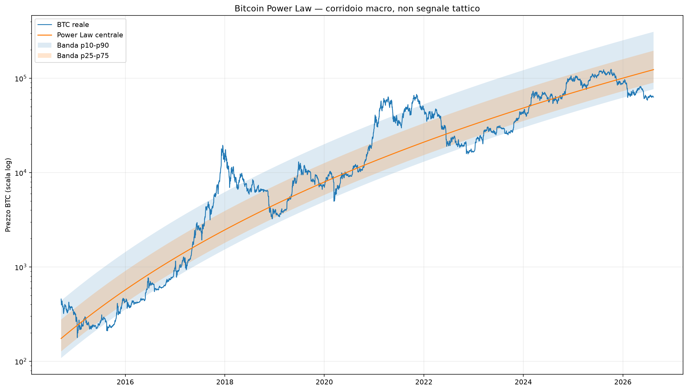

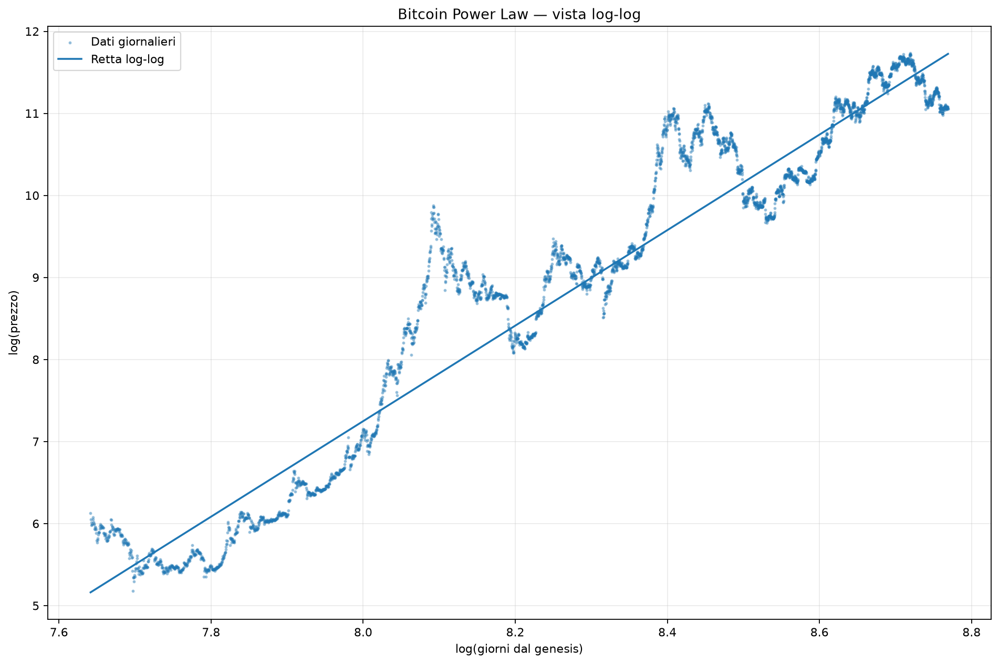

### Stabilità dell'esponente

| Inizio campione | β | R² log-log |
| --- | --- | --- |
| 2014 | 5,8398 | 91,98% |
| 2015 | 5,9262 | 91,55% |
| 2016 | 5,6158 | 87,79% |
| 2017 | 4,8854 | 82,88% |
| 2018 | 4,6188 | 78,35% |

### Backtest walk-forward contro prezzo invariato

| Orizzonte | Controlli | Vittorie vs naive | Errore mediano modello | Errore mediano naive |
| --- | --- | --- | --- | --- |
| 90g | 79 | 26,58% | 55,14% | 20,89% |
| 180g | 79 | 40,51% | 60,84% | 45,16% |
| 365g | 79 | 56,96% | 73,12% | 81,57% |
| 730g | 79 | 59,49% | 72,50% | 109,89% |

## Bitcoin Four-Year Spiral

Nel grafico l'angolo rappresenta il tempo dentro una finestra di quattro anni e il raggio rappresenta il prezzo in scala logaritmica. ATH, bottom storici e halving sono marker descrittivi: la spirale rende visibili le ricorrenze, ma non dimostra che il ciclo futuro debba ripetersi.

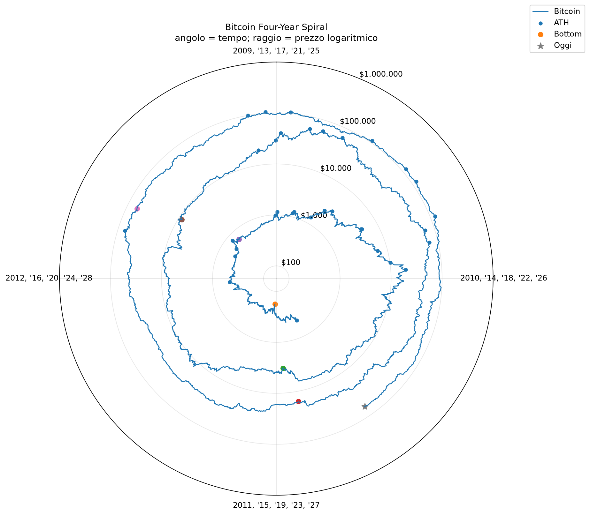

## Stessa fase dei cicli halving precedenti

| Ciclo | Data analoga | +30g | +90g | +180g | +365g |
| --- | --- | --- | --- | --- | --- |
| 2012-11-28 → 2016-07-09 | 2014-12-12 | -24,64% | -16,51% | -35,10% | +23,39% |
| 2016-07-09 → 2020-05-11 | 2018-09-08 | +6,85% | -45,07% | -37,17% | +67,70% |
| 2020-05-11 → 2024-04-19 | 2022-08-01 | -14,00% | -11,49% | -1,21% | +27,29% |

Campione molto piccolo: questi rendimenti sono contesto di ciclo, non probabilità affidabili.

## SOL/BTC e DOGE/BTC dentro il tempo Bitcoin

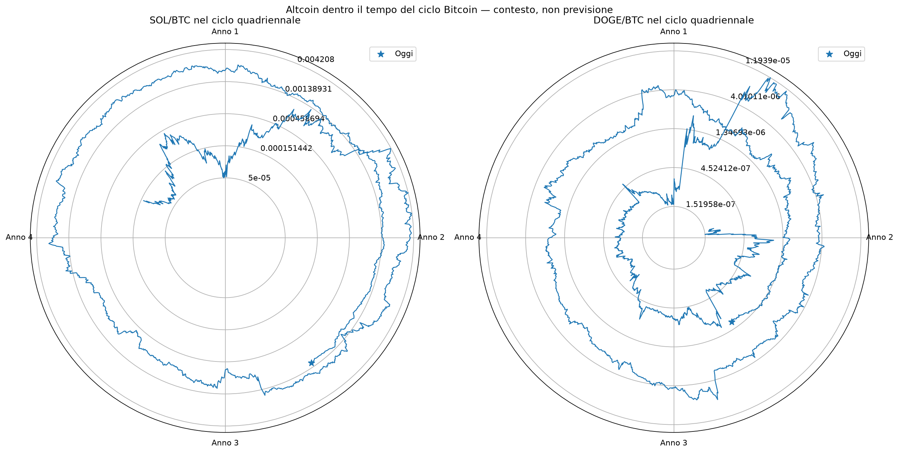

| Asset | Coppia | Forza vs BTC | Score raw | Candidato | 30g | Peso Global |
| --- | --- | --- | --- | --- | --- | --- |
| SOL | SOL/BTC | RELATIVA MISTA / NON CONFERMATA | -1 | 0 | 2.72489127368023 | 0 |
| DOGE | DOGE/BTC | SOTTOPERFORMA BTC | -8 | -1 | -14.97202237337959 | 0 |

## Tracker live Power Law

| Orizzonte | Controlli | Vittorie vs naive | Errore modello | Errore naive | Stato |
| --- | --- | --- | --- | --- | --- |
| 90g | 0 | n/a | n/a | n/a | RACCOLTA LIVE / PESO 0 |
| 180g | 0 | n/a | n/a | n/a | RACCOLTA LIVE / PESO 0 |
| 365g | 0 | n/a | n/a | n/a | RACCOLTA LIVE / PESO 0 |

Il modulo resta a peso 0 anche con un buon backtest. Prima si osserva la verifica live, poi si decide se usarlo soltanto per il rischio macro di lungo periodo. Le fotografie live della Power Law vengono salvate una sola volta per mese, così non si contano come indipendenti previsioni giornaliere quasi identiche.

## File prodotti

- `reports/btc_power_law_metrics.csv`
- `reports/btc_power_law_backtest.csv`
- `reports/btc_cycle_phase_metrics.csv`
- `reports/btc_macro_cycle_history.csv`
- `reports/btc_macro_cycle_tracker_metrics.csv`
<!-- BTC_MACRO_CYCLE_END -->

<!-- COMPACT_SECTION_END:btc_macro_cycle -->

<!-- COMPACT_SECTION_START:relative_strength_btc -->

<strong>₿ Forza relativa SOL/BTC e DOGE/BTC</strong>

<!-- RELATIVE_STRENGTH_BTC_START -->
# Forza relativa SOL/BTC e DOGE/BTC

Generato: 2026-07-22 05:14 UTC

<!-- DIRECT_REPORT_LINK -->
Report separato completo: [relative_strength_btc_report.md](relative_strength_btc_report.md)

Questo modulo controlla se SOL e DOGE stanno davvero battendo Bitcoin. Una salita in USD accompagnata da una coppia ALT/BTC ribassista è spesso soltanto trascinamento di BTC.

**Protezione iniziale:** il candidato relativo è limitato a -1/0/+1, ma il peso nel Global resta **0**. La coppia BTC conferma o indebolisce il tecnico USD; non viene sommata come secondo modulo indipendente.

## Sintesi

| Asset | Coppia | Prezzo | Score raw | Candidato | Peso Global | Forza vs BTC | Confidenza | 30g | Tecnico USD | Lettura combinata |
| --- | --- | --- | --- | --- | --- | --- | --- | --- | --- | --- |
| SOL | SOL/BTC | 0.00117620 | -1 | 0 | 0 | RELATIVA MISTA / NON CONFERMATA | BASSA | +2,72% | MISTA | QUADRO MISTO / NESSUNA CONFERMA RELATIVA |
| DOGE | DOGE/BTC | 0.00000110 | -8 | -1 | 0 | SOTTOPERFORMA BTC | MEDIA | -14,97% | RIBASSISTA | DEBOLEZZA COMPLETA: scende in USD e contro BTC |

## Matrice di lettura

| ALT/USD | ALT/BTC | Interpretazione |
| --- | --- | --- |
| Rialzista | Rialzista | Conferma migliore: sale e batte BTC |
| Rialzista | Ribassista | Sale soprattutto perché BTC trascina il mercato |
| Ribassista | Rialzista | Forza relativa nascosta / possibile rotazione futura |
| Ribassista | Ribassista | Debolezza completa |

## SOL/BTC

- **Verdetto relativo:** RELATIVA MISTA / NON CONFERMATA (-1)
- **Candidato futuro:** 0; **peso attuale Global: 0**
- **Lettura combinata USD/BTC:** QUADRO MISTO / NESSUNA CONFERMA RELATIVA
- **Struttura:** MASSIMI E MINIMI CRESCENTI
- **Rendimenti relativi:** 7g -1,74%; 30g +2,72%; 90g +5,77%; 180g -17,98%
- **Daily:** RSI 44.40; MA50 0.00116048; MA200 0.00122108
- **Weekly:** MA30 0.00122027; RSI 45.69
- **Livelli:** supporto 0.00117300; resistenza 0.00119800; breakout 60g 0.00134900; breakdown 60g 0.00100900
- **Pattern:** DOPPIO MINIMO / TARGET RAGGIUNTO; neckline 0.00113200; target 0.00117200
- **Fibonacci:** VICINO — 50.0% a 0.00117900
- **Fonte:** Yahoo Finance SOL-BTC (coppia diretta)
- **Motivi score:** prezzo sopra MA50 daily; prezzo sotto MA200 daily; MA50 daily in salita; prezzo sotto MA30 weekly; MA30 weekly in discesa; struttura con massimi/minimi crescenti; MACD relativo negativo

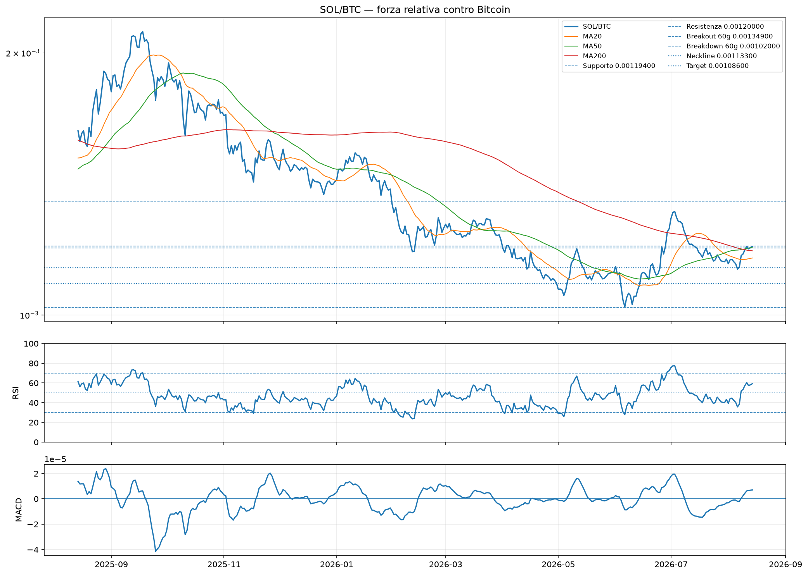

## DOGE/BTC

- **Verdetto relativo:** SOTTOPERFORMA BTC (-8)
- **Candidato futuro:** -1; **peso attuale Global: 0**
- **Lettura combinata USD/BTC:** DEBOLEZZA COMPLETA: scende in USD e contro BTC
- **Struttura:** MASSIMI E MINIMI DECRESCENTI
- **Rendimenti relativi:** 7g -3,59%; 30g -14,97%; 90g -9,75%; 180g -20,42%
- **Daily:** RSI 21.96; MA50 0.00000125; MA200 0.00000135
- **Weekly:** MA30 0.00000134; RSI 30.48
- **Livelli:** supporto 0.00000110; resistenza 0.00000121; breakout 60g 0.00000153; breakdown 60g 0.00000110
- **Pattern:** DOPPIO MASSIMO / CONFERMATO; neckline 0.00000112; target 0.00000099
- **Fibonacci:** NON ATTIVO — 23.6% a 0.00000119
- **Fonte:** Rapporto sintetico DOGE-USD / BTC-USD (sintetica)
- **Motivi score:** prezzo sotto MA50 daily; prezzo sotto MA200 daily; MA50 daily in discesa; prezzo sotto MA30 weekly; MA30 weekly in discesa; struttura con massimi/minimi decrescenti; RSI relativo debole; MACD relativo negativo

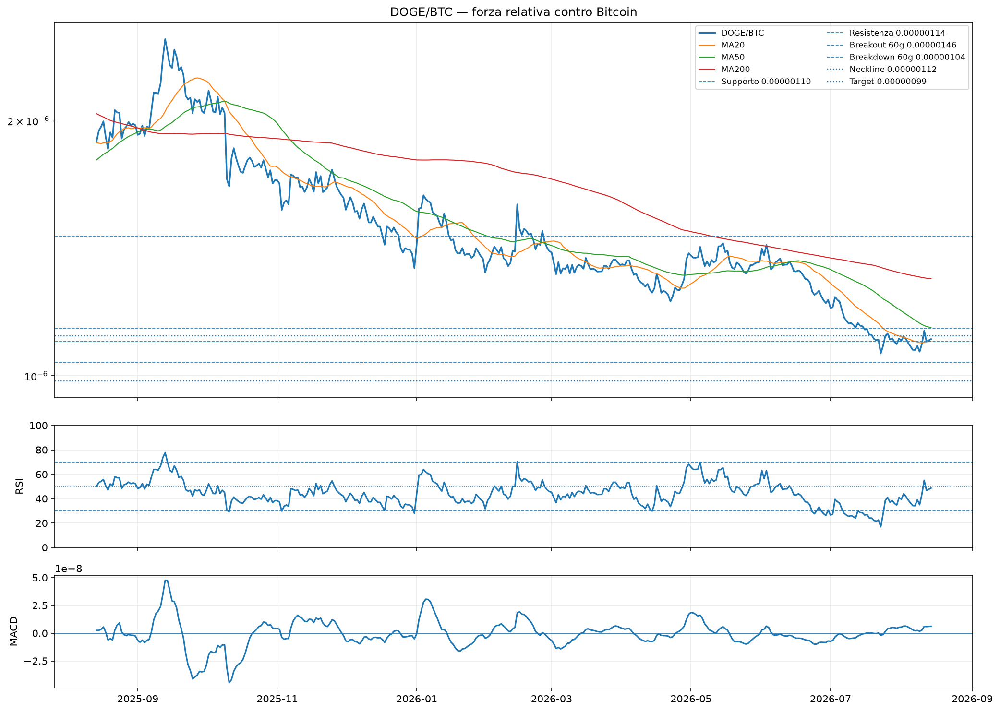

## Backtest storico diagnostico

Il backtest usa soltanto indicatori disponibili alla data del segnale e campiona una volta a settimana. È utile subito, ma non sostituisce il tracker live: le soglie sono state definite prima di vedere il risultato.

| Asset | Orizzonte | Controlli | Accuratezza | Return corretto direzione | Return futuro mediano |
| --- | --- | --- | --- | --- | --- |
| SOL | 7g | 202 | 51,98% | +1,96% | -1,34% |
| SOL | 30g | 200 | 48,00% | +4,76% | +0,44% |
| SOL | 90g | 194 | 54,12% | +10,43% | +1,07% |
| DOGE | 7g | 290 | 55,86% | +1,85% | -1,73% |
| DOGE | 30g | 287 | 52,61% | +1,98% | -3,49% |
| DOGE | 90g | 284 | 53,87% | +6,93% | -8,33% |

## Tracker live e gate futuro

| Asset | Orizzonte | Controlli | Accuratezza | Return corretto | Stato | Peso Global |
| --- | --- | --- | --- | --- | --- | --- |
| SOL | 1g | 0 | n/a | n/a | LOCKED / RACCOLTA LIVE | 0 |
| SOL | 3g | 0 | n/a | n/a | LOCKED / RACCOLTA LIVE | 0 |
| SOL | 7g | 0 | n/a | n/a | LOCKED / RACCOLTA LIVE | 0 |
| SOL | 14g | 0 | n/a | n/a | LOCKED / RACCOLTA LIVE | 0 |
| SOL | 30g | 0 | n/a | n/a | LOCKED / RACCOLTA LIVE | 0 |
| DOGE | 1g | 11 | 90,91% | +0,90% | LOCKED / RACCOLTA LIVE | 0 |
| DOGE | 3g | 9 | 88,89% | +1,71% | LOCKED / RACCOLTA LIVE | 0 |
| DOGE | 7g | 5 | 100,00% | +3,61% | LOCKED / RACCOLTA LIVE | 0 |
| DOGE | 14g | 0 | n/a | n/a | LOCKED / RACCOLTA LIVE | 0 |
| DOGE | 30g | 0 | n/a | n/a | LOCKED / RACCOLTA LIVE | 0 |

Gate prudente: almeno 30 controlli live a 7 giorni, accuratezza almeno 55% e return corretto direzione positivo. Anche dopo il gate, il contributo futuro non dovrà superare ±1 e dovrà restare dentro la famiglia tecnica.

## File prodotti

- `reports/relative_strength_btc_metrics.csv`
- `reports/relative_strength_btc_history.csv`
- `reports/relative_strength_btc_tracker_metrics.csv`
- `reports/relative_strength_btc_backtest.csv`
<!-- RELATIVE_STRENGTH_BTC_END -->

<!-- COMPACT_SECTION_END:relative_strength_btc -->

<!-- COMPACT_SECTION_START:btc_sol_fractal -->

<strong>🧬 Frattale mirato BTC 2022 / SOL 2026</strong>

<!-- BTC_SOL_FRACTAL_START -->

---

# Frattale mirato: BTC 2022 vs SOL 2026

Report separato completo: [btc_2022_vs_sol_2026_report.md](btc_2022_vs_sol_2026_report.md)

Ultima candela SOL usata: **22 luglio 2026**

## Verdetto: ANALOGIA DEBOLE / SCENARIO SECONDARIO

- **Fase attuale:** FRATTALE SOLO DI CONTESTO
- **Somiglianza totale:** +64,69%
- **Somiglianza strutturale:** +64,69%
- **Aderenza prezzo live:** +63,34%
- **Errore medio live:** +18,33%
- **Gap prezzo corrente:** +16,57%
- **Peso operativo suggerito:** 0
- **Affidabilita:** BASSA
- **Rischio fase:** ALTO
- **Trend tracking:** STRUTTURA STABILE
- **Sintesi:** Esistono alcuni elementi comuni, ma non abbastanza per una conferma.
- **SOL è al giorno:** 46 dal bottom usato.
- **Giorno BTC equivalente:** 2023-01-06
- **Prossimo step:** Proiezione condizionale, non conferma operativa: **Spinta rialzista abbastanza pulita.** Zona bassa **77,84 $** intorno al **22 luglio 2026**; zona alta **104,13 $** intorno al **5 agosto 2026**; fine step circa **104,13 $** entro il **5 agosto 2026**.

## Somiglianza prima e dopo inizio programma

Questa sezione separa la somiglianza della forma dall'aderenza reale del prezzo.

- **Inizio programma/scanner:** 3 luglio 2026
- **Prima del programma** = backtest retroattivo.
- **Da inizio programma** = verifica live: è la parte più importante per l'uso operativo.

| Periodo | Date | Giorni | Aderenza prezzo | Errore medio | Gap ultimo | Stato |
| --- | --- | --- | --- | --- | --- | --- |
| Prima del programma | 6 giugno 2026 -> 2 luglio 2026 | 27 | +87,95% | +6,02% | +21,89% | ABBASTANZA ALLINEATO |
| Da inizio programma | 3 luglio 2026 -> 22 luglio 2026 | 20 | +63,34% | +18,33% | +16,57% | STACCATO / NON ADERENTE |
| Totale dal bottom | 6 giugno 2026 -> 22 luglio 2026 | 47 | +77,48% | +11,26% | +16,57% | DEVIAZIONE MODERATA |

Nota: un frattale può avere una forma simile ma un prezzo distante. In quel caso non è operativo finché il gap non rientra.

## Lettura operativa veloce

Il frattale non deve generare acquisti o leva adesso. La forma è un contesto, ma l'aderenza live del prezzo è insufficiente.

| Voce | Risposta | Perché |
| --- | --- | --- |
| Uso operativo | NO | Il frattale vale 0 punti operativi finché il prezzo resta non aderente. |
| Aderenza live | +63,34% | Errore medio live +18,33%. |
| Gap corrente | +16,57% | Deve rientrare circa entro ±12%. |
| Prima conferma prezzo | 104,13 $ | Serve anche miglioramento del gap, non solo una candela sopra il livello. |
| Seconda conferma | 114,01 $ | Rende più credibile il percorso, ma non sostituisce l'aderenza. |
| Invalidazione soft | 73,95 $ | Sotto questa zona il quadro peggiora. |
| Invalidazione forte | 62,19 $ | Sotto il bottom il paragone è quasi rotto. |

## Target ciclo fino al top BTC 2025

| Voce | Valore |
| --- | --- |
| Stato | CONTESTO / NON OPERATIVO |
| Top BTC 2025 | 6 ottobre 2025 - 124.753 $ |
| Data SOL equivalente | 21 aprile 2029 |
| Target ciclo base da oggi | 572,84 $ |
| Massimo percorso base | 572,84 $ (21 aprile 2029) |

## Grafici

### Grafico frattale sovrapposto

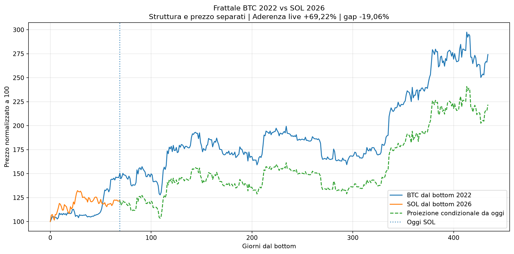

### Grafico proiezione condizionale

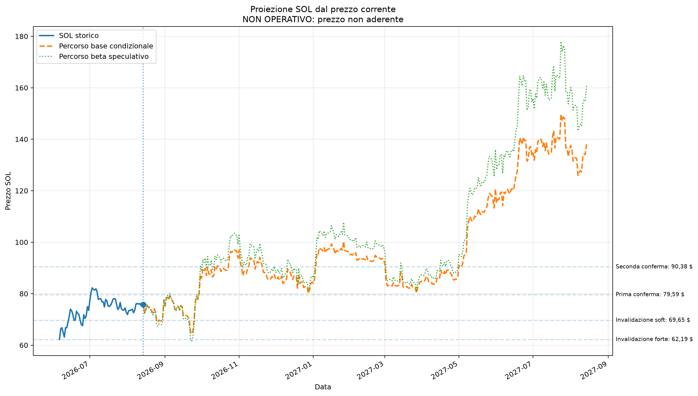

### Grafico ciclo base

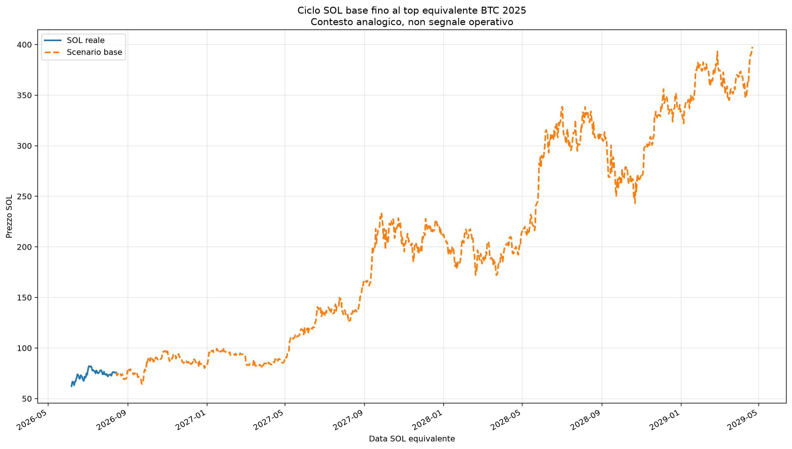

### Grafico struttura vs aderenza

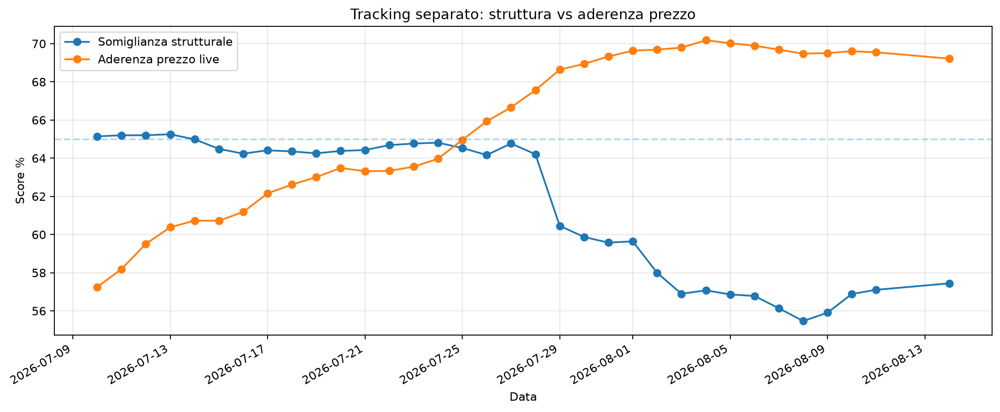

## Livelli chiave

| Livello | Prezzo / soglia | Lettura |
| --- | --- | --- |
| Rientro gap | entro ±12% | Condizione necessaria per tornare operativo. |
| Prima conferma | 104,13 $ | Deve accompagnarsi al rientro del gap. |
| Seconda conferma | 114,01 $ | Scenario più credibile. |
| Invalidazione soft | 73,95 $ | Il frattale si indebolisce. |
| Invalidazione forte | 62,19 $ | Il paragone si rompe. |

## Proiezione veloce con date SOL

| Orizzonte | Data SOL | BTC fece | SOL base | Min percorso | Max percorso |
| --- | --- | --- | --- | --- | --- |
| 7 giorni | 29 luglio 2026 | +17,45% | 91,42 $ | 77,84 $ | 91,42 $ |
| 14 giorni | 5 agosto 2026 | +33,77% | 104,13 $ | 77,84 $ | 104,13 $ |
| 30 giorni | 21 agosto 2026 | +35,42% | 105,41 $ | 77,84 $ | 109,17 $ |
| 60 giorni | 20 settembre 2026 | +31,07% | 102,03 $ | 77,84 $ | 114,01 $ |
| 90 giorni | 20 ottobre 2026 | +65,43% | 128,77 $ | 77,84 $ | 130,77 $ |
| 120 giorni | 19 novembre 2026 | +70,51% | 132,72 $ | 77,84 $ | 139,98 $ |

## Prossimi step se SOL segue BTC 2022

| Step | Date SOL | BTC fine | SOL zona bassa | SOL zona alta | SOL fine base | Lettura |
| --- | --- | --- | --- | --- | --- | --- |
| Step 1 - prossime 2 settimane | 22 luglio 2026 -> 5 agosto 2026 | +33,77% | 77,84 $ (22 luglio 2026) | 104,13 $ (5 agosto 2026) | 104,13 $ | Spinta rialzista abbastanza pulita. |
| Step 2 - primo mese | 6 agosto 2026 -> 21 agosto 2026 | +35,42% | 103,94 $ (9 agosto 2026) | 109,17 $ (14 agosto 2026) | 105,41 $ | Spinta rialzista abbastanza pulita. |
| Step 3 - secondo mese | 22 agosto 2026 -> 20 settembre 2026 | +31,07% | 99,42 $ (26 agosto 2026) | 114,01 $ (5 settembre 2026) | 102,03 $ | Spinta rialzista abbastanza pulita. |
| Step 4 - terzo mese | 21 settembre 2026 -> 20 ottobre 2026 | +65,43% | 92,70 $ (23 settembre 2026) | 130,77 $ (14 ottobre 2026) | 128,77 $ | Spinta rialzista abbastanza pulita. |

Nota: le proiezioni restano condizionali. La forma simile non compensa un prezzo non aderente.

<!-- BTC_SOL_FRACTAL_END -->

<!-- COMPACT_SECTION_END:btc_sol_fractal -->

<!-- COMPACT_SECTION_START:rsi_top_cycle -->

<strong>📈 RSI top-cycle SOL</strong>

<!-- RSI_TOP_CYCLE_START -->

---

# RSI top-cycle warning - SOL

Report separato completo: [rsi_top_cycle_report.md](rsi_top_cycle_report.md)

Filtro prudente: usa almeno 3 picchi RSI, separa vicinanza matematica e rischio reale, e non proietta la top-line oltre 12 mesi.

| Voce | Valore | Lettura |
| --- | --- | --- |
| Prezzo SOL | 77,84 $ |  |
| Weekly RSI | 40,98 / linea grezza 53,89 | LINEA NON AFFIDABILE / RISCHIO NON ATTIVO — IRREALISTICA / NON OPERATIVA |
| Monthly RSI | 41,37 / linea grezza 56,16 | RSI TROPPO BASSO PER RISCHIO TOP — VALIDA / USO PRUDENTE |
| Target ciclo base | 572,84 $ | Avanzamento +13,59% |
| Rischio top-cycle RSI | BASSO | Nessun segnale top-cycle macro attivo. Prezzo ancora lontano dal target ciclo; il filtro RSI resta solo di monitoraggio. |

## Lettura semplice

- Weekly: La top-line weekly non supera i controlli di qualità. Non viene usata per generare rischio top-cycle.
- Monthly: RSI monthly è 41,4, sotto la soglia prudente 55. Anche se fosse vicino alla linea, non è una vera zona di esaurimento ciclo.
- Confluenza prezzo + RSI: **BASSO**

Questo non è un segnale di entrata. RSI bassi o trendline non affidabili restano neutrali e non penalizzano il Global Confluence.

## Grafici RSI

<!-- RSI_TOP_CYCLE_END -->

<!-- COMPACT_SECTION_END:rsi_top_cycle -->

<!-- COMPACT_SECTION_START:sol_onchain -->

<strong>⛓️ Metriche on-chain SOL</strong>

<!-- SOL_ONCHAIN_METRICS_START -->

---

# SOL on-chain metrics

Report separato completo: **[sol_onchain_metrics_report.md](sol_onchain_metrics_report.md)**

| Voce | Valore |
| --- | --- |
| Score on-chain | 0 |
| Bias | NEUTRALE / MISTA |
| Azione coerente | NESSUNA CONFERMA FORTE / LEGGERE INSIEME AL FRATTALE |
| Prezzo SOL | 77,84 $ |
| TVL Solana | 4,98 mld $ |
| TVL 7g | +1,50% |
| DEX volume 24h | 1,50 mld $ |
| Fees 24h | 5,54 mln $ |
| Stablecoin su Solana | 15,86 mld $ |
| Stake ratio | 67,60% |
| Metriche mancanti | sol_realized_price_usd, sol_mvrv, sol_holder_profit_pct, sol_exchange_netflow_24h_usd |

Lettura semplice:

**NESSUNA CONFERMA FORTE / LEGGERE INSIEME AL FRATTALE**

Questo blocco non sostituisce il frattale SOL/BTC: serve come filtro per capire se il movimento è sostenuto anche da attività on-chain.

<!-- SOL_ONCHAIN_METRICS_END -->

<!-- COMPACT_SECTION_END:sol_onchain -->

<!-- COMPACT_SECTION_START:major_alt_lifecycle -->

<strong>🔄 Lifecycle squeeze / EMA200 SOL</strong>

<!-- MAJOR_ALT_LIFECYCLE_SQUEEZE_START -->

---

# Major alt lifecycle squeeze - SOL

Report separato completo: **[major_alt_lifecycle_squeeze_report.md](major_alt_lifecycle_squeeze_report.md)**

| Voce                      | Valore                                            |
|:--------------------------|:--------------------------------------------------|
| Lifecycle squeeze score | 4 |
| Bias | SQUEEZE SETUP MODERATO |
| Azione coerente | CONTESTO INTERESSANTE, SERVONO CONFERME DI PREZZO |
| Peso suggerito Global | 0 |
| Trend squeeze | STABILE / DA CONFERMARE |
| Trend squeeze score | 0 |
| Confronto precedente | 2026-07-20 |
| Fonte prezzi | Yahoo Finance SOL-USD weekly |
| Prezzo SOL | 77,84 $ |
| EMA200 weekly target | 112,78 $ |
| Upside verso EMA200 | +44,96% |
| Distanza prezzo da EMA200 | -31,02% |
| Gap EMA50/EMA200 | -3,00% |
| Stato cross | EMA50 SOTTO EMA200 |
| RSI weekly | 40,95 |
| Età SOL | 6,3 anni |
| Analoghi storici usati | 30 |
| Max analoghi per asset | 3 |
| Hit EMA200 12w analoghi | +30,00% |
| Max gain mediano 12w | +21,56% |
| Drawdown mediano 12w | -20,38% |

Lettura semplice:

**CONTESTO INTERESSANTE, SERVONO CONFERME DI PREZZO**

Autocontrollo: **STABILE / DA CONFERMARE**.

Questo modulo confronta SOL con altre crypto in fasi simili di età, distanza da EMA200, EMA50/EMA200 e RSI. Non usa stock market.

Nota importante: **questo modulo ora NON pesa più nel Global Confluence**. Resta solo come contesto di ciclo e come mappa verso EMA200 weekly. Il punteggio Global resta guidato da prezzo, scanner, regime, struttura tecnica, frattale, RSI e conferme reali.

Nota: se EMA50/EMA200 sono dentro ±2%, il modulo parla di medie sovrapposte / incrocio in corso, perché exchange diversi possono mostrare il cross leggermente prima o dopo.

<!-- Generato: 2026-07-22 05:14 UTC -->
<!-- MAJOR_ALT_LIFECYCLE_SQUEEZE_END -->

<!-- COMPACT_SECTION_END:major_alt_lifecycle -->

# Report giornaliero BTC / SOL / DOGE

Aggiornato il: **2026-07-22 05:12:23 UTC**

Questo report confronta il grafico attuale di Bitcoin, Solana e Dogecoin con tanti grafici storici di altre crypto.

Non è una previsione certa. È uno scanner statistico: guarda situazioni simili già successe e mostra cosa accadde dopo nei 30 giorni successivi.

<!-- COMPACT_SECTION_START:daily_change -->

<strong>🗓️ Cambiamenti rispetto a ieri</strong>

<!-- DAILY_CHANGE_START -->

---

# Mini report cambiamenti da ieri

Report separato completo: [daily_change_report.md](daily_change_report.md)

- BTC: nessun cambiamento forte rispetto a ieri.
- SOL: nessun cambiamento forte rispetto a ieri.
- DOGE: cambiamento importante in miglioramento rispetto a ieri.

| Asset | Cambio | Tono | Verdetto oggi | Casi positivi oggi | Δ casi positivi |
| --- | --- | --- | --- | --- | --- |
| BTC | NESSUN CAMBIAMENTO FORTE | miglioramento | RIALZISTA | +60.00% | 0.00 punti |
| SOL | NESSUN CAMBIAMENTO FORTE | peggioramento | NEUTRALE / INCERTO | +47.50% | -5.00 punti |
| DOGE | CAMBIAMENTO MEDIO | miglioramento | RIBASSISTA | +37.50% | +5.00 punti |

<!-- DAILY_CHANGE_END -->

<!-- COMPACT_SECTION_END:daily_change -->

<!-- COMPACT_SECTION_START:bounce_after_drawdown -->

<strong>↕️ Sequenze rimbalzo / dump</strong>

<!-- BOUNCE_AFTER_DRAWDOWN_START -->

---

# Sequenze pratiche: rimbalzo / dump

Report separato completo: [bounce_after_drawdown_report.md](bounce_after_drawdown_report.md)

Questa sezione risponde subito a due domande:

- **Se scende, è una zona di rimbalzo?**
- **Se sale forte, è una zona da prendere profitto?**

| Asset | Scende a | Target rimbalzo | % casi rimbalzo | Movimento reale | Lettura discesa | Sale a | Target dump | % casi dump | Movimento reale | Lettura spike |
| --- | --- | --- | --- | --- | --- | --- | --- | --- | --- | --- |
| BTC | 62.909 $ | 72.842 $ | +48,57% | +15,79% | rimbalzo debole | 72.842 $ | 62.909 $ | +16,00% | -13,64% | spike storicamente più resistente |
| SOL | 73,95 $ | 85,62 $ | +20,00% | +15,79% | rimbalzo poco frequente | 85,62 $ | 73,95 $ | +20,00% | -13,64% | spike storicamente più resistente |
| DOGE | 0,06951 $ | 0,08049 $ | +32,43% | +15,79% | rimbalzo poco frequente | 0,08049 $ | 0,06951 $ | +50,00% | -13,64% | attenzione a prendere profitto |

## Spiegazione ultra semplice

`% casi rimbalzo` e `% casi dump` non sono percentuali assolute.

Sono percentuali **condizionate**:

- prima deve succedere la prima cosa;
- solo dopo si controlla se succede la seconda.

Esempio rimbalzo:

- prezzo iniziale 100 $
- scende a -5% = 95 $
- poi target +10% = 110 $
- da 95 $ a 110 $ il movimento reale è circa +15,79%

Quindi `poi +10%` non vuol dire +10% dal minimo. Vuol dire +10% dal prezzo iniziale.

Esempio dump:

- prezzo iniziale 100 $
- sale a +10% = 110 $
- poi target -5% = 95 $
- da 110 $ a 95 $ il movimento reale è circa -13,64%

Quindi `dump -5%` non vuol dire -5% dallo spike. Vuol dire che torna fino a 5% sotto il prezzo iniziale.

Nel report principale vedi solo la sintesi. Nel report separato ci sono anche soglie intermedie: -8%, +5%, +15%, ecc.

## Traduzione veloce

- **BTC: su 40 casi simili, 35 prima sono scesi a -5,00%. Tra quei 35, 17 poi sono rimbalzati fino a +10,00%. Percentuale: +48,57% (17/35). Dal livello -5,00% al target +10,00% il movimento reale sarebbe circa +15,79%. Lettura: rimbalzo debole.**
- **BTC: su 40 casi simili, 25 prima sono saliti a +10,00%. Tra quei 25, 4 poi sono scaricati a -5,00%. Percentuale: +16,00% (4/25). Dal livello +10,00% al target -5,00% il movimento reale sarebbe circa -13,64%. Lettura: spike storicamente più resistente.**
- **SOL: su 40 casi simili, 30 prima sono scesi a -5,00%. Tra quei 30, 6 poi sono rimbalzati fino a +10,00%. Percentuale: +20,00% (6/30). Dal livello -5,00% al target +10,00% il movimento reale sarebbe circa +15,79%. Lettura: rimbalzo poco frequente.**
- **SOL: su 40 casi simili, 15 prima sono saliti a +10,00%. Tra quei 15, 3 poi sono scaricati a -5,00%. Percentuale: +20,00% (3/15). Dal livello +10,00% al target -5,00% il movimento reale sarebbe circa -13,64%. Lettura: spike storicamente più resistente.**
- **DOGE: su 40 casi simili, 37 prima sono scesi a -5,00%. Tra quei 37, 12 poi sono rimbalzati fino a +10,00%. Percentuale: +32,43% (12/37). Dal livello -5,00% al target +10,00% il movimento reale sarebbe circa +15,79%. Lettura: rimbalzo poco frequente.**
- **DOGE: su 40 casi simili, 22 prima sono saliti a +10,00%. Tra quei 22, 11 poi sono scaricati a -5,00%. Percentuale: +50,00% (11/22). Dal livello +10,00% al target -5,00% il movimento reale sarebbe circa -13,64%. Lettura: attenzione a prendere profitto.**

<!-- BOUNCE_AFTER_DRAWDOWN_END -->

<!-- COMPACT_SECTION_END:bounce_after_drawdown -->

<!-- COMPACT_SECTION_START:scanner_forecast -->

<strong>🔭 Cono probabilistico dello scanner</strong>

<!-- SCANNER_FORECAST_TRACKER_START -->
# Scanner forecast path / cono probabilistico

Generato: 2026-07-22 05:13:52 UTC

<!-- DIRECT_REPORT_LINK -->
Report separato completo: [scanner_forecast_tracker_report.md](scanner_forecast_tracker_report.md)

Questo report trasforma i 40 casi simili dello scanner in un cono previsionale leggibile.

Per ogni asset crea:

- banda larga p10-p90
- banda centrale p25-p75
- scenario centrale p50
- prezzo reale sovrapposto quando sono disponibili dati successivi

Correzione importante: il cono ora viene calcolato dai percorsi reali dei match storici, non solo dai percentili finali a 30 giorni. Quindi il grafico non deve più mostrare solo due puntini.

## Ultimo cono previsionale salvato

| Asset   | Data       | Prezzo iniziale   | Direzione scanner   | Casi positivi   | P10 30g     | P25 30g     | P50 30g     | P75 30g     | P90 30g     |
|:--------|:-----------|:------------------|:--------------------|:----------------|:------------|:------------|:------------|:------------|:------------|
| BTC | 2026-07-22 | 66.220 $ | SALITA | 60,00% | 50.921,48 $ | 57.290,99 $ | 72.439,47 $ | 81.658,20 $ | 85.674,73 $ |
| SOL | 2026-07-22 | 77,84 $ | INCERTO | 47,50% | 59,49 $ | 69,95 $ | 77,12 $ | 84,72 $ | 91,65 $ |
| DOGE | 2026-07-22 | 0.07317 $ | DISCESA | 37,50% | 0.05088 $ | 0.05711 $ | 0.06749 $ | 0.08040 $ | 0.09174 $ |

## Grafici

### BTC

#### Verifica storica e discrepanza

- Cono congelato il **2026-07-10**; verificato fino al **2026-07-22**; stato **PARZIALE 12/30g**.
- Reale **66.235,85 $**; p50 previsto **68.245,64 $**; scarto **-2,94%**.
- Errore medio assoluto **3,82%**; massimo **7,75%**; DENTRO p10-p90; DENTRO p25-p75.

### SOL

#### Verifica storica e discrepanza

- Cono congelato il **2026-07-10**; verificato fino al **2026-07-22**; stato **PARZIALE 12/30g**.
- Reale **77,79 $**; p50 previsto **74,31 $**; scarto **4,69%**.
- Errore medio assoluto **2,86%**; massimo **5,38%**; DENTRO p10-p90; DENTRO p25-p75.

### DOGE

#### Verifica storica e discrepanza

- Cono congelato il **2026-07-10**; verificato fino al **2026-07-22**; stato **PARZIALE 12/30g**.
- Reale **0.07317 $**; p50 previsto **0.06241 $**; scarto **17,24%**.
- Errore medio assoluto **3,18%**; massimo **17,24%**; DENTRO p10-p90; FUORI p25-p75.

## Accuratezza percorso scanner

| Asset   | Giorno   |   Controlli | Dentro p10-p90   | Dentro p25-p75   | Errore medio abs vs p50   | Errore medio vs p50   |
|:--------|:---------|------------:|:-----------------|:-----------------|:--------------------------|:----------------------|
| BTC | 1g | 12 | 100,00% | 66,67% | 2,03% | 0,22% |
| BTC | 3g | 10 | 100,00% | 60,00% | 3,03% | -0,88% |
| BTC | 7g | 6 | 100,00% | 66,67% | 2,88% | -1,78% |
| BTC | 14g | 0 | n/a | n/a | n/a | n/a |
| BTC | 30g | 0 | n/a | n/a | n/a | n/a |
| SOL | 1g | 12 | 75,00% | 50,00% | 2,45% | 0,11% |
| SOL | 3g | 10 | 100,00% | 40,00% | 2,94% | -0,10% |
| SOL | 7g | 6 | 100,00% | 100,00% | 2,37% | -0,01% |
| SOL | 14g | 0 | n/a | n/a | n/a | n/a |
| SOL | 30g | 0 | n/a | n/a | n/a | n/a |
| DOGE | 1g | 12 | 100,00% | 58,33% | 2,61% | 1,23% |
| DOGE | 3g | 10 | 100,00% | 100,00% | 2,32% | 0,89% |
| DOGE | 7g | 6 | 100,00% | 100,00% | 5,33% | 5,33% |
| DOGE | 14g | 0 | n/a | n/a | n/a | n/a |
| DOGE | 30g | 0 | n/a | n/a | n/a | n/a |

## Calibratore shadow

Il cono ufficiale resta grezzo e invariato. Il calibratore usa soltanto previsioni passate già mature, campionate una volta a settimana per ridurre la falsa indipendenza. Ogni orizzonte si attiva a 30 controlli indipendenti: parte al 25% della correzione stimata e cresce gradualmente fino al 100% a 100 controlli.

| Asset   | Orizzonte   |   Controlli indipendenti |   Soglia | Stato                  | Forza correzione   | Shift p50   |   Scala p10-p90 |
|:--------|:------------|-------------------------:|---------:|:-----------------------|:-------------------|:------------|----------------:|
| BTC | 1g | 3 | 30 | RACCOLTA (27 mancanti) | 0,0% | 0,00% | 1,000 |
| BTC | 3g | 2 | 30 | RACCOLTA (28 mancanti) | 0,0% | 0,00% | 1,000 |
| BTC | 7g | 2 | 30 | RACCOLTA (28 mancanti) | 0,0% | 0,00% | 1,000 |
| BTC | 14g | 0 | 30 | RACCOLTA (30 mancanti) | 0,0% | 0,00% | 1,000 |
| BTC | 30g | 0 | 30 | RACCOLTA (30 mancanti) | 0,0% | 0,00% | 1,000 |
| SOL | 1g | 3 | 30 | RACCOLTA (27 mancanti) | 0,0% | 0,00% | 1,000 |
| SOL | 3g | 2 | 30 | RACCOLTA (28 mancanti) | 0,0% | 0,00% | 1,000 |
| SOL | 7g | 2 | 30 | RACCOLTA (28 mancanti) | 0,0% | 0,00% | 1,000 |
| SOL | 14g | 0 | 30 | RACCOLTA (30 mancanti) | 0,0% | 0,00% | 1,000 |
| SOL | 30g | 0 | 30 | RACCOLTA (30 mancanti) | 0,0% | 0,00% | 1,000 |
| DOGE | 1g | 3 | 30 | RACCOLTA (27 mancanti) | 0,0% | 0,00% | 1,000 |
| DOGE | 3g | 2 | 30 | RACCOLTA (28 mancanti) | 0,0% | 0,00% | 1,000 |
| DOGE | 7g | 2 | 30 | RACCOLTA (28 mancanti) | 0,0% | 0,00% | 1,000 |
| DOGE | 14g | 0 | 30 | RACCOLTA (30 mancanti) | 0,0% | 0,00% | 1,000 |
| DOGE | 30g | 0 | 30 | RACCOLTA (30 mancanti) | 0,0% | 0,00% | 1,000 |

### Confronto fuori campione: grezzo vs shadow

| Asset   | Orizzonte   |   Controlli OOS | MAE grezzo   | MAE shadow   | Miglioramento   | Shadow vince   | Copertura larga grezza   | Copertura larga shadow   |
|:--------|:------------|----------------:|:-------------|:-------------|:----------------|:---------------|:-------------------------|:-------------------------|
| BTC | 1g | 0 | n/a | n/a | n/a | n/a | n/a | n/a |
| BTC | 3g | 0 | n/a | n/a | n/a | n/a | n/a | n/a |
| BTC | 7g | 0 | n/a | n/a | n/a | n/a | n/a | n/a |
| BTC | 14g | 0 | n/a | n/a | n/a | n/a | n/a | n/a |
| BTC | 30g | 0 | n/a | n/a | n/a | n/a | n/a | n/a |
| DOGE | 1g | 0 | n/a | n/a | n/a | n/a | n/a | n/a |
| DOGE | 3g | 0 | n/a | n/a | n/a | n/a | n/a | n/a |
| DOGE | 7g | 0 | n/a | n/a | n/a | n/a | n/a | n/a |
| DOGE | 14g | 0 | n/a | n/a | n/a | n/a | n/a | n/a |
| DOGE | 30g | 0 | n/a | n/a | n/a | n/a | n/a | n/a |
| SOL | 1g | 0 | n/a | n/a | n/a | n/a | n/a | n/a |
| SOL | 3g | 0 | n/a | n/a | n/a | n/a | n/a | n/a |
| SOL | 7g | 0 | n/a | n/a | n/a | n/a | n/a | n/a |
| SOL | 14g | 0 | n/a | n/a | n/a | n/a | n/a | n/a |
| SOL | 30g | 0 | n/a | n/a | n/a | n/a | n/a | n/a |

## Come leggerlo

- Se il prezzo resta dentro p10-p90, lo scanner sta ancora descrivendo bene il range largo.
- Se il prezzo resta dentro p25-p75, lo scanner sta descrivendo bene anche il range centrale.
- Se il prezzo segue p50, il percorso reale è vicino allo scenario normale.
- Se il prezzo esce da p10-p90, il modello statistico dei 40 casi sta perdendo aderenza.
- Questo non sostituisce drawdown e max gain: serve soprattutto a vedere il percorso del return previsto.

Nota: servono almeno 5 controlli prima di dare un peso minimo al cono. Sotto 5 controlli resta solo osservazione.
<!-- SCANNER_FORECAST_TRACKER_END -->

<!-- FORECAST_30D_HISTORY_START -->

---

# Storico previsioni 30 giorni

Report separato completo: [forecast_30d_history.md](forecast_30d_history.md)

Righe salvate nello storico: **30**.

Questa sezione tiene un diario delle previsioni giornaliere a 30 giorni, senza appesantire il report principale.

| Data | Asset | Prezzo | Direzione | Casi positivi | Return p50 | Drawdown p50 | Max gain p50 | Controllo 30g |
| --- | --- | --- | --- | --- | --- | --- | --- | --- |
| 2026-07-22 | BTC | 66.220 $ | SALITA | 60,00% | 72.439 $ | 59.257 $ | 77.162 $ | 2026-08-21 |
| 2026-07-22 | DOGE | 0,07000 $ | DISCESA | 37,50% | 0,07000 $ | 0,06000 $ | 0,08000 $ | 2026-08-21 |
| 2026-07-22 | SOL | 77,84 $ | INCERTO | 47,50% | 77,12 $ | 70,35 $ | 84,73 $ | 2026-08-21 |

<!-- FORECAST_30D_HISTORY_END -->

<!-- COMPACT_SECTION_END:scanner_forecast -->

<!-- COMPACT_SECTION_START:extreme_cases -->

<strong>⚠️ Percorso dei casi estremi</strong>

<!-- EXTREME_CASES_PATH_START -->
# Extreme cases path report

Generato: 2026-07-22 05:14 UTC

<!-- DIRECT_REPORT_LINK -->
Report separato completo: [extreme_cases_path_report.md](extreme_cases_path_report.md)

Questo report si attiva quando i casi positivi o negativi sono almeno **80%**.

Ora misura anche il **rialzo massimo prima della discesa principale**, quindi distingue uno spike iniziale da una discesa quasi immediata.

## Trigger estremi

| Asset   | Direzione   | Trigger   | Percentuale   | Motivo                           |   Match disponibili |
|:--------|:------------|:----------|:--------------|:---------------------------------|--------------------:|
| BTC     | NESSUNO     | NO        | +60,00%       | Nessun lato sopra soglia estrema |                  40 |
| SOL     | NESSUNO     | NO        | +52,50%       | Nessun lato sopra soglia estrema |                  40 |
| DOGE    | NESSUNO     | NO        | +62,50%       | Nessun lato sopra soglia estrema |                  40 |

## Come leggerlo

- **Grafico pulito**: mostra il percorso centrale.
- **Asset per asset**: mostra le differenze tra gli analoghi storici.
- **Spike prima della discesa**: risponde a quanto poteva salire prima di scendere.
- **Spike contro minimo**: mostra quanto rialzo iniziale è stato poi seguito da quale discesa.

Questo report è diagnostico e non modifica il Global Confluence.
<!-- EXTREME_CASES_PATH_END -->

<!-- COMPACT_SECTION_END:extreme_cases -->

<!-- COMPACT_SECTION_START:scanner_full_detail -->

<strong>📚 Scanner statistico completo — percentili, mappe e 40 casi storici</strong>

# Come leggere questo report

Leggilo sempre in questo ordine:

1. **Direzione più probabile**: ti dice se storicamente era più facile salita, discesa o incertezza.
2. **Casi positivi / negativi**: ti dice la percentuale storica di salita o discesa dopo 30 giorni.
3. **Return 30d**: ti dice dove potrebbe stare il prezzo fra 30 giorni.
4. **Drawdown 30d**: ti dice quanto potrebbe scendere durante quei 30 giorni.
5. **Max gain 30d**: ti dice quanto potrebbe salire durante quei 30 giorni.
6. **Scanner autocalibrato**: dopo abbastanza dati, confronta previsione e realtà e corregge la lettura.

La frase più importante è questa:

> **Return = prezzo finale dopo 30 giorni. Drawdown = discesa durante il mese. Max gain = rialzo durante il mese.**

---

# Scheda veloce: cosa sono i percentili

I **percentili** sono solo un modo per trasformare i 40 casi storici simili in scenari semplici.

## Traduzione semplice

- **Percentile 10%** = molto male / scenario brutto.
- **Percentile 25%** = male / scenario negativo.
- **Percentile 50%** = normale / scenario centrale. È il più importante.
- **Percentile 75%** = bene / scenario buono.
- **Percentile 90%** = molto bene / scenario molto forte.

## Cosa guardare davvero

- Per capire la situazione normale: guarda sempre il **Percentile 50%**.
- Per capire il rischio con leva: guarda **Drawdown 25%** e **Drawdown 10%**.
- Per capire un possibile take profit: guarda **Max gain 50%** e **Max gain 75%**.

## I tre tipi di percentili

- **Percentili Return 30d** = dove potrebbe stare il prezzo fra 30 giorni.
- **Percentili Drawdown 30d** = quanto potrebbe scendere durante i 30 giorni.
- **Percentili Max gain 30d** = quanto potrebbe salire durante i 30 giorni.

## Esempio semplice

Se SOL oggi vale 82 $ e il report dice:

- **Return 50% → 81 $**: fra 30 giorni lo scenario normale è circa 81 $.
- **Drawdown 50% → 77 $**: durante il mese può scendere normalmente verso 77 $.
- **Max gain 50% → 92 $**: durante il mese può fare uno spike normale verso 92 $.

Quindi può salire e scendere durante il mese, ma il **return** guarda solo dove finisce dopo 30 giorni.

---

# Lettura velocissima

Questa è la parte da leggere per prima. Ti dice subito se lo scenario è più da salita, discesa o incertezza.

## Bitcoin
- Direzione più probabile a 30 giorni: **SALITA**
- Casi positivi / salita storica: **60,00%**
- Casi negativi / discesa storica: **40,00%**
- Quanto è netto il segnale: **debole**
- Prezzo attuale: **66.220,37 $**
- Return normale fra 30 giorni: **72.439,47 $** (9,39%)
- Drawdown normale durante il mese: **59.256,86 $** (-10,52%)
- Drawdown brutto da rispettare: **55.924,59 $** (-15,55%)
- Max gain normale durante il mese: **77.162,24 $** (16,52%)
- Max gain buono / take profit ottimistico: **83.035,67 $** (25,39%)

**Come leggerlo:** casi positivi/negativi ti dicono la direzione più probabile. Return ti dice il prezzo finale fra 30 giorni. Drawdown ti dice il rischio di discesa durante il mese. Max gain ti dice il possibile rialzo durante il mese.

## Solana
- Direzione più probabile a 30 giorni: **INCERTO**
- Casi positivi / salita storica: **47,50%**
- Casi negativi / discesa storica: **52,50%**
- Quanto è netto il segnale: **molto debole / quasi pari**
- Prezzo attuale: **77,84 $**
- Return normale fra 30 giorni: **77,12 $** (-0,93%)
- Drawdown normale durante il mese: **70,35 $** (-9,63%)
- Drawdown brutto da rispettare: **63,57 $** (-18,33%)
- Max gain normale durante il mese: **84,73 $** (8,85%)
- Max gain buono / take profit ottimistico: **90,80 $** (16,65%)

**Come leggerlo:** casi positivi/negativi ti dicono la direzione più probabile. Return ti dice il prezzo finale fra 30 giorni. Drawdown ti dice il rischio di discesa durante il mese. Max gain ti dice il possibile rialzo durante il mese.

## Dogecoin
- Direzione più probabile a 30 giorni: **DISCESA**
- Casi positivi / salita storica: **37,50%**
- Casi negativi / discesa storica: **62,50%**
- Quanto è netto il segnale: **medio**
- Prezzo attuale: **0,07 $**
- Return normale fra 30 giorni: **0,07 $** (-7,77%)
- Drawdown normale durante il mese: **0,06 $** (-20,48%)
- Drawdown brutto da rispettare: **0,05 $** (-30,59%)
- Max gain normale durante il mese: **0,08 $** (14,24%)
- Max gain buono / take profit ottimistico: **0,09 $** (21,66%)

**Come leggerlo:** casi positivi/negativi ti dicono la direzione più probabile. Return ti dice il prezzo finale fra 30 giorni. Drawdown ti dice il rischio di discesa durante il mese. Max gain ti dice il possibile rialzo durante il mese.

## Messaggio del giorno

Il quadro generale oggi è misto. Alcuni asset possono avere lettura diversa, quindi è meglio valutare asset per asset.

---

# Mappa semplice asset per asset

# Bitcoin — mappa semplice dei prossimi 30 giorni

**Semaforo:** 🟢 VERDE / Favorevole
**Prezzo attuale:** 66.220,37 $

**Direzione più probabile a 30 giorni:** **SALITA**
- Probabilità storica di salita: **60,00%**
- Probabilità storica di discesa: **40,00%**
- Quanto è netto il segnale: **debole**

## Come leggere questa parte

- **Probabilità storica di salita** = su 40 casi simili, quanti hanno chiuso sopra dopo 30 giorni.
- **Probabilità storica di discesa** = su 40 casi simili, quanti hanno chiuso sotto dopo 30 giorni.
- **Quanto è netto il segnale** = quanto è grande la differenza tra salita e discesa. Non vuol dire certezza, vuol dire solo che il risultato storico non è vicino al 50/50.

La lettura principale è rialzista, con segnale debole. Nei casi storici simili, il prezzo ha chiuso sopra dopo 30 giorni più spesso di quanto abbia chiuso sotto.

## 1. Return 30d — prezzo fra 30 giorni

**Return** significa rendimento finale. Qui guardiamo dove potrebbe stare il prezzo **alla fine dei 30 giorni**, non durante il percorso.

- Se va molto male: **50.921,48 $** (-23,10%)
- Se va male: **57.290,99 $** (-13,48%)
- Scenario normale: **72.439,47 $** (9,39%)
- Se va bene: **81.658,20 $** (23,31%)
- Se va molto bene: **85.674,73 $** (29,38%)

**Come leggerlo:** se vuoi sapere dove potrebbe trovarsi il prezzo fra 30 giorni, guarda soprattutto lo **scenario normale**.

## 2. Drawdown 30d — discesa durante i 30 giorni

**Drawdown** significa la discesa massima durante il periodo. Non è il prezzo finale: è il punto più basso che il prezzo può toccare durante il mese.

- Discesa normale: **59.256,86 $** (-10,52%)
- Discesa brutta: **55.924,59 $** (-15,55%)
- Discesa molto brutta: **50.463,46 $** (-23,79%)

**Come leggerlo:** se usi leva, questa è la parte più importante. Anche se dopo 30 giorni il prezzo recupera, durante il mese può prima scendere qui.

## 3. Max gain 30d — rialzo durante i 30 giorni

**Max gain** significa il massimo rialzo toccato durante il mese. Non è il prezzo finale: può essere anche solo uno spike temporaneo.

- Rialzo normale: **77.162,24 $** (16,52%)
- Rialzo buono: **83.035,67 $** (25,39%)
- Rialzo molto forte: **86.485,00 $** (30,60%)

**Come leggerlo:** questa parte serve per capire possibili zone di take profit. Il rialzo normale è più realistico; il rialzo molto forte è possibile ma meno comune.

## Lettura pratica finale

Scenario normale: nei casi simili, Bitcoin tendeva a muoversi tra una zona bassa intorno a **59.256,86 $** e uno spike normale intorno a **77.162,24 $**.

La chiusura a 30 giorni era più spesso positiva: salita 60,00%, discesa 40,00%. Quindi la lettura principale è favorevole.

Nota leva BTC: se la liquidazione è vicina a 51.000 $, guarda soprattutto la discesa brutta e molto brutta. Il prezzo può recuperare dopo, ma la leva può saltare prima.

---

# Solana — mappa semplice dei prossimi 30 giorni

**Semaforo:** 🟡 GIALLO / Incerto
**Prezzo attuale:** 77,84 $

**Direzione più probabile a 30 giorni:** **INCERTO**
- Probabilità storica di salita: **47,50%**
- Probabilità storica di discesa: **52,50%**
- Quanto è netto il segnale: **molto debole / quasi pari**

## Come leggere questa parte

- **Probabilità storica di salita** = su 40 casi simili, quanti hanno chiuso sopra dopo 30 giorni.
- **Probabilità storica di discesa** = su 40 casi simili, quanti hanno chiuso sotto dopo 30 giorni.
- **Quanto è netto il segnale** = quanto è grande la differenza tra salita e discesa. Non vuol dire certezza, vuol dire solo che il risultato storico non è vicino al 50/50.

La lettura principale è incerta, con segnale molto debole / quasi pari. Nei casi storici simili non c'è stato un vantaggio chiaro né per salita né per discesa.

## 1. Return 30d — prezzo fra 30 giorni

**Return** significa rendimento finale. Qui guardiamo dove potrebbe stare il prezzo **alla fine dei 30 giorni**, non durante il percorso.

- Se va molto male: **59,49 $** (-23,57%)
- Se va male: **69,95 $** (-10,14%)
- Scenario normale: **77,12 $** (-0,93%)
- Se va bene: **84,72 $** (8,84%)
- Se va molto bene: **91,65 $** (17,75%)

**Come leggerlo:** se vuoi sapere dove potrebbe trovarsi il prezzo fra 30 giorni, guarda soprattutto lo **scenario normale**.

## 2. Drawdown 30d — discesa durante i 30 giorni

**Drawdown** significa la discesa massima durante il periodo. Non è il prezzo finale: è il punto più basso che il prezzo può toccare durante il mese.

- Discesa normale: **70,35 $** (-9,63%)
- Discesa brutta: **63,57 $** (-18,33%)
- Discesa molto brutta: **58,31 $** (-25,09%)

**Come leggerlo:** se usi leva, questa è la parte più importante. Anche se dopo 30 giorni il prezzo recupera, durante il mese può prima scendere qui.

## 3. Max gain 30d — rialzo durante i 30 giorni

**Max gain** significa il massimo rialzo toccato durante il mese. Non è il prezzo finale: può essere anche solo uno spike temporaneo.

- Rialzo normale: **84,73 $** (8,85%)
- Rialzo buono: **90,80 $** (16,65%)
- Rialzo molto forte: **99,11 $** (27,33%)

**Come leggerlo:** questa parte serve per capire possibili zone di take profit. Il rialzo normale è più realistico; il rialzo molto forte è possibile ma meno comune.

## Lettura pratica finale

Scenario normale: nei casi simili, Solana tendeva a muoversi tra una zona bassa intorno a **70,35 $** e uno spike normale intorno a **84,73 $**.

La chiusura a 30 giorni è incerta: salita 47,50%, discesa 52,50%. Non c'è un vantaggio netto.

---

# Dogecoin — mappa semplice dei prossimi 30 giorni

**Semaforo:** 🔴 ROSSO / Prudenza
**Prezzo attuale:** 0,07 $

**Direzione più probabile a 30 giorni:** **DISCESA**
- Probabilità storica di salita: **37,50%**
- Probabilità storica di discesa: **62,50%**
- Quanto è netto il segnale: **medio**

## Come leggere questa parte

- **Probabilità storica di salita** = su 40 casi simili, quanti hanno chiuso sopra dopo 30 giorni.
- **Probabilità storica di discesa** = su 40 casi simili, quanti hanno chiuso sotto dopo 30 giorni.
- **Quanto è netto il segnale** = quanto è grande la differenza tra salita e discesa. Non vuol dire certezza, vuol dire solo che il risultato storico non è vicino al 50/50.

La lettura principale è ribassista, con segnale medio. Nei casi storici simili, il prezzo ha chiuso sotto dopo 30 giorni più spesso di quanto abbia chiuso sopra.

## 1. Return 30d — prezzo fra 30 giorni

**Return** significa rendimento finale. Qui guardiamo dove potrebbe stare il prezzo **alla fine dei 30 giorni**, non durante il percorso.

- Se va molto male: **0,05 $** (-30,46%)
- Se va male: **0,06 $** (-21,94%)
- Scenario normale: **0,07 $** (-7,77%)
- Se va bene: **0,08 $** (9,88%)
- Se va molto bene: **0,09 $** (25,38%)

**Come leggerlo:** se vuoi sapere dove potrebbe trovarsi il prezzo fra 30 giorni, guarda soprattutto lo **scenario normale**.

## 2. Drawdown 30d — discesa durante i 30 giorni

**Drawdown** significa la discesa massima durante il periodo. Non è il prezzo finale: è il punto più basso che il prezzo può toccare durante il mese.

- Discesa normale: **0,06 $** (-20,48%)
- Discesa brutta: **0,05 $** (-30,59%)
- Discesa molto brutta: **0,05 $** (-37,18%)

**Come leggerlo:** se usi leva, questa è la parte più importante. Anche se dopo 30 giorni il prezzo recupera, durante il mese può prima scendere qui.

## 3. Max gain 30d — rialzo durante i 30 giorni

**Max gain** significa il massimo rialzo toccato durante il mese. Non è il prezzo finale: può essere anche solo uno spike temporaneo.

- Rialzo normale: **0,08 $** (14,24%)
- Rialzo buono: **0,09 $** (21,66%)
- Rialzo molto forte: **0,10 $** (30,01%)

**Come leggerlo:** questa parte serve per capire possibili zone di take profit. Il rialzo normale è più realistico; il rialzo molto forte è possibile ma meno comune.

## Lettura pratica finale

Scenario normale: nei casi simili, Dogecoin tendeva a muoversi tra una zona bassa intorno a **0,06 $** e uno spike normale intorno a **0,08 $**.

La chiusura a 30 giorni era più spesso negativa: salita 37,50%, discesa 62,50%. Quindi la lettura principale è prudente/debole.

---

# Come leggere correttamente i 30 giorni

Ogni report giornaliero è una previsione statistica sui **prossimi 30 giorni**.

Ci sono tre dati diversi:

1. **Return 30d** = dove potrebbe stare il prezzo fra 30 giorni.
2. **Drawdown 30d** = quanto potrebbe scendere durante quei 30 giorni.
3. **Max gain 30d** = quanto potrebbe salire al massimo durante quei 30 giorni.

Il prezzo può salire durante il mese e poi chiudere sotto, oppure scendere prima e poi recuperare. Per chi usa leva, il drawdown è spesso più importante del prezzo finale.

# Controllo accuratezza dello scanner

Questa sezione controlla se lo scanner sta funzionando davvero. Ogni giorno viene salvata una previsione. Dopo 30 giorni, lo scanner confronta quella previsione con quello che è successo realmente.

## Come leggerla

- **Previsioni già controllate** = quante vecchie previsioni hanno già compiuto 30 giorni.
- **Direzione corretta** = quante volte lo scanner ha indovinato salita o discesa finale a 30 giorni.
- **Errore medio scenario centrale** = quanto era distante il prezzo reale dal prezzo centrale previsto.
- **Zona rischio toccata** = quante volte il prezzo è sceso fino alla zona di rischio prevista.
- **Zona rialzo toccata** = quante volte il prezzo è salito fino alla zona rialzo prevista.

Per ora non ci sono ancora previsioni vecchie di 30 giorni da controllare.
Il controllo vero inizierà automaticamente dopo il primo mese di utilizzo.

---

# Scanner autocalibrato

Questa è una sezione separata dalla previsione storica grezza. La previsione grezza resta quella basata sui pattern storici. Qui invece lo scanner guarda i propri errori passati e prova a correggere leggermente la lettura.

## Come funziona

Lo scanner confronta le sue vecchie previsioni con la realtà dopo 30 giorni.

- Se in passato è stato troppo ottimista, abbassa la stima.
- Se in passato è stato troppo pessimista, alza la stima.
- Se ha sottostimato il drawdown, rende la zona rischio più prudente.
- Se ha sovrastimato gli spike, riduce la zona rialzo calibrata.

La calibrazione non modifica il codice. Crea solo una seconda lettura: **scanner grezzo** contro **scanner corretto dai suoi errori reali**.

Regola: servono almeno **30 previsioni controllate per asset** prima di applicare la calibrazione. Prima di allora mostra solo dati insufficienti.

## Bitcoin

Dati ancora insufficienti: previsioni controllate **0** su **30** necessarie.

Per ora si usa solo lo scanner storico grezzo. Quando ci saranno abbastanza previsioni controllate, qui apparirà la lettura autocalibrata.

## Solana

Dati ancora insufficienti: previsioni controllate **0** su **30** necessarie.

Per ora si usa solo lo scanner storico grezzo. Quando ci saranno abbastanza previsioni controllate, qui apparirà la lettura autocalibrata.

## Dogecoin

Dati ancora insufficienti: previsioni controllate **0** su **30** necessarie.

Per ora si usa solo lo scanner storico grezzo. Quando ci saranno abbastanza previsioni controllate, qui apparirà la lettura autocalibrata.

---

# Approfondimento tecnico — Bitcoin (BTC-USD)

## Semaforo: 🟢 VERDE / Favorevole

**Prezzo attuale:** 66.220,37 $

Bitcoin ha un segnale favorevole. La statistica dei casi simili indica più possibilità di salita che di discesa, ma resta comunque una probabilità, non una certezza.

## Casi positivi e negativi

- Casi positivi dopo 30 giorni: **60,00%**
- Casi negativi dopo 30 giorni: **40,00%**

**Come leggerli:** questi numeri dicono quante volte, nei 40 casi storici simili, il prezzo ha chiuso sopra o sotto dopo 30 giorni. Sono la parte più semplice per capire se storicamente era più probabile salita o discesa.

## Cosa dicono i 40 casi storici più simili

- Somiglianza media dei pattern: **86,34%**
- Rendimento medio dopo 30 giorni: **5,98%**
- Rendimento centrale dopo 30 giorni: **9,39%**
- Discesa media durante i 30 giorni: **-12,25%**
- Massimo rialzo medio durante i 30 giorni: **18,89%**

**Come leggerli:** il rendimento dopo 30 giorni guarda il prezzo finale. La discesa media guarda il rischio durante il mese. Il massimo rialzo medio guarda il possibile spike durante il mese.

## Livelli principali

- Scenario medio a 30 giorni: **70.178,49 $**
- Scenario centrale a 30 giorni: **72.439,47 $**
- Zona di rischio media: **58.109,86 $**
- Zona di rialzo media: **78.731,07 $**

**Come leggerli:** scenario centrale = prezzo finale più normale a 30 giorni. Zona rischio = dove può scendere durante il mese. Zona rialzo = dove può arrivare durante uno spike.

## Percentili return — prezzo fra 30 giorni

**Return** significa prezzo finale dopo 30 giorni rispetto al prezzo di oggi.

- **Percentile 10%**: -23,10% → **50.921,48 $**
  - Percentile 10: se va molto male, fra 30 giorni il prezzo può stare circa in questa zona.
- **Percentile 25%**: -13,48% → **57.290,99 $**
  - Percentile 25: se va male, fra 30 giorni il prezzo può stare circa in questa zona.
- **Percentile 50%**: 9,39% → **72.439,47 $**
  - Percentile 50: scenario normale. È il valore principale da guardare per il prezzo fra 30 giorni.
- **Percentile 75%**: 23,31% → **81.658,20 $**
  - Percentile 75: se va bene, fra 30 giorni il prezzo può stare circa in questa zona.
- **Percentile 90%**: 29,38% → **85.674,73 $**
  - Percentile 90: se va molto bene, fra 30 giorni il prezzo può arrivare circa in questa zona.

## Percentili drawdown — discesa durante i 30 giorni

**Drawdown** significa quanto può scendere il prezzo durante il mese, anche se poi recupera.

- **Percentile 10%**: -23,79% → **50.463,46 $**
  - Percentile 10: rischio molto brutto. Durante i 30 giorni il prezzo può scendere fino a questa zona o peggio.
- **Percentile 25%**: -15,55% → **55.924,59 $**
  - Percentile 25: rischio brutto. Durante i 30 giorni il prezzo può scendere fino a questa zona.
- **Percentile 50%**: -10,52% → **59.256,86 $**
  - Percentile 50: discesa normale durante il mese. È il drawdown centrale.
- **Percentile 75%**: -6,64% → **61.825,92 $**
  - Percentile 75: discesa contenuta. Scenario abbastanza tranquillo.
- **Percentile 90%**: -4,78% → **63.058,06 $**
  - Percentile 90: discesa molto contenuta. Scenario molto tranquillo.

## Percentili max gain — rialzo durante i 30 giorni

**Max gain** significa il massimo rialzo che il prezzo può toccare durante il mese, anche solo temporaneamente.

- **Percentile 10%**: 0,35% → **66.451,66 $**
  - Percentile 10: rialzo scarso. Durante i 30 giorni il prezzo è salito poco.
- **Percentile 25%**: 7,08% → **70.909,97 $**
  - Percentile 25: rialzo modesto. Durante i 30 giorni il prezzo ha fatto poca strada verso l'alto.
- **Percentile 50%**: 16,52% → **77.162,24 $**
  - Percentile 50: rialzo normale. È lo spike centrale più realistico.
- **Percentile 75%**: 25,39% → **83.035,67 $**
  - Percentile 75: rialzo buono. Zona interessante per possibile take profit.
- **Percentile 90%**: 30,60% → **86.485,00 $**
  - Percentile 90: rialzo molto forte. Possibile, ma meno comune.

## Dati tecnici per controllo

Questa tabella serve solo per vedere quali vecchi pattern sono stati trovati. Non è obbligatorio leggerla ogni giorno.

| similar_asset   | start_date   | end_date   |   similarity |   return_30d |   drawdown_30d |   max_gain_30d |
|:----------------|:-------------|:-----------|-------------:|-------------:|---------------:|---------------:|
| LRC-USD         | 2018-09-29   | 2019-01-06 |        91.36 |        21.04 |         -13.46 |         133.38 |
| XLM-USD         | 2020-07-15   | 2020-10-22 |        89.39 |        27.12 |         -12.53 |          27.12 |
| XRP-USD         | 2019-10-04   | 2020-01-11 |        89.38 |        29.37 |           0    |          33.33 |
| FIL-USD         | 2023-06-29   | 2023-10-06 |        89.17 |        23.33 |          -4.87 |          23.33 |
| SAND-USD        | 2023-06-29   | 2023-10-06 |        88.99 |        24.82 |          -6.32 |          24.82 |
| ONE-USD         | 2020-01-22   | 2020-04-30 |        87.9  |         8.85 |          -5.79 |           9.61 |
| DOGE-USD        | 2020-07-15   | 2020-10-22 |        87.83 |        32.09 |          -5.2  |          32.09 |
| APT-USD         | 2024-05-27   | 2024-09-05 |        87.65 |        -1.32 |          -3.95 |           7.11 |
| BTC-USD         | 2018-09-29   | 2019-01-06 |        87.41 |       -14.97 |         -15.42 |           0    |
| EGLD-USD        | 2024-02-20   | 2024-05-29 |        87.03 |       -26.72 |         -28.75 |           1.47 |

---

# Approfondimento tecnico — Solana (SOL-USD)

## Semaforo: 🟡 GIALLO / Incerto

**Prezzo attuale:** 77,84 $

Solana è in una situazione incerta. Lo scanner non vede un vantaggio chiaro né per la salita né per la discesa. In questi casi è meglio non forzare la previsione.

## Casi positivi e negativi

- Casi positivi dopo 30 giorni: **47,50%**
- Casi negativi dopo 30 giorni: **52,50%**

**Come leggerli:** questi numeri dicono quante volte, nei 40 casi storici simili, il prezzo ha chiuso sopra o sotto dopo 30 giorni. Sono la parte più semplice per capire se storicamente era più probabile salita o discesa.

## Cosa dicono i 40 casi storici più simili

- Somiglianza media dei pattern: **76,83%**
- Rendimento medio dopo 30 giorni: **-0,80%**
- Rendimento centrale dopo 30 giorni: **-0,93%**
- Discesa media durante i 30 giorni: **-12,12%**
- Massimo rialzo medio durante i 30 giorni: **14,56%**

**Come leggerli:** il rendimento dopo 30 giorni guarda il prezzo finale. La discesa media guarda il rischio durante il mese. Il massimo rialzo medio guarda il possibile spike durante il mese.

## Livelli principali

- Scenario medio a 30 giorni: **77,22 $**
- Scenario centrale a 30 giorni: **77,12 $**
- Zona di rischio media: **68,40 $**
- Zona di rialzo media: **89,17 $**

**Come leggerli:** scenario centrale = prezzo finale più normale a 30 giorni. Zona rischio = dove può scendere durante il mese. Zona rialzo = dove può arrivare durante uno spike.

## Percentili return — prezzo fra 30 giorni

**Return** significa prezzo finale dopo 30 giorni rispetto al prezzo di oggi.

- **Percentile 10%**: -23,57% → **59,49 $**
  - Percentile 10: se va molto male, fra 30 giorni il prezzo può stare circa in questa zona.
- **Percentile 25%**: -10,14% → **69,95 $**
  - Percentile 25: se va male, fra 30 giorni il prezzo può stare circa in questa zona.
- **Percentile 50%**: -0,93% → **77,12 $**
  - Percentile 50: scenario normale. È il valore principale da guardare per il prezzo fra 30 giorni.
- **Percentile 75%**: 8,84% → **84,72 $**
  - Percentile 75: se va bene, fra 30 giorni il prezzo può stare circa in questa zona.
- **Percentile 90%**: 17,75% → **91,65 $**
  - Percentile 90: se va molto bene, fra 30 giorni il prezzo può arrivare circa in questa zona.

## Percentili drawdown — discesa durante i 30 giorni

**Drawdown** significa quanto può scendere il prezzo durante il mese, anche se poi recupera.

- **Percentile 10%**: -25,09% → **58,31 $**
  - Percentile 10: rischio molto brutto. Durante i 30 giorni il prezzo può scendere fino a questa zona o peggio.
- **Percentile 25%**: -18,33% → **63,57 $**
  - Percentile 25: rischio brutto. Durante i 30 giorni il prezzo può scendere fino a questa zona.
- **Percentile 50%**: -9,63% → **70,35 $**
  - Percentile 50: discesa normale durante il mese. È il drawdown centrale.
- **Percentile 75%**: -5,59% → **73,49 $**
  - Percentile 75: discesa contenuta. Scenario abbastanza tranquillo.
- **Percentile 90%**: -0,46% → **77,48 $**
  - Percentile 90: discesa molto contenuta. Scenario molto tranquillo.

## Percentili max gain — rialzo durante i 30 giorni

**Max gain** significa il massimo rialzo che il prezzo può toccare durante il mese, anche solo temporaneamente.

- **Percentile 10%**: 0,08% → **77,90 $**
  - Percentile 10: rialzo scarso. Durante i 30 giorni il prezzo è salito poco.
- **Percentile 25%**: 3,24% → **80,36 $**
  - Percentile 25: rialzo modesto. Durante i 30 giorni il prezzo ha fatto poca strada verso l'alto.
- **Percentile 50%**: 8,85% → **84,73 $**
  - Percentile 50: rialzo normale. È lo spike centrale più realistico.
- **Percentile 75%**: 16,65% → **90,80 $**
  - Percentile 75: rialzo buono. Zona interessante per possibile take profit.
- **Percentile 90%**: 27,33% → **99,11 $**
  - Percentile 90: rialzo molto forte. Possibile, ma meno comune.

## Dati tecnici per controllo

Questa tabella serve solo per vedere quali vecchi pattern sono stati trovati. Non è obbligatorio leggerla ogni giorno.

| similar_asset   | start_date   | end_date   |   similarity |   return_30d |   drawdown_30d |   max_gain_30d |
|:----------------|:-------------|:-----------|-------------:|-------------:|---------------:|---------------:|
| DASH-USD        | 2024-04-25   | 2024-08-02 |        81.42 |        -6.67 |          -9.34 |          10.9  |
| RUNE-USD        | 2025-12-17   | 2026-03-26 |        79.87 |        18.5  |          -7.03 |          20.04 |
| QTUM-USD        | 2018-10-04   | 2019-01-11 |        79.09 |        -9.14 |         -19.1  |           3.33 |
| BNB-USD         | 2025-12-16   | 2026-03-25 |        79.05 |        -1.69 |          -9.92 |           0    |
| SOL-USD         | 2025-12-14   | 2026-03-23 |        78.94 |        -4.93 |         -13.64 |           0.31 |
| NEAR-USD        | 2024-04-25   | 2024-08-02 |        78.89 |       -16.23 |         -23.24 |           9.72 |
| VET-USD         | 2020-01-19   | 2020-04-27 |        78.4  |        12.16 |          -4.99 |          16.08 |
| XLM-USD         | 2020-01-17   | 2020-04-25 |        78.33 |         6.35 |           0    |          21.39 |
| WAVES-USD       | 2019-03-03   | 2019-06-10 |        78.33 |       -27.46 |         -27.46 |           4.37 |
| ZIL-USD         | 2018-10-01   | 2019-01-08 |        78.24 |       -29.75 |         -30.6  |           1.89 |

---

# Approfondimento tecnico — Dogecoin (DOGE-USD)

## Semaforo: 🔴 ROSSO / Prudenza

**Prezzo attuale:** 0,07 $

Dogecoin richiede prudenza. La statistica dei casi simili indica più possibilità di discesa che di salita. Con leva, il rischio principale è il drawdown durante il percorso.

## Casi positivi e negativi

- Casi positivi dopo 30 giorni: **37,50%**
- Casi negativi dopo 30 giorni: **62,50%**

**Come leggerli:** questi numeri dicono quante volte, nei 40 casi storici simili, il prezzo ha chiuso sopra o sotto dopo 30 giorni. Sono la parte più semplice per capire se storicamente era più probabile salita o discesa.

## Cosa dicono i 40 casi storici più simili

- Somiglianza media dei pattern: **87,36%**
- Rendimento medio dopo 30 giorni: **-3,88%**
- Rendimento centrale dopo 30 giorni: **-7,77%**
- Discesa media durante i 30 giorni: **-20,39%**
- Massimo rialzo medio durante i 30 giorni: **14,28%**

**Come leggerli:** il rendimento dopo 30 giorni guarda il prezzo finale. La discesa media guarda il rischio durante il mese. Il massimo rialzo medio guarda il possibile spike durante il mese.

## Livelli principali

- Scenario medio a 30 giorni: **0,07 $**
- Scenario centrale a 30 giorni: **0,07 $**
- Zona di rischio media: **0,06 $**
- Zona di rialzo media: **0,08 $**

**Come leggerli:** scenario centrale = prezzo finale più normale a 30 giorni. Zona rischio = dove può scendere durante il mese. Zona rialzo = dove può arrivare durante uno spike.

## Percentili return — prezzo fra 30 giorni

**Return** significa prezzo finale dopo 30 giorni rispetto al prezzo di oggi.

- **Percentile 10%**: -30,46% → **0,05 $**
  - Percentile 10: se va molto male, fra 30 giorni il prezzo può stare circa in questa zona.
- **Percentile 25%**: -21,94% → **0,06 $**
  - Percentile 25: se va male, fra 30 giorni il prezzo può stare circa in questa zona.
- **Percentile 50%**: -7,77% → **0,07 $**
  - Percentile 50: scenario normale. È il valore principale da guardare per il prezzo fra 30 giorni.
- **Percentile 75%**: 9,88% → **0,08 $**
  - Percentile 75: se va bene, fra 30 giorni il prezzo può stare circa in questa zona.
- **Percentile 90%**: 25,38% → **0,09 $**
  - Percentile 90: se va molto bene, fra 30 giorni il prezzo può arrivare circa in questa zona.

## Percentili drawdown — discesa durante i 30 giorni

**Drawdown** significa quanto può scendere il prezzo durante il mese, anche se poi recupera.

- **Percentile 10%**: -37,18% → **0,05 $**
  - Percentile 10: rischio molto brutto. Durante i 30 giorni il prezzo può scendere fino a questa zona o peggio.
- **Percentile 25%**: -30,59% → **0,05 $**
  - Percentile 25: rischio brutto. Durante i 30 giorni il prezzo può scendere fino a questa zona.
- **Percentile 50%**: -20,48% → **0,06 $**
  - Percentile 50: discesa normale durante il mese. È il drawdown centrale.
- **Percentile 75%**: -7,46% → **0,07 $**
  - Percentile 75: discesa contenuta. Scenario abbastanza tranquillo.
- **Percentile 90%**: -5,20% → **0,07 $**
  - Percentile 90: discesa molto contenuta. Scenario molto tranquillo.

## Percentili max gain — rialzo durante i 30 giorni

**Max gain** significa il massimo rialzo che il prezzo può toccare durante il mese, anche solo temporaneamente.

- **Percentile 10%**: 0,00% → **0,07 $**
  - Percentile 10: rialzo scarso. Durante i 30 giorni il prezzo è salito poco.
- **Percentile 25%**: 0,00% → **0,07 $**
  - Percentile 25: rialzo modesto. Durante i 30 giorni il prezzo ha fatto poca strada verso l'alto.
- **Percentile 50%**: 14,24% → **0,08 $**
  - Percentile 50: rialzo normale. È lo spike centrale più realistico.
- **Percentile 75%**: 21,66% → **0,09 $**
  - Percentile 75: rialzo buono. Zona interessante per possibile take profit.
- **Percentile 90%**: 30,01% → **0,10 $**
  - Percentile 90: rialzo molto forte. Possibile, ma meno comune.

## Dati tecnici per controllo

Questa tabella serve solo per vedere quali vecchi pattern sono stati trovati. Non è obbligatorio leggerla ogni giorno.

| similar_asset   | start_date   | end_date   |   similarity |   return_30d |   drawdown_30d |   max_gain_30d |
|:----------------|:-------------|:-----------|-------------:|-------------:|---------------:|---------------:|
| ZEC-USD         | 2019-06-01   | 2019-09-08 |        90.67 |       -23.97 |         -27.41 |           8.97 |
| DASH-USD        | 2022-03-02   | 2022-06-09 |        89.9  |       -17.14 |         -27.85 |           0    |
| INJ-USD         | 2022-03-04   | 2022-06-11 |        89.06 |       -32.36 |         -35.14 |           0    |
| OP-USD          | 2025-12-17   | 2026-03-26 |        89.05 |        15.02 |          -6.29 |          23.81 |
| NEAR-USD        | 2022-03-17   | 2022-06-24 |        88.33 |         8.87 |         -20.28 |          13.53 |
| 1INCH-USD       | 2022-03-04   | 2022-06-11 |        88.32 |       -14.71 |         -20.68 |           8.97 |
| ENJ-USD         | 2022-03-07   | 2022-06-14 |        88.31 |        10.19 |          -8.9  |          29.08 |
| AVAX-USD        | 2025-08-24   | 2025-12-01 |        88.26 |        -3.7  |         -10.51 |          15.94 |
| DOGE-USD        | 2020-07-15   | 2020-10-22 |        88.24 |        32.09 |          -5.2  |          32.09 |
| VET-USD         | 2022-03-09   | 2022-06-16 |        88.17 |         4.43 |          -5.37 |          15.47 |

<!-- COMPACT_SECTION_END:scanner_full_detail -->

<!-- COMPACT_SECTION_START:market_regime -->

<strong>🌦️ Market Regime Match</strong>

<!-- MARKET_REGIME_MATCH_START -->
# Market Regime Match Report

<!-- DIRECT_REPORT_LINK -->
Report separato completo: [market_regime_match_report.md](market_regime_match_report.md)

Generated: 2026-07-22 05:14 UTC

This report adds market regime context to the raw fractal matches.

Main idea:

- A chart match during a bull market is not the same as a chart match during a bear market.
- This report separates matches by BTC regime and by similar-asset regime.
- The most useful group is SAME_BTC_AND_ASSET_REGIME, but only if it has enough matches.

## Current regime snapshot

| target   | target_regime_today   |   target_price | target_above_ma200   | target_return_90d   | target_ma200_slope_60d   | btc_regime_today   | btc_return_90d   | btc_ma200_slope_60d   |
|:---------|:----------------------|---------------:|:---------------------|:--------------------|:-------------------------|:-------------------|:-----------------|:----------------------|
| BTC-USD | BEAR | 66.220 $ | False | -15.39% | -9.73% | BEAR | -15.39% | -9.73% |
| DOGE-USD | BEAR | 0.07317 $ | False | -24.72% | -15.72% | BEAR | -15.39% | -9.73% |
| SOL-USD | BEAR | 77,84 $ | False | -9.67% | -16.69% | BEAR | -15.39% | -9.73% |

## Summary by regime filter

| target   | group                     |   matches | positive_30d_rate   | return_30d_p50   | return_30d_p75   | return_30d_p90   | drawdown_30d_p50   | drawdown_30d_p10   | max_gain_30d_p50   | max_gain_30d_p75   | max_gain_30d_p90   | positive_60d_rate   | return_60d_p50   | return_60d_p75   | return_60d_p90   |
|:---------|:--------------------------|----------:|:--------------------|:-----------------|:-----------------|:-----------------|:-------------------|:-------------------|:-------------------|:-------------------|:-------------------|:--------------------|:-----------------|:-----------------|:-----------------|
| BTC-USD | ALL_MATCHES | 40 | 60.00% | 9.39% | 23.31% | 29.38% | -10.52% | -23.79% | 16.52% | 25.39% | 30.60% | 60.00% | 14.13% | 41.71% | 80.46% |
| BTC-USD | SAME_BTC_REGIME | 5 | 60.00% | 6.81% | 29.37% | 29.40% | -9.92% | -10.60% | 11.67% | 33.33% | 39.55% | 40.00% | -1.77% | 1.35% | 17.30% |
| BTC-USD | SAME_ASSET_REGIME | 21 | 80.95% | 22.48% | 27.01% | 29.42% | -9.96% | -13.46% | 22.59% | 29.45% | 33.33% | 76.19% | 30.21% | 48.98% | 81.89% |
| BTC-USD | SAME_BTC_AND_ASSET_REGIME | 4 | 75.00% | 18.09% | 29.38% | 29.40% | -9.29% | -10.70% | 22.50% | 35.92% | 40.58% | 25.00% | -2.50% | 5.66% | 19.03% |
| DOGE-USD | ALL_MATCHES | 40 | 37.50% | -7.77% | 9.88% | 25.38% | -20.48% | -37.18% | 14.24% | 21.66% | 30.01% | 72.50% | 7.31% | 39.04% | 72.43% |
| DOGE-USD | SAME_BTC_REGIME | 30 | 40.00% | -8.65% | 9.55% | 19.66% | -21.29% | -37.18% | 11.25% | 21.78% | 29.33% | 76.67% | 7.31% | 40.03% | 65.48% |
| DOGE-USD | SAME_ASSET_REGIME | 32 | 40.62% | -4.85% | 10.25% | 24.64% | -19.59% | -36.67% | 14.24% | 23.40% | 29.76% | 78.12% | 10.48% | 41.29% | 71.42% |
| DOGE-USD | SAME_BTC_AND_ASSET_REGIME | 29 | 37.93% | -8.77% | 9.78% | 20.28% | -21.90% | -37.52% | 8.97% | 23.26% | 29.58% | 75.86% | 7.14% | 40.52% | 66.22% |
| SOL-USD | ALL_MATCHES | 40 | 47.50% | -0.93% | 8.84% | 17.75% | -9.63% | -25.09% | 8.85% | 16.65% | 27.33% | 55.00% | 1.11% | 12.39% | 30.27% |
| SOL-USD | SAME_BTC_REGIME | 15 | 46.67% | -0.47% | 8.73% | 16.17% | -9.92% | -25.40% | 5.84% | 9.71% | 17.09% | 66.67% | 3.69% | 9.47% | 17.38% |
| SOL-USD | SAME_ASSET_REGIME | 23 | 56.52% | 0.82% | 10.76% | 17.79% | -7.77% | -22.18% | 8.30% | 16.35% | 26.11% | 56.52% | 0.86% | 10.49% | 28.11% |
| SOL-USD | SAME_BTC_AND_ASSET_REGIME | 13 | 53.85% | 0.82% | 8.84% | 17.34% | -7.77% | -22.18% | 7.73% | 9.76% | 18.57% | 69.23% | 7.75% | 9.91% | 19.48% |

## Breakdown by historical BTC regime

| target   | group                   |   matches | positive_30d_rate   | return_30d_p50   | drawdown_30d_p50   | max_gain_30d_p75   | positive_60d_rate   | return_60d_p50   | max_gain_60d_p75   |
|:---------|:------------------------|----------:|:--------------------|:-----------------|:-------------------|:-------------------|:--------------------|:-----------------|:-------------------|
| BTC-USD | HISTORICAL_BTC_BEAR | 5 | 60.00% | 6.81% | -9.92% | 33.33% | 40.00% | -1.77% | 58.05% |
| BTC-USD | HISTORICAL_BTC_BULL | 22 | 68.18% | 22.30% | -10.00% | 26.54% | 72.73% | 34.39% | 61.78% |
| BTC-USD | HISTORICAL_BTC_RECOVERY | 13 | 46.15% | -3.96% | -12.93% | 19.23% | 46.15% | -4.05% | 29.68% |
| DOGE-USD | HISTORICAL_BTC_BEAR | 30 | 40.00% | -8.65% | -21.29% | 21.78% | 76.67% | 7.31% | 54.63% |
| DOGE-USD | HISTORICAL_BTC_BULL | 5 | 60.00% | 14.72% | -6.83% | 29.83% | 80.00% | 32.77% | 80.30% |
| DOGE-USD | HISTORICAL_BTC_RECOVERY | 5 | 0.00% | -23.97% | -27.41% | 18.96% | 40.00% | -5.22% | 19.23% |
| SOL-USD | HISTORICAL_BTC_BEAR | 15 | 46.67% | -0.47% | -9.92% | 9.71% | 66.67% | 3.69% | 21.04% |
| SOL-USD | HISTORICAL_BTC_BULL | 9 | 22.22% | -6.67% | -13.82% | 16.09% | 44.44% | -0.32% | 34.24% |
| SOL-USD | HISTORICAL_BTC_MIXED | 1 | 0.00% | -16.48% | -17.11% | 2.98% | 0.00% | -21.33% | 2.98% |
| SOL-USD | HISTORICAL_BTC_RECOVERY | 15 | 66.67% | 5.16% | -7.41% | 24.34% | 53.33% | 0.80% | 36.72% |

## Breakdown by historical asset regime

| target   | group                         |   matches | positive_30d_rate   | return_30d_p50   | drawdown_30d_p50   | max_gain_30d_p75   | positive_60d_rate   | return_60d_p50   | max_gain_60d_p75   |
|:---------|:------------------------------|----------:|:--------------------|:-----------------|:-------------------|:-------------------|:--------------------|:-----------------|:-------------------|
| BTC-USD | HISTORICAL_ASSET_BEAR | 21 | 80.95% | 22.48% | -9.96% | 29.45% | 76.19% | 30.21% | 78.53% |
| BTC-USD | HISTORICAL_ASSET_BULL | 9 | 33.33% | -16.23% | -22.79% | 16.23% | 44.44% | -9.67% | 40.34% |
| BTC-USD | HISTORICAL_ASSET_DISTRIBUTION | 1 | 0.00% | -1.69% | -9.92% | 0.00% | 100.00% | 1.35% | 4.73% |
| BTC-USD | HISTORICAL_ASSET_RECOVERY | 9 | 44.44% | -3.96% | -11.34% | 18.56% | 33.33% | -4.18% | 29.65% |
| DOGE-USD | HISTORICAL_ASSET_BEAR | 32 | 40.62% | -4.85% | -19.59% | 23.40% | 78.12% | 10.48% | 56.31% |
| DOGE-USD | HISTORICAL_ASSET_BULL | 3 | 66.67% | 8.87% | -20.28% | 22.81% | 100.00% | 19.94% | 64.95% |
| DOGE-USD | HISTORICAL_ASSET_RECOVERY | 5 | 0.00% | -13.13% | -24.85% | 18.96% | 20.00% | -14.97% | 18.96% |
| SOL-USD | HISTORICAL_ASSET_BEAR | 23 | 56.52% | 0.82% | -7.77% | 16.35% | 56.52% | 0.86% | 25.97% |
| SOL-USD | HISTORICAL_ASSET_BULL | 5 | 20.00% | -8.48% | -14.33% | 19.76% | 60.00% | 5.32% | 34.24% |
| SOL-USD | HISTORICAL_ASSET_DISTRIBUTION | 1 | 0.00% | -1.69% | -9.92% | 0.00% | 100.00% | 1.35% | 4.73% |
| SOL-USD | HISTORICAL_ASSET_RECOVERY | 11 | 45.45% | -6.67% | -9.34% | 16.45% | 45.45% | -6.89% | 36.72% |

## Top regime-adjusted matches

The table below shows the top matches separately for each target, so BTC does not hide SOL and DOGE.

| target   | similar_asset   | start_date   | similarity   | btc_regime_at_match   | similar_asset_regime_at_match   | regime_alignment   | outcome_family   | return_30d   | drawdown_30d   | max_gain_30d   | return_60d   | drawdown_60d   | max_gain_60d   |
|:---------|:----------------|:-------------|:-------------|:----------------------|:--------------------------------|:-------------------|:-----------------|:-------------|:---------------|:---------------|:-------------|:---------------|:---------------|
| BTC-USD | XRP-USD | 2019-10-04 | 89.38% | BEAR | BEAR | SAME_BTC_AND_ASSET | BULLISH_30D | 29.37% | 0.00% | 33.33% | -1.77% | -2.34% | 58.05% |
| BTC-USD | MKR-USD | 2020-01-23 | 86.16% | BEAR | BEAR | SAME_BTC_AND_ASSET | HIGH_SPIKE_60D | 29.42% | -10.98% | 43.69% | 27.94% | -10.98% | 94.10% |
| BTC-USD | ETH-USD | 2025-12-16 | 85.12% | BEAR | BEAR | SAME_BTC_AND_ASSET | MIXED | 6.81% | -8.55% | 11.67% | -3.23% | -8.55% | 11.67% |
| BTC-USD | WAVES-USD | 2025-12-16 | 84.87% | BEAR | BEAR | SAME_BTC_AND_ASSET | MIXED | -6.09% | -10.03% | 0.00% | -8.67% | -15.86% | 0.00% |
| BTC-USD | BNB-USD | 2025-12-16 | 85.38% | BEAR | DISTRIBUTION | SAME_BTC_ONLY | MIXED | -1.69% | -9.92% | 0.00% | 1.35% | -9.92% | 4.73% |
| BTC-USD | LRC-USD | 2018-09-29 | 91.36% | RECOVERY | BEAR | SAME_ASSET_ONLY | HIGH_SPIKE_60D | 21.04% | -13.46% | 133.38% | 29.74% | -13.46% | 133.38% |
| BTC-USD | FIL-USD | 2023-06-29 | 89.17% | BULL | BEAR | SAME_ASSET_ONLY | BULLISH_30D | 23.33% | -4.87% | 23.33% | 43.44% | -4.87% | 56.53% |
| BTC-USD | SAND-USD | 2023-06-29 | 88.99% | BULL | BEAR | SAME_ASSET_ONLY | BULLISH_30D | 24.82% | -6.32% | 24.82% | 49.53% | -6.32% | 49.53% |
| BTC-USD | APT-USD | 2024-05-27 | 87.65% | BULL | BEAR | SAME_ASSET_ONLY | MIXED | -1.32% | -3.95% | 7.11% | -53.95% | -53.95% | 7.11% |
| BTC-USD | MATIC-USD | 2023-06-30 | 86.46% | BULL | BEAR | SAME_ASSET_ONLY | BULLISH_30D | 30.44% | -9.96% | 30.44% | 45.24% | -9.96% | 63.53% |
| DOGE-USD | DASH-USD | 2022-03-02 | 89.90% | BEAR | BEAR | SAME_BTC_AND_ASSET | BEARISH_30D | -17.14% | -27.85% | 0.00% | -2.98% | -30.72% | 0.00% |
| DOGE-USD | INJ-USD | 2022-03-04 | 89.06% | BEAR | BEAR | SAME_BTC_AND_ASSET | BEARISH_30D | -32.36% | -35.14% | 0.00% | 0.31% | -36.02% | 0.31% |
| DOGE-USD | OP-USD | 2025-12-17 | 89.05% | BEAR | BEAR | SAME_BTC_AND_ASSET | BULLISH_30D | 15.02% | -6.29% | 23.81% | 19.12% | -6.29% | 58.54% |
| DOGE-USD | 1INCH-USD | 2022-03-04 | 88.32% | BEAR | BEAR | SAME_BTC_AND_ASSET | BEARISH_30D | -14.71% | -20.68% | 8.97% | 26.51% | -20.68% | 26.51% |
| DOGE-USD | ENJ-USD | 2022-03-07 | 88.31% | BEAR | BEAR | SAME_BTC_AND_ASSET | EXPLOSIVE_60D | 10.19% | -8.90% | 29.08% | 54.45% | -8.90% | 55.79% |
| DOGE-USD | VET-USD | 2022-03-09 | 88.17% | BEAR | BEAR | SAME_BTC_AND_ASSET | MIXED | 4.43% | -5.37% | 15.47% | 38.55% | -5.37% | 47.28% |
| DOGE-USD | THETA-USD | 2022-03-06 | 88.00% | BEAR | BEAR | SAME_BTC_AND_ASSET | MIXED | -0.29% | -5.56% | 27.80% | 40.52% | -5.56% | 44.44% |
| DOGE-USD | LTC-USD | 2022-03-02 | 87.93% | BEAR | BEAR | SAME_BTC_AND_ASSET | BEARISH_30D | -10.06% | -28.09% | 0.00% | 3.95% | -28.09% | 5.39% |
| DOGE-USD | OMG-USD | 2022-03-07 | 87.93% | BEAR | BEAR | SAME_BTC_AND_ASSET | MIXED | -8.54% | -14.76% | 5.54% | 24.58% | -14.76% | 24.58% |
| DOGE-USD | XRP-USD | 2019-09-29 | 87.91% | BEAR | BEAR | SAME_BTC_AND_ASSET | BULLISH_30D | 25.26% | -7.50% | 25.26% | 10.19% | -7.50% | 51.15% |
| SOL-USD | RUNE-USD | 2025-12-17 | 79.87% | BEAR | BEAR | SAME_BTC_AND_ASSET | BULLISH_30D | 18.50% | -7.03% | 20.04% | 9.91% | -7.03% | 54.43% |
| SOL-USD | QTUM-USD | 2018-10-04 | 79.09% | BEAR | BEAR | SAME_BTC_AND_ASSET | MIXED | -9.14% | -19.10% | 3.33% | -0.16% | -19.10% | 10.72% |
| SOL-USD | SOL-USD | 2025-12-14 | 78.94% | BEAR | BEAR | SAME_BTC_AND_ASSET | MIXED | -4.93% | -13.64% | 0.31% | -7.78% | -13.64% | 6.48% |
| SOL-USD | NEAR-USD | 2025-12-11 | 77.17% | BEAR | BEAR | SAME_BTC_AND_ASSET | MIXED | 0.92% | -11.77% | 8.98% | 21.58% | -11.77% | 23.26% |
| SOL-USD | BTC-USD | 2025-12-16 | 76.85% | BEAR | BEAR | SAME_BTC_AND_ASSET | MIXED | 8.62% | -7.51% | 9.76% | 7.95% | -7.51% | 15.19% |
| SOL-USD | APT-USD | 2024-09-16 | 76.71% | BEAR | BEAR | SAME_BTC_AND_ASSET | BEARISH_30D | -29.47% | -29.47% | 7.73% | -30.92% | -30.92% | 7.73% |
| SOL-USD | LINK-USD | 2025-12-11 | 76.62% | BEAR | BEAR | SAME_BTC_AND_ASSET | MIXED | -0.47% | -7.77% | 5.62% | 3.69% | -7.77% | 17.55% |
| SOL-USD | EOS-USD | 2018-10-14 | 76.59% | BEAR | BEAR | SAME_BTC_AND_ASSET | EXPLOSIVE_60D | 66.62% | -4.37% | 66.62% | 55.08% | -4.37% | 81.36% |
| SOL-USD | KAVA-USD | 2025-12-16 | 76.46% | BEAR | BEAR | SAME_BTC_AND_ASSET | BULLISH_30D | 12.67% | -7.55% | 12.67% | 9.02% | -7.55% | 24.66% |
| SOL-USD | DOT-USD | 2025-12-11 | 76.12% | BEAR | BEAR | SAME_BTC_AND_ASSET | BEARISH_30D | -17.31% | -22.31% | 0.00% | -18.37% | -22.31% | 0.00% |

## Interpretation rules

- ALL_MATCHES is the raw view. It can mix bull, bear, recovery and distribution phases.
- SAME_BTC_REGIME is cleaner because BTC had a similar macro background.
- SAME_ASSET_REGIME is cleaner because the matched altcoin had a similar local trend.
- SAME_BTC_AND_ASSET_REGIME is the cleanest filter, but it needs enough matches to matter.
- If SAME_BTC_AND_ASSET_REGIME has fewer than 5 matches, treat it as useful context, not a strong statistic.
- If ALL_MATCHES is bullish but SAME_BTC_AND_ASSET_REGIME is bearish, the bullish read is weaker.
- If ALL_MATCHES is uncertain but SAME_BTC_AND_ASSET_REGIME improves, the setup is more interesting.

## Regime definitions

- BULL: price above MA200, MA200 rising, positive 90d trend.
- BEAR: price below MA200, MA200 falling, weak 90d trend.
- RECOVERY: improving 90d trend, but not yet a clean bull structure.
- DISTRIBUTION: price still structurally high, but 90d momentum is weakening.
- MIXED: unclear regime.
- UNKNOWN: not enough historical data.
<!-- MARKET_REGIME_MATCH_END -->

<!-- COMPACT_SECTION_END:market_regime -->

<!-- COMPACT_SECTION_START:classic_technical -->

<strong>📐 Conferma tecnica classica</strong>

<!-- CLASSIC_TECHNICAL_CONFIRMATION_START -->
# Classic technical confirmation report

Generato: 2026-07-22 05:14 UTC

<!-- DIRECT_REPORT_LINK -->
Report separato completo: [classic_technical_confirmation_report.md](classic_technical_confirmation_report.md)

Questo modulo controlla se il setup è confermato secondo analisi tecnica classica. Non sostituisce lo scanner frattale: serve come filtro di conferma.

Cosa controlla:

- trend daily e weekly
- stage analysis stile Weinstein
- struttura massimi/minimi
- breakout o breakdown con volume
- RSI e MACD
- OBV, CMF e volume relativo
- candele principali
- Wyckoff semplificato
- volatilità tecnica locale tramite ATR e distanza dai livelli

## Sintesi

| Asset | Prezzo | Score | Verdetto | Stage | Struttura | Wyckoff | Volatilità locale | Azione |
| --- | --- | --- | --- | --- | --- | --- | --- | --- |
| BTC | 66.220 $ | +3 | ANTICIPATO / COSTRUTTIVO MA NON CONFERMATO | STAGE 4 / MARKDOWN | MASSIMI E MINIMI CRESCENTI | ACCUMULO POSSIBILE / RANGE BASSO | BASSO | HOLD / ASPETTA ROTTURA RESISTENZA |
| SOL | 77,84 $ | -5 | RIBASSISTA / FRAGILE | STAGE 4 / MARKDOWN | MASSIMI E MINIMI DECRESCENTI | RANGE / FASE NON CHIARA | BASSO | NON INSEGUIRE / TAKE PROFIT SU SPIKE |
| DOGE | 0.07317 $ | -6 | RIBASSISTA / FRAGILE | STAGE 4 / MARKDOWN | COMPRESSIONE / TRIANGOLO POSSIBILE | MARKDOWN / DEBOLEZZA | BASSO | NO LONG / SHORT SOLO DOPO SPIKE E REJECTION |

## Punteggi per area

| Asset | Trend | Struttura | Momentum | Volume | Prezzo | Candela | Wyckoff | Totale |
| --- | --- | --- | --- | --- | --- | --- | --- | --- |
| BTC | -4 | +2 | +3 | +2 | 0 | 0 | 0 | +3 |
| SOL | -4 | -2 | +2 | -1 | 0 | 0 | 0 | -5 |
| DOGE | -4 | 0 | +3 | -2 | 0 | -1 | -2 | -6 |

## Livelli tecnici

| Asset | Supporto | Resistenza | Breakout 60g | Breakdown 60g | ATR14 | Rendimento 30g | Rendimento 90g |
| --- | --- | --- | --- | --- | --- | --- | --- |
| BTC | 65.725 $ | 67.248 $ | 78.101 $ | 57.748 $ | 2,34% | 4,72% | -15,32% |
| SOL | 77,45 $ | 78,88 $ | 87,79 $ | 60,41 $ | 2,87% | 7,42% | -10,50% |
| DOGE | 0.07206 $ | 0.07546 $ | 0.10895 $ | 0.06961 $ | 2,74% | -10,96% | -23,57% |

## Lettura dettagliata

### BTC

- Prezzo: **66.220 $**
- Score classico: **+3 / 12**
- Verdetto: **ANTICIPATO / COSTRUTTIVO MA NON CONFERMATO**
- Azione coerente: **HOLD / ASPETTA ROTTURA RESISTENZA**
- Volatilità tecnica locale: **BASSO** — ATR14 2,34%; distanza supporto 0,75%; distanza resistenza 1,55%

Dettaglio:

- Trend: **-4** — prezzo sotto MA200 daily; breve termine sopra MA20/MA50; MA50 daily in discesa; MA200 daily in discesa; STAGE 4 / MARKDOWN
- Stage weekly: **STAGE 4 / MARKDOWN** — Prezzo sotto MA30 weekly con MA30 in discesa.
- Struttura: **+2** — MASSIMI E MINIMI CRESCENTI
- Momentum: **+3** — RSI sano 60.6; RSI in miglioramento; MACD sopra signal; istogramma MACD in miglioramento
- Volume: **+2** — OBV sopra media; CMF positivo 0.12; volume ratio 1.16
- Conferma prezzo: **0** — Nessuna rottura confermata di prezzo.
- Candela: **0** — Nessuna candela forte
- Wyckoff: **0** — ACCUMULO POSSIBILE / RANGE BASSO. Prezzo nella metà bassa del range, ma senza spring confermato.

Indicatori principali:

| Indicatore | Valore |
| --- | --- |
| RSI14 | 60.61 |
| MACD histogram | 380.82672 |
| CMF20 | 0.122 |
| Volume ratio 20 | 1.16 |
| MA20 | 63.782 $ |
| MA50 | 63.087 $ |
| MA100 | 70.165 $ |
| MA200 | 72.809 $ |
| Pendenza MA50 20g | -7,35% |
| Pendenza MA200 60g | -9,87% |
| Bollinger width | 6,92% |
| Bollinger position | 1.03 |

### SOL

- Prezzo: **77,84 $**
- Score classico: **-5 / 12**
- Verdetto: **RIBASSISTA / FRAGILE**
- Azione coerente: **NON INSEGUIRE / TAKE PROFIT SU SPIKE**
- Volatilità tecnica locale: **BASSO** — ATR14 2,87%; distanza supporto 0,44%; distanza resistenza 1,40%

Dettaglio:

- Trend: **-4** — prezzo sotto MA200 daily; MA50 daily in discesa; MA200 daily in discesa; STAGE 4 / MARKDOWN
- Stage weekly: **STAGE 4 / MARKDOWN** — Prezzo sotto MA30 weekly con MA30 in discesa.
- Struttura: **-2** — MASSIMI E MINIMI DECRESCENTI
- Momentum: **+2** — RSI sano 54.3; RSI in miglioramento; MACD sotto signal; istogramma MACD in miglioramento
- Volume: **-1** — OBV sotto media; CMF neutrale -0.05; volume ratio 0.79
- Conferma prezzo: **0** — Nessuna rottura confermata di prezzo.
- Candela: **0** — Nessuna candela forte
- Wyckoff: **0** — RANGE / FASE NON CHIARA. Nessuna fase Wyckoff pulita.

Indicatori principali:

| Indicatore | Valore |
| --- | --- |
| RSI14 | 54.29 |
| MACD histogram | -0.18526 |
| CMF20 | -0.045 |
| Volume ratio 20 | 0.79 |
| MA20 | 78,19 $ |
| MA50 | 73,19 $ |
| MA100 | 79,77 $ |
| MA200 | 89,56 $ |
| Pendenza MA50 20g | -3,66% |
| Pendenza MA200 60g | -16,96% |
| Bollinger width | 12,42% |
| Bollinger position | 0.46 |

### DOGE

- Prezzo: **0.07317 $**
- Score classico: **-6 / 12**
- Verdetto: **RIBASSISTA / FRAGILE**
- Azione coerente: **NO LONG / SHORT SOLO DOPO SPIKE E REJECTION**
- Volatilità tecnica locale: **BASSO** — ATR14 2,74%; distanza supporto 1,54%; distanza resistenza 3,14%

Dettaglio:

- Trend: **-4** — prezzo sotto MA200 daily; medie daily allineate ribassiste; MA50 daily in discesa; MA200 daily in discesa; STAGE 4 / MARKDOWN
- Stage weekly: **STAGE 4 / MARKDOWN** — Prezzo sotto MA30 weekly con MA30 in discesa.
- Struttura: **0** — COMPRESSIONE / TRIANGOLO POSSIBILE
- Momentum: **+3** — RSI neutrale 41.8; RSI in miglioramento; MACD sopra signal; istogramma MACD in miglioramento
- Volume: **-2** — OBV sotto media; CMF negativo -0.09; volume ratio 1.01
- Conferma prezzo: **0** — Nessuna rottura confermata di prezzo.
- Candela: **-1** — Shooting star / rejection alto
- Wyckoff: **-2** — MARKDOWN / DEBOLEZZA. Prezzo basso nel range e sotto medie principali.

Indicatori principali:

| Indicatore | Valore |
| --- | --- |
| RSI14 | 41.83 |
| MACD histogram | 0.00044 |
| CMF20 | -0.088 |
| Volume ratio 20 | 1.01 |
| MA20 | 0.07391 $ |
| MA50 | 0.07898 $ |
| MA100 | 0.09115 $ |
| MA200 | 0.09865 $ |
| Pendenza MA50 20g | -13,37% |
| Pendenza MA200 60g | -15,93% |
| Bollinger width | 10,57% |
| Bollinger position | 0.40 |

## Come leggere lo score

- **+8 a +12**: conferma tecnica rialzista forte.
- **+5 a +7**: setup costruttivo, ma può mancare ancora una rottura pulita.
- **+2 a +4**: setup anticipato, interessante ma non confermato.
- **-1 a +1**: neutrale / misto.
- **-4 a -2**: debole / non confermato.
- **-8 o meno**: conferma tecnica ribassista.

Nota: questo modulo deve pesare poco nel Global finché non viene verificato dalla calibrazione. La funzione principale è evitare di confondere un contesto interessante con una conferma vera.
<!-- CLASSIC_TECHNICAL_CONFIRMATION_END -->

<!-- COMPACT_SECTION_END:classic_technical -->

<!-- COMPACT_SECTION_START:classic_visual -->

<strong>🖼️ Grafici e pattern Classic Visual</strong>

<!-- CLASSIC_TECHNICAL_VISUAL_START -->
# Classic technical visual report

Generato: 2026-07-22 05:14 UTC

<!-- DIRECT_REPORT_LINK -->
Report separato completo: [classic_technical_visual_report.md](classic_technical_visual_report.md)

Questo report crea grafici visivi dei pattern tecnici principali. Serve per vedere il grafico e il ciclo di vita dei pattern; non aggiunge automaticamente punteggio al Global.

Regola anti-pattern-zombie: dopo il breakout un pattern passa da ATTIVO a CONFERMATO RECENTE, poi a MATURO. Quando raggiunge il target o viene invalidato vale 0 e non resta confermato per sempre.

Pattern controllati:

- doppio minimo
- doppio massimo
- testa e spalle
- testa e spalle inverso
- triangolo / compressione
- candela giornaliera principale
- pivot high / pivot low
- supporto, resistenza, breakout e breakdown 60 giorni
- data breakout, età, target teorico, progresso e invalidazione
- livelli Fibonacci 23,6 / 38,2 / 50 / 61,8 / 78,6 letti dal Technical Structure

## Sintesi visiva

| Asset | Prezzo | Pattern principale | Stato | Famiglia | Breakout | Target | Progresso | Distanza neckline | Fibonacci | Stato prezzo | Supporto |
| --- | --- | --- | --- | --- | --- | --- | --- | --- | --- | --- | --- |
| BTC | 66.220 $ | Doppio massimo | CANDIDATO | ribassista | n/a | 49.952 $ | n/a | 14,67% | Fib 23,6% TENUTO (0) @ 63.676 $ | NEL RANGE | 65.639 $ |
| SOL | 77,84 $ | Doppio minimo | MATURO | rialzista | 2026-07-01 | 91,46 $ | 12,25% | n/a | Fib 23,6% REJECTION (-1) @ 79,27 $ | NEL RANGE | 76,82 $ |
| DOGE | 0.07317 $ | Triplo massimo | MATURO | ribassista | 2026-06-24 | 0.05847 $ | 25,10% | n/a | Fib 23,6% NON ATTIVO (0) @ 0.08213 $ | NEL RANGE | 0.07107 $ |

## BTC

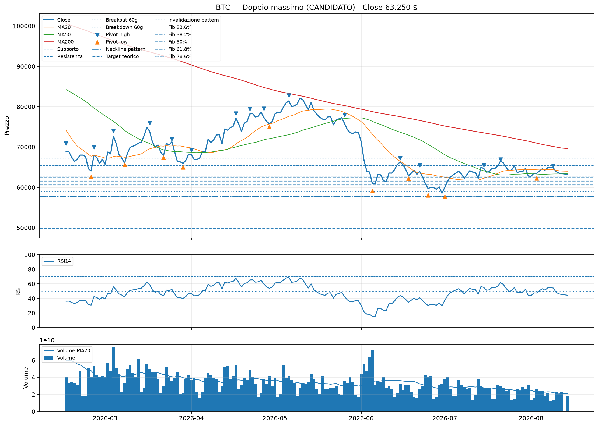

- Pattern principale: **Doppio massimo**
- Stato pattern: **CANDIDATO** (0)
- Famiglia: **ribassista**
- Confidenza lifecycle: **TECHNICAL STRUCTURE**
- Formazione: **2026-06-22 -> 2026-07-15**
- Età formazione: **7 giorni**
- Breakout pattern: **n/a**
- Età breakout: **n/a**
- Neckline: **57.748 $**
- Target teorico: **49.952 $**
- Progresso verso target: **n/a**
- Distanza dalla neckline: **14,67%**
- Fonte lifecycle: **technical_structure_metrics.csv**
- Fibonacci: **Fib 23,6% TENUTO (0) @ 63.676 $** — Swing UP 2026-07-01 57.748 -> 2026-07-15 65.508; livello più vicino 23.6% a 63.676; stato TENUTO; confluenza: nessuna confluenza indipendente.
- Invalidazione: **58.903 $**
- Relazione prezzo/neckline: **sopra neckline**
- Dettaglio: Due massimi simili vicino a 65.544 tra 2026-06-22 e 2026-07-15. Neckline ribassista stimata: 57.748. Stato: CANDIDATO; la neckline non è ancora stata rotta con un margine di almeno 0.50%. Età della formazione: 7 giorni. Fonte lifecycle: technical_structure_metrics.csv.
- Candela più recente: **Nessuna candela forte**
- Stato prezzo: **NEL RANGE**
- Supporto: **65.639 $**
- Resistenza: **67.248 $**
- Breakout 60g: **78.101 $**
- Breakdown 60g: **57.748 $**
- RSI14: **60.61**
- ATR14: **2,34%**
- Volume ratio 20g: **1.17**
- Rendimento 30g: **+4,72%**
- Rendimento 90g: **-15,32%**

### Pattern trovati

| Pattern | Stato | Score | Famiglia | Neckline | Breakout | Età | Target | Progresso | Distanza neckline | Invalidazione | Dettaglio |
| --- | --- | --- | --- | --- | --- | --- | --- | --- | --- | --- | --- |
| Doppio massimo | CANDIDATO | 0 | ribassista | 57.748 $ | n/a | n/a | 49.952 $ | n/a | 14,67% | 58.903 $ | Due massimi simili a 65.544 $ e 65.508 $. Neckline circa 57.748 $. Stato: CANDIDATO; la neckline non è ancora stata rotta con un margine di almeno 0.50%. Età formazione: 7 giorni. |
| Triangolo discendente possibile | CANDIDATO | 0 | ribassista | n/a | n/a | n/a | n/a | n/a | n/a | n/a | Massimi decrescenti e supporto quasi piatto. Stato: CANDIDATO; il pattern non ha una neckline univoca da usare per il lifecycle. |
| Doppio minimo | CANDIDATO | 0 | rialzista | 67.248 $ | n/a | n/a | 76.748 $ | n/a | 1,55% | 65.903 $ | Due minimi simili a 59.109 $ e 57.748 $. Neckline circa 67.248 $. Stato: CANDIDATO; la neckline non è ancora stata rotta con un margine di almeno 0.50%. Età formazione: 21 giorni. |

## SOL

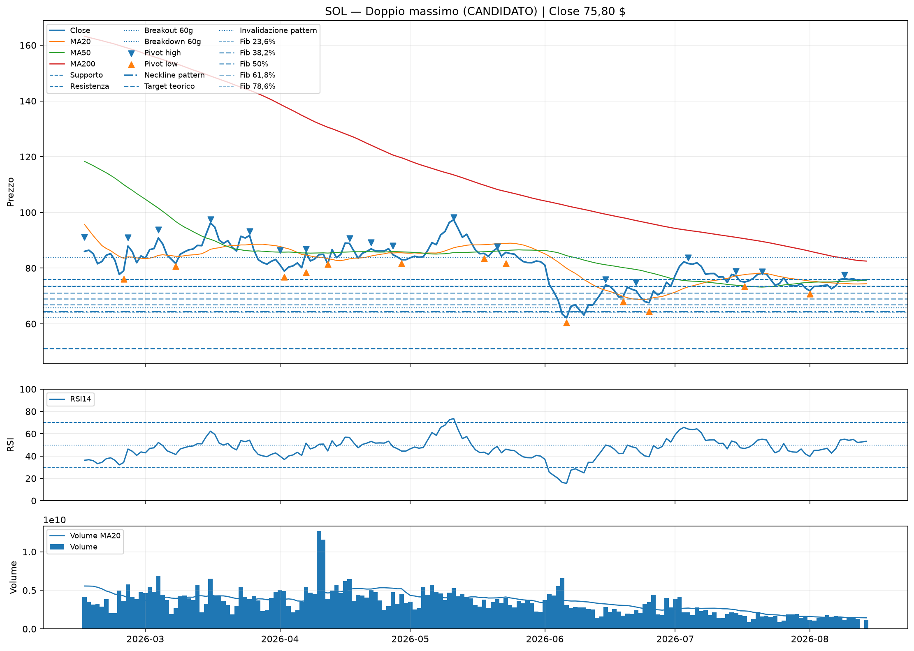

- Pattern principale: **Doppio minimo**
- Stato pattern: **MATURO** (+1)
- Famiglia: **rialzista**
- Confidenza lifecycle: **TECHNICAL STRUCTURE**
- Formazione: **2026-06-06 -> 2026-06-25**
- Età formazione: **27 giorni**
- Breakout pattern: **2026-07-01**
- Età breakout: **21 giorni**
- Neckline: **75,94 $**
- Target teorico: **91,46 $**
- Progresso verso target: **12,25%**
- Distanza dalla neckline: **n/a**
- Fonte lifecycle: **technical_structure_metrics.csv**
- Fibonacci: **Fib 23,6% REJECTION (-1) @ 79,27 $** — Swing DOWN 2026-05-11 98,27 -> 2026-07-17 73,40; livello più vicino 23.6% a 79,27; stato REJECTION; confluenza: resistenza tecnica.
- Invalidazione: **74,42 $**
- Relazione prezzo/neckline: **sopra neckline**
- Dettaglio: Due minimi simili vicino a 60,41 tra 2026-06-06 e 2026-06-25. Neckline stimata: 75,94. Breakout neckline: 2026-07-01 (21 giorni fa). Stato: MATURO. Target teorico: 91,46; progresso corrente: 12,25%. Relazione prezzo/neckline: sopra neckline. Fonte lifecycle: technical_structure_metrics.csv.
- Candela più recente: **Nessuna candela forte**
- Stato prezzo: **NEL RANGE**
- Supporto: **76,82 $**
- Resistenza: **78,88 $**
- Breakout 60g: **87,79 $**
- Breakdown 60g: **60,41 $**
- RSI14: **54.42**
- ATR14: **2,87%**
- Volume ratio 20g: **0.79**
- Rendimento 30g: **+7,49%**
- Rendimento 90g: **-10,44%**

### Pattern trovati

| Pattern | Stato | Score | Famiglia | Neckline | Breakout | Età | Target | Progresso | Distanza neckline | Invalidazione | Dettaglio |
| --- | --- | --- | --- | --- | --- | --- | --- | --- | --- | --- | --- |
| Doppio minimo | MATURO | +1 | rialzista | 75,94 $ | 2026-07-01 | 21g | 91,46 $ | 12,25% | n/a | 74,42 $ | Due minimi simili vicino a 60,41 tra 2026-06-06 e 2026-06-25. Neckline stimata: 75,94. Breakout neckline: 2026-07-01 (21 giorni fa). Stato: MATURO. Target teorico: 91,46; progresso corrente: 12,25%. Relazione prezzo/neckline: sopra neckline. Fonte lifecycle: technical_structure_metrics.csv. |
| Testa e spalle inverso | CANDIDATO | 0 | rialzista | 79,35 $ | n/a | n/a | 94,28 $ | n/a | 1,94% | 77,76 $ | Spalla sinistra 67,92 $, testa 64,42 $, spalla destra 73,40 $. Neckline circa 79,35 $. Stato: CANDIDATO; la neckline non è ancora stata rotta con un margine di almeno 0.50%. Età formazione: 5 giorni. |
| Doppio massimo | CANDIDATO | 0 | ribassista | 64,42 $ | n/a | n/a | 49,96 $ | n/a | 20,84% | 65,71 $ | Due massimi simili a 75,94 $ e 78,88 $. Neckline circa 64,42 $. Stato: CANDIDATO; la neckline non è ancora stata rotta con un margine di almeno 0.50%. Età formazione: 7 giorni. |
| Doppio minimo | CANDIDATO | 0 | rialzista | 98,27 $ | n/a | n/a | 114,91 $ | n/a | 26,24% | 96,30 $ | Due minimi simili a 81,63 $ e 81,69 $. Neckline circa 98,27 $. Stato: CANDIDATO; la neckline non è ancora stata rotta con un margine di almeno 0.50%. Età formazione: 60 giorni. |
| Testa e spalle | TARGET RAGGIUNTO | 0 | ribassista | 82,57 $ | 2026-05-28 | 55g | 66,88 $ | 30,15% | n/a | 84,22 $ | Spalla sinistra 88,05 $, testa 98,27 $, spalla destra 87,79 $. Neckline circa 82,57 $. Breakout neckline: 2026-05-28 (55 giorni fa). Stato: TARGET RAGGIUNTO. Target teorico: 66,88 $; progresso: 30,15%; prezzo sotto neckline. |

## DOGE

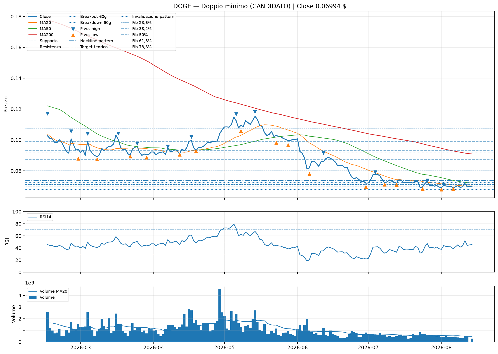

- Pattern principale: **Triplo massimo**
- Stato pattern: **MATURO** (-1)
- Famiglia: **ribassista**
- Confidenza lifecycle: **TECHNICAL STRUCTURE**
- Formazione: **2026-03-25 -> 2026-06-12**
- Età formazione: **40 giorni**
- Breakout pattern: **2026-06-24**
- Età breakout: **28 giorni**
- Neckline: **0.07809 $**
- Target teorico: **0.05847 $**
- Progresso verso target: **25,10%**
- Distanza dalla neckline: **n/a**
- Fonte lifecycle: **technical_structure_metrics.csv**
- Fibonacci: **Fib 23,6% NON ATTIVO (0) @ 0.08213 $** — Swing DOWN 2026-05-14 0.11825 -> 2026-07-13 0.07097; livello più vicino 23.6% a 0.08213; stato NON ATTIVO; confluenza: nessuna confluenza indipendente.
- Invalidazione: **0.07966 $**
- Relazione prezzo/neckline: **sotto neckline**
- Dettaglio: Tre massimi simili vicino a 0.09772 dal 2026-03-25 al 2026-06-12. Neckline ribassista stimata: 0.07809. Breakout neckline: 2026-06-24 (28 giorni fa). Stato: MATURO. Target teorico: 0.05847; progresso corrente: 25,10%. Relazione prezzo/neckline: sotto neckline. Fonte lifecycle: technical_structure_metrics.csv.
- Candela più recente: **Shooting star / rejection alto**
- Stato prezzo: **NEL RANGE**
- Supporto: **0.07107 $**
- Resistenza: **0.07923 $**
- Breakout 60g: **0.10895 $**
- Breakdown 60g: **0.06961 $**
- RSI14: **41.83**
- ATR14: **2,74%**
- Volume ratio 20g: **1.01**
- Rendimento 30g: **-10,96%**
- Rendimento 90g: **-23,57%**

### Pattern trovati

| Pattern | Stato | Score | Famiglia | Neckline | Breakout | Età | Target | Progresso | Distanza neckline | Invalidazione | Dettaglio |
| --- | --- | --- | --- | --- | --- | --- | --- | --- | --- | --- | --- |
| Triplo massimo | MATURO | -1 | ribassista | 0.07809 $ | 2026-06-24 | 28g | 0.05847 $ | 25,10% | n/a | 0.07966 $ | Tre massimi simili vicino a 0.09772 dal 2026-03-25 al 2026-06-12. Neckline ribassista stimata: 0.07809. Breakout neckline: 2026-06-24 (28 giorni fa). Stato: MATURO. Target teorico: 0.05847; progresso corrente: 25,10%. Relazione prezzo/neckline: sotto neckline. Fonte lifecycle: technical_structure_metrics.csv. |
| Doppio massimo | MATURO | -1 | ribassista | 0.07809 $ | 2026-06-24 | 28g | 0.06035 $ | 27,76% | n/a | 0.07966 $ | Due massimi simili a 0.09584 $ e 0.09169 $. Neckline circa 0.07809 $. Breakout neckline: 2026-06-24 (28 giorni fa). Stato: MATURO. Target teorico: 0.06035 $; progresso: 27,76%; prezzo sotto neckline. |
| Doppio minimo | CANDIDATO | 0 | rialzista | 0.07923 $ | n/a | n/a | 0.08886 $ | n/a | 8,29% | 0.07765 $ | Due minimi simili a 0.06961 $ e 0.07097 $. Neckline circa 0.07923 $. Stato: CANDIDATO; la neckline non è ancora stata rotta con un margine di almeno 0.50%. Età formazione: 9 giorni. |
| Triangolo discendente possibile | CANDIDATO | 0 | ribassista | n/a | n/a | n/a | n/a | n/a | n/a | n/a | Massimi decrescenti e supporto quasi piatto. Stato: CANDIDATO; il pattern non ha una neckline univoca da usare per il lifecycle. |

## Stati del ciclo di vita

- **CANDIDATO**: geometria presente, ma neckline non ancora rotta; score 0.
- **ATTIVO**: breakout avvenuto da 0 a 3 giorni; score prudente ±1.
- **CONFERMATO RECENTE**: breakout da 4 a 14 giorni; score ±2.
- **MATURO**: breakout più vecchio di 14 giorni e ancora valido; score ridotto ±1.
- **TARGET RAGGIUNTO**: movimento teorico già completato; score 0.
- **INVALIDATO**: due chiusure consecutive oltre la soglia opposta; score 0.

## Come leggerlo

- Il grafico in alto mostra prezzo, MA20, MA50, MA200, supporti, resistenze, neckline, target, invalidazione e livelli Fibonacci.
- Il pannello centrale mostra RSI14.
- Il pannello basso mostra volume e media volume 20 giorni.
- Un pattern CANDIDATO non è un segnale operativo: il progresso target resta n/a e viene mostrata soltanto la distanza dalla neckline.
- TARGET RAGGIUNTO e INVALIDATO restano visibili per memoria storica, ma valgono 0.
- Il pattern principale usa come fonte autorevole il lifecycle di technical_structure_metrics.csv; il detector visuale resta di supporto grafico.
- Fibonacci non crea un segnale autonomo: pesa al massimo ±1 nel Technical Structure solo con una confluenza indipendente.

Nota: questi pattern sono riconosciuti con regole algoritmiche semplici. Sono utili per visualizzare il grafico, ma vanno sempre controllati a occhio.
<!-- CLASSIC_TECHNICAL_VISUAL_END -->

<!-- COMPACT_SECTION_END:classic_visual -->

<!-- COMPACT_SECTION_START:fractal_path -->

<strong>🛤️ Tracking percorso frattale SOL/BTC</strong>

<!-- FRACTAL_PATH_TRACKER_START -->
# Tracking percorso frattale SOL/BTC

Generato: 2026-07-22 05:14 UTC

<!-- DIRECT_REPORT_LINK -->
Report separato completo: [fractal_path_tracker.md](fractal_path_tracker.md)

Questo modulo separa due percorsi che prima potevano essere confusi:

- **percorso ancorato al bottom**: continua la scala originale BTC 2022 -> SOL 2026 e misura l'aderenza reale;
- **scenario riancorato oggi**: parte dal prezzo SOL corrente e replica solo i movimenti futuri di BTC; e uno scenario condizionale, non una conferma del frattale.

## Stato letto dal frattale principale

- Fonte metadati: **structured_csv**
- Data corrente: **2026-07-22**
- Bottom SOL usato: **2026-06-06**
- Bottom BTC equivalente: **2022-11-21**
- Giorno BTC equivalente: **2023-01-06**
- Inizio programma/scanner: **2026-07-03**
- Prezzo SOL corrente: **77,84 $**
- Verdetto principale: **ANALOGIA DEBOLE / SCENARIO SECONDARIO**
- Somiglianza strutturale: **+64,69%**
- Aderenza live principale: **+63,34%**
- Errore medio live principale: **18,33%**
- Peso operativo suggerito: **0**
- Fase: **FRATTALE SOLO DI CONTESTO**
- Rischio fase: **ALTO**

## Aderenza del percorso ancorato

- Giorno corrente dal bottom: **46**
- Osservazioni inclusive dal bottom: **47**
- Osservazioni da inizio programma/scanner: **20**
- Errore assoluto medio dal bottom: **11,26%**
- Errore assoluto medio da inizio programma: **18,33%**
- Gap firmato medio ultimi 7 giorni: **+16,00%**
- Errore assoluto medio ultimi 7 giorni: **16,00%**
- Gap ultimo giorno: **+16,57%**
- Stato aderenza: **STACCATO / MOLTO IN ANTICIPO**

## Grafico completo: due percorsi distinti

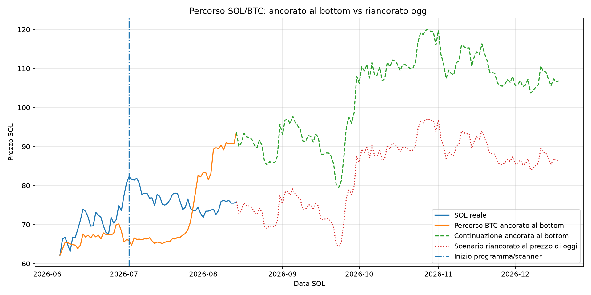

La linea **ancorata al bottom** serve a verificare il frattale originale. La linea **riancorata oggi** serve soltanto come scenario futuro condizionale.

## Grafico backtest dal bottom

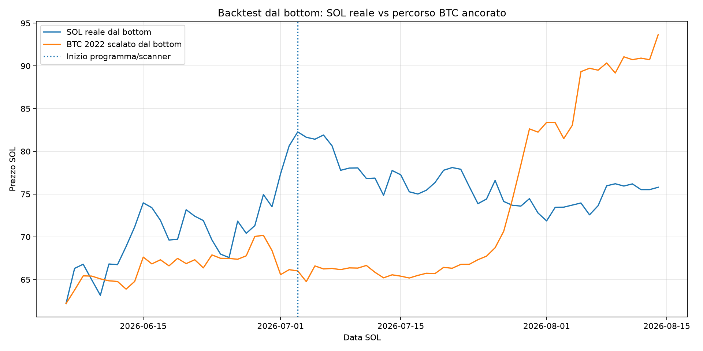

## Grafico gap SOL vs BTC scalato

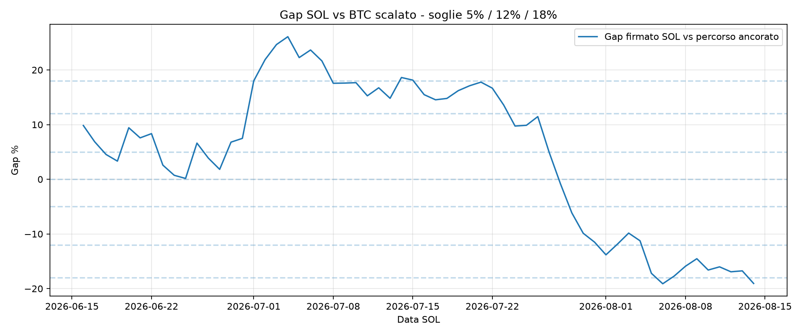

### Lettura rapida gap

- Ultimo gap firmato: **+16,57%**
- Gap firmato medio 7g: **+16,00%**
- Errore assoluto medio 7g: **16,00%**
- Variazione recente gap: **+0,36%**
- Stato gap: **IN DEVIAZIONE SOPRA IL FRATTALE**
- Trend gap: **SOL resta sopra il percorso ancorato con distacco quasi stabile**

Soglie operative del grafico:

- entro **±5%**: percorso vicino;
- tra **±5% e ±12%**: deviazione gestibile;
- oltre **±12%**: frattale non abbastanza aderente per conferma operativa;
- oltre **±18%**: disallineamento marcato.

## Ultimi giorni del confronto ancorato

|   Giorno | Data SOL   | Data BTC eq.   | SOL reale   | Percorso ancorato   | Gap firmato   | Fase                |
|---------:|:-----------|:---------------|:------------|:--------------------|:--------------|:--------------------|
| 37 | 2026-07-13 | 2022-12-28 | 74,86 $ | 65,20 $ | +14,81% | da inizio programma |
| 38 | 2026-07-14 | 2022-12-29 | 77,76 $ | 65,56 $ | +18,62% | da inizio programma |
| 39 | 2026-07-15 | 2022-12-30 | 77,26 $ | 65,40 $ | +18,14% | da inizio programma |
| 40 | 2026-07-16 | 2022-12-31 | 75,27 $ | 65,18 $ | +15,48% | da inizio programma |
| 41 | 2026-07-17 | 2023-01-01 | 75,01 $ | 65,49 $ | +14,54% | da inizio programma |
| 42 | 2026-07-18 | 2023-01-02 | 75,46 $ | 65,74 $ | +14,79% | da inizio programma |
| 43 | 2026-07-19 | 2023-01-03 | 76,36 $ | 65,71 $ | +16,21% | da inizio programma |
| 44 | 2026-07-20 | 2023-01-04 | 77,79 $ | 66,43 $ | +17,11% | da inizio programma |
| 45 | 2026-07-21 | 2023-01-05 | 77,79 $ | 66,32 $ | +17,29% | da inizio programma |
| 46 | 2026-07-22 | 2023-01-06 | 77,84 $ | 66,78 $ | +16,57% | da inizio programma |

## Proiezione futura salvata

| Orizzonte   | Data target   | Percorso ancorato   | Scenario riancorato oggi   | Min/max riancorato   | Controllato   | Prezzo reale   | Errore riancorato   | Errore ancorato   |
|:------------|:--------------|:--------------------|:---------------------------|:---------------------|:--------------|:---------------|:--------------------|:------------------|
| 7g | 2026-07-29 | 78,43 $ | 91,42 $ | 77,84 $ / 91,42 $ | no | n/a | n/a | n/a |
| 14g | 2026-08-05 | 89,33 $ | 104,13 $ | 77,84 $ / 104,13 $ | no | n/a | n/a | n/a |
| 21g | 2026-08-12 | 90,91 $ | 105,97 $ | 77,84 $ / 106,15 $ | no | n/a | n/a | n/a |
| 28g | 2026-08-19 | 92,37 $ | 107,67 $ | 77,84 $ / 109,17 $ | no | n/a | n/a | n/a |
| 35g | 2026-08-26 | 85,29 $ | 99,42 $ | 77,84 $ / 109,17 $ | no | n/a | n/a | n/a |
| 42g | 2026-09-02 | 96,77 $ | 112,80 $ | 77,84 $ / 112,80 $ | no | n/a | n/a | n/a |
| 49g | 2026-09-09 | 91,38 $ | 106,52 $ | 77,84 $ / 114,01 $ | no | n/a | n/a | n/a |
| 56g | 2026-09-16 | 88,09 $ | 102,68 $ | 77,84 $ / 114,01 $ | no | n/a | n/a | n/a |
| 63g | 2026-09-23 | 79,52 $ | 92,70 $ | 77,84 $ / 114,01 $ | no | n/a | n/a | n/a |
| 70g | 2026-09-30 | 108,03 $ | 125,93 $ | 77,84 $ / 125,93 $ | no | n/a | n/a | n/a |
| 77g | 2026-10-07 | 108,30 $ | 126,24 $ | 77,84 $ / 130,10 $ | no | n/a | n/a | n/a |
| 84g | 2026-10-14 | 112,18 $ | 130,77 $ | 77,84 $ / 130,77 $ | no | n/a | n/a | n/a |
| 91g | 2026-10-21 | 110,01 $ | 128,23 $ | 77,84 $ / 130,77 $ | no | n/a | n/a | n/a |
| 98g | 2026-10-28 | 120,09 $ | 139,98 $ | 77,84 $ / 139,98 $ | no | n/a | n/a | n/a |
| 105g | 2026-11-04 | 107,45 $ | 125,25 $ | 77,84 $ / 139,98 $ | no | n/a | n/a | n/a |
| 112g | 2026-11-11 | 115,58 $ | 134,72 $ | 77,84 $ / 139,98 $ | no | n/a | n/a | n/a |
| 119g | 2026-11-18 | 116,34 $ | 135,62 $ | 77,84 $ / 139,98 $ | no | n/a | n/a | n/a |
| 126g | 2026-11-25 | 105,59 $ | 123,08 $ | 77,84 $ / 139,98 $ | no | n/a | n/a | n/a |

La colonna **Percorso ancorato** continua la scala dal bottom. La colonna **Scenario riancorato oggi** riparte dal prezzo corrente e non cancella, nei controlli, il gap gia accumulato.

## Accuratezza storica della proiezione futura

| Orizzonte   |   Controlli | Dentro banda riancorata   | Errore ass. riancorato   | Errore ass. ancorato   |
|:------------|------------:|:--------------------------|:-------------------------|:-----------------------|
| 7g | 8 | 37,50% | 1,53% | 16,08% |
| 14g | 0 | n/a | n/a | n/a |
| 21g | 0 | n/a | n/a | n/a |
| 28g | 0 | n/a | n/a | n/a |
| 35g | 0 | n/a | n/a | n/a |
| 42g | 0 | n/a | n/a | n/a |
| 49g | 0 | n/a | n/a | n/a |
| 56g | 0 | n/a | n/a | n/a |
| 63g | 0 | n/a | n/a | n/a |
| 70g | 0 | n/a | n/a | n/a |
| 77g | 0 | n/a | n/a | n/a |
| 84g | 0 | n/a | n/a | n/a |
| 91g | 0 | n/a | n/a | n/a |
| 98g | 0 | n/a | n/a | n/a |
| 105g | 0 | n/a | n/a | n/a |
| 112g | 0 | n/a | n/a | n/a |
| 119g | 0 | n/a | n/a | n/a |
| 126g | 0 | n/a | n/a | n/a |

## Regola di lettura

- La somiglianza strutturale descrive la forma.
- Il gap ancorato descrive la distanza reale dal percorso.
- Lo scenario riancorato non dimostra che il frattale sia valido.
- Prima di pesare il modulo servono milestone maturate e un errore ancorato accettabile.
<!-- FRACTAL_PATH_TRACKER_END -->

<!-- SOL_BTC_FRACTAL_HISTORY_START -->

---

# Storico frattale SOL/BTC

Per vedere la tabella giorno per giorno devi aprire/cliccare questo file:

**[sol_btc_fractal_history.md](sol_btc_fractal_history.md)**

Ultima lettura salvata: **2026-07-22** — SOL 77,84 $, gap +16,57%, somiglianza +64,69%.

Nel report principale lascio solo il link, così non diventa troppo lungo.

<!-- SOL_BTC_FRACTAL_HISTORY_END -->

<!-- COMPACT_SECTION_END:fractal_path -->

<!-- COMPACT_SECTION_START:exchange_microstructure -->

<strong>🏦 Dati exchange, liquidità e leva</strong>

<!-- EXCHANGE_MICROSTRUCTURE_START -->
# Dati exchange, liquidità e leva

Generato: 2026-07-22 05:14 UTC

<!-- DIRECT_REPORT_LINK -->
Report separato completo: [exchange_microstructure_report.md](exchange_microstructure_report.md)

Questo modulo legge Kraken Futures, Bitget Futures e KuCoin Futures come nucleo derivati. OKX e Coinbase vengono raccolti come fonti ausiliarie non pesate.
Non modifica la formula matematica di RSI, Fibonacci o Wyckoff: controlla se quei segnali sono sostenuti da acquisti, vendite, OI, funding e liquidità.

**Limite importante:** questo nucleo non assume disponibile un feed pubblico completo delle liquidazioni. La componente liquidazioni resta neutrale; le zone future restano stime di pressione, non dati certi delle singole posizioni.

Diagnostica completa: [exchange_source_diagnostics.md](exchange_source_diagnostics.md)

## Sintesi

| Asset | Prezzo | Exchange | Segnale candidato | Peso Global | Bias exchange | Confidenza | Copertura | Funding 8h eq. | OI 24h | Taker flow (campione/4h) | Book 0,5% | Liq long campione | Liq short campione |
| --- | --- | --- | --- | --- | --- | --- | --- | --- | --- | --- | --- | --- | --- |
| BTC | 66.242 $ | 3 | 0 | 0 | LEGGERMENTE POSITIVA / NON PESATA | ALTA | 100% | -0,0137% | +3,44% | 1,21 | +1,49% | 0 $ | 0 $ |
| SOL | 77,84 $ | 3 | 0 | 0 | LEGGERMENTE POSITIVA / NON PESATA | MEDIA | 100% | +0,0005% | +6,24% | 1,93 | +6,76% | 0 $ | 0 $ |
| DOGE | 0.07326 $ | 3 | 0 | 0 | MISTA / NEUTRALE | BASSA | 100% | +0,0100% | +2,24% | 0,95 | +0,22% | 0 $ | 0 $ |

Il segnale candidato è limitato a **±1**, ma il peso nel Global resta **0** finché il tracker a 7 giorni non raggiunge 30 controlli, almeno 55% di accuratezza e return corretto direzione positivo. Un singolo muro o funding non basta.

La colonna taker usa un campione recente nel primo run. Dopo almeno 3 fotografie distribuite su almeno 45 minuti viene sostituita automaticamente dalla media intraday 4h.

## Dati separati per exchange

| Asset | Exchange | Stato | Funding 8h eq. | Open interest | Taker flow | Book 0,5% |
| --- | --- | --- | --- | --- | --- | --- |
| BTC | Kraken | OK | +0,0031% | 143,21 mln $ | 0,06 | +4,52% |
| BTC | Bitget | OK | +0,0002% | 2,32 mld $ | 0,09 | +79,70% |
| BTC | Kucoin | OK | -0,0190% | 1,85 mld $ | 0,62 | +4,18% |
| SOL | Kraken | OK | -0,0167% | 15,95 mln $ | 7,30 | +5,47% |
| SOL | Bitget | OK | +0,0067% | 359,13 mln $ | 19,49 | -14,55% |
| SOL | Kucoin | OK | -0,0175% | 303,43 mln $ | 1,95 | +45,69% |
| DOGE | Kraken | OK | +0,0384% | 3,36 mln $ | 0,20 | +25,70% |
| DOGE | Bitget | OK | +0,0100% | 88,32 mln $ | 0,15 | +6,29% |
| DOGE | Kucoin | OK | +0,0100% | 119,31 mln $ | 0,15 | -10,65% |

Kraken, Bitget e KuCoin contribuiscono a funding normalizzato, open interest, trade aggressivi e order book. Non viene inventato un long/short ratio pubblico né un feed completo delle liquidazioni.

## Conferme per indicatori tecnici

### BTC

- Score grezzo exchange: **+3,50**; candidato: **0**; peso Global: **0**.
- Attivazione Global: **LOCKED / RACCOLTA 7G** — controlli 7g 0, accuratezza n/a.
- Fonti disponibili: Kraken **SI**, Bitget **SI**, KuCoin **SI**.
- Consenso multi-exchange: bull 0, bear 1, divergenze 0.
- Flusso taker/order book: **+1,75**.
- OI/funding/basis: **+1,00**.
- Affollamento long/short: **+0,00**.
- Liquidazioni: **NON PESATE / FEED COMPLETO NON ASSUNTO DISPONIBILE**.
- **Wyckoff:** Markdown non pienamente confermato: compare assorbimento compratore.
- **Fibonacci:** Fibonacci tenuto con acquisti/assorbimento coerenti: conferma positiva.
- **RSI:** RSI in zona non estrema o flusso exchange non abbastanza netto.
- **Pattern:** I pattern candidati restano non operativi: i dati exchange possono solo preparare la conferma.
- **Breakout/breakdown:** Resistenza vicina con acquisti aggressivi: breakout più credibile, ma serve chiusura sopra il livello.
- **Mappa liquidità attuale:** muro bid: n/a; muro ask: n/a

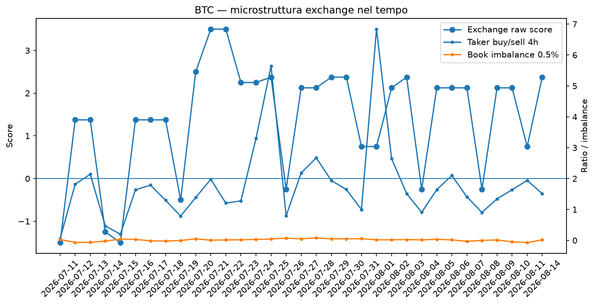

### SOL

- Score grezzo exchange: **+2,25**; candidato: **0**; peso Global: **0**.
- Attivazione Global: **LOCKED / RACCOLTA 7G** — controlli 7g 0, accuratezza n/a.
- Fonti disponibili: Kraken **SI**, Bitget **SI**, KuCoin **SI**.
- Consenso multi-exchange: bull 3, bear 0, divergenze 0.
- Flusso taker/order book: **+1,75**.
- OI/funding/basis: **+0,00**.
- Affollamento long/short: **+0,00**.
- Liquidazioni: **NON PESATE / FEED COMPLETO NON ASSUNTO DISPONIBILE**.
- **Wyckoff:** Fase Wyckoff non abbastanza chiara per una conferma exchange.
- **Fibonacci:** Fibonacci rejection; nessuna conferma exchange netta. Confluenza tecnica dichiarata: resistenza tecnica.
- **RSI:** RSI in zona non estrema o flusso exchange non abbastanza netto.
- **Pattern:** Doppio minimo maturo sostenuto dal flusso exchange.
- **Breakout/breakdown:** Resistenza vicina con acquisti aggressivi: breakout più credibile, ma serve chiusura sopra il livello.
- **Mappa liquidità attuale:** muro bid: n/a; muro ask: n/a

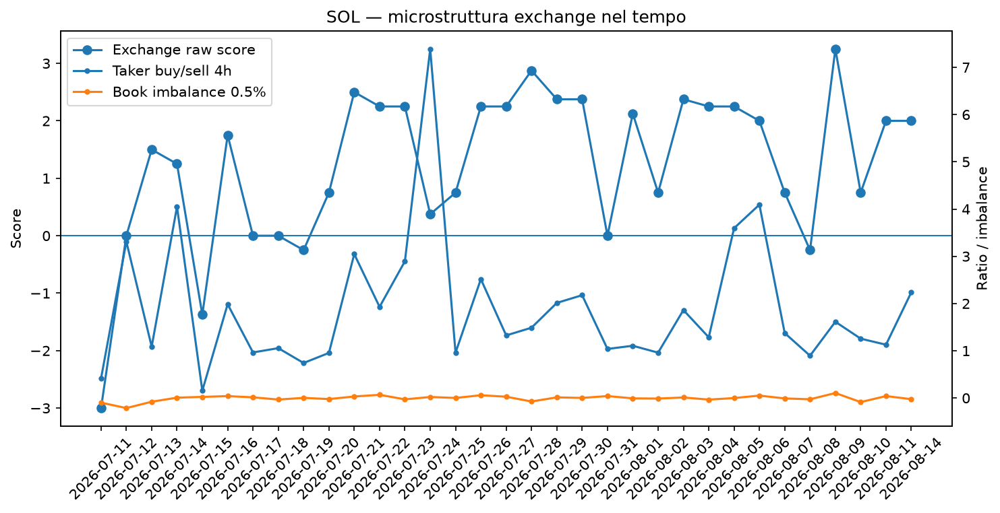

### DOGE

- Score grezzo exchange: **+0,75**; candidato: **0**; peso Global: **0**.
- Attivazione Global: **LOCKED / RACCOLTA 7G** — controlli 7g 0, accuratezza n/a.
- Fonti disponibili: Kraken **SI**, Bitget **SI**, KuCoin **SI**.
- Consenso multi-exchange: bull 1, bear 2, divergenze 0.
- Flusso taker/order book: **+0,75**.
- OI/funding/basis: **+0,00**.
- Affollamento long/short: **+0,00**.
- Liquidazioni: **NON PESATE / FEED COMPLETO NON ASSUNTO DISPONIBILE**.
- **Wyckoff:** Possibile accumulazione ancora neutrale nei dati exchange.
- **Fibonacci:** Fibonacci non_attivo; nessuna conferma exchange netta.
- **RSI:** RSI in zona non estrema o flusso exchange non abbastanza netto.
- **Pattern:** I pattern candidati restano non operativi: i dati exchange possono solo preparare la conferma.
- **Breakout/breakdown:** Prezzo non abbastanza vicino a un livello chiave o flusso non netto.
- **Mappa liquidità attuale:** muro bid: n/a; muro ask: n/a

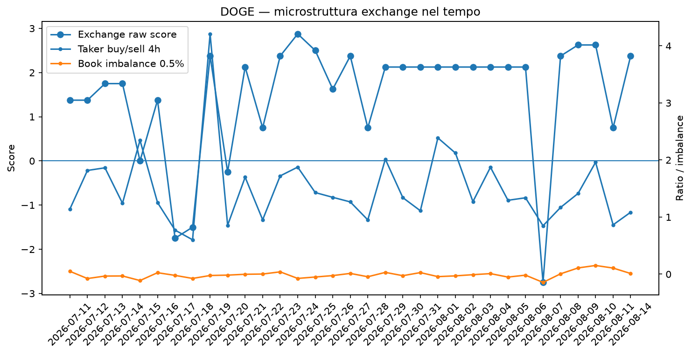

## Overlay sulle previsioni a 30 giorni

La previsione storica grezza dello scanner resta intatta. L'overlay exchange può correggerla solo dopo almeno 30 controlli maturati a 30 giorni e solo se il modulo dimostra accuratezza direzionale almeno del 55%.

| Asset | Prob. grezza salita | Return p50 grezzo | Controlli 30g | Accuratezza exchange | Stato overlay | Peso | Prob. corretta | Return corretto |
| --- | --- | --- | --- | --- | --- | --- | --- | --- |
| BTC | +60,00% | +9,39% | 0 | n/a | RACCOLTA DATI | 0,00 | +60,00% | +9,39% |
| SOL | +47,50% | -0,93% | 0 | n/a | RACCOLTA DATI | 0,00 | +47,50% | -0,93% |
| DOGE | +37,50% | -7,77% | 0 | n/a | RACCOLTA DATI | 0,00 | +37,50% | -7,77% |

## Dati salvati

- `exchange_market_data_snapshot.json`: fotografia derivata Kraken + Bitget + KuCoin, con OKX e Coinbase ausiliari.
- `exchange_market_data_intraday.csv`: memoria operativa mobile degli ultimi 180 giorni, ripristinata da due copie ridondanti su GitHub Releases.
- `exchange_intraday_YYYY-MM.csv.gz`: archivio mensile permanente dei dati intraday, creato dopo la chiusura del mese.
- `exchange_microstructure_metrics.csv`: score e conferme correnti lette dal Global.
- `exchange_microstructure_history.csv`: prima fotografia giornaliera congelata, usata per valutare le previsioni.
- `exchange_signal_tracker_metrics.csv`: accuratezza a 1/3/7/14/30 giorni.
- `exchange_prediction_overlay.csv`: confronto scanner grezzo vs overlay calibrato.

## Regole di prudenza

- Un muro dell'order book può essere cancellato: non è un supporto garantito.
- Funding, OI e flusso misurano pressione/affollamento, non direzione certa.
- OI in aumento conta soltanto insieme alla direzione del prezzo e al taker flow.
- La componente liquidazioni resta neutrale finché non esiste un feed pubblico completo e verificato.
- Prima dei 30 controlli a 7g il modulo non pesa nel Global; prima dei 30 controlli a 30g l'overlay non altera le previsioni.

Salute fonti: **OK** — coppie exchange/asset disponibili: 9/9. Kraken OK; Bitget OK; KuCoin OK.
Fonti ausiliarie non pesate: OKX OK; Coinbase PARZIALE. Copertura ausiliaria: 3/6.
Storage persistente: **OK** — ultimo asset: exchange_state_A.tar.gz.
<!-- EXCHANGE_MICROSTRUCTURE_END -->

<!-- COMPACT_SECTION_END:exchange_microstructure -->

<!-- COMPACT_SECTION_START:exchange_signal_tracker -->

<strong>🧠 Accuratezza segnali exchange</strong>

<!-- EXCHANGE_SIGNAL_TRACKER_START -->
# Accuratezza dati exchange e microstruttura

Generato: 2026-07-22 05:14 UTC

<!-- DIRECT_REPORT_LINK -->
Report separato completo: [exchange_signal_tracker_report.md](exchange_signal_tracker_report.md)

Questo tracker verifica se il segnale candidato exchange ±1 anticipa correttamente la direzione del prezzo a 1/3/7/14/30 giorni.
Il peso Global resta 0 finché l'orizzonte 7g non ha almeno 30 controlli, accuratezza almeno 55% e return corretto direzione positivo. L'overlay a 30g ha un gate separato.

Controlli maturati completati in questa esecuzione: **9**.

## Ultime fotografie giornaliere

| Data | Asset | Prezzo | Versione | Calibrazione | Candidato | Peso Global | Score raw | Confidenza | Taker 4h | OI 24h | Book 0,5% |
| --- | --- | --- | --- | --- | --- | --- | --- | --- | --- | --- | --- |
| 2026-07-22 | BTC | 66.242,06 | V2.1.3 | OK | 0 | 0 | 3,50 | ALTA | 1,21 | +3,44% | +1,49% |
| 2026-07-22 | DOGE | 0.07326 | V2.1.3 | OK | 0 | 0 | 0,75 | BASSA | 0,95 | +2,24% | +0,22% |
| 2026-07-22 | SOL | 77,84 | V2.1.3 | OK | 0 | 0 | 2,25 | MEDIA | 1,93 | +6,24% | +6,76% |
| 2026-07-21 | BTC | 65.482,28 | V2.1.3 | OK | 0 | 0 | 3,50 | ALTA | 1,98 | +2,64% | +0,77% |
| 2026-07-21 | DOGE | 0.07279 | V2.1.3 | OK | 0 | 0 | 2,12 | MEDIA | 1,70 | -1,89% | -0,20% |
| 2026-07-21 | SOL | 78,16 | V2.1.3 | OK | 1 | 0 | 2,50 | MEDIA | 3,05 | +1,19% | +3,26% |
| 2026-07-20 | BTC | 64.448,63 | V2.1.3 | OK | 1 | 0 | 2,50 | MEDIA | 1,39 | +1,07% | +4,99% |
| 2026-07-20 | DOGE | 0.07216 | V2.1.3 | OK | 0 | 0 | -0,25 | BASSA | 0,86 | +4,68% | -1,67% |
| 2026-07-20 | SOL | 76,36 | V2.1.3 | OK | 0 | 0 | 0,75 | BASSA | 0,95 | +0,11% | -2,20% |

## Accuratezza direzionale

| Asset | Orizzonte | Controlli | Accuratezza | Return corretto direzione | Drawdown medio | Max gain medio | Stato |
| --- | --- | --- | --- | --- | --- | --- | --- |
| BTC | 1g | 1 | +100,00% | +1,59% | +1,07% | +1,84% | FEEDBACK RAPIDO |
| BTC | 3g | 0 | n/a | n/a | n/a | n/a | RACCOLTA DATI |
| BTC | 7g | 0 | n/a | n/a | n/a | n/a | RACCOLTA DATI |
| BTC | 14g | 0 | n/a | n/a | n/a | n/a | RACCOLTA DATI |
| BTC | 30g | 0 | n/a | n/a | n/a | n/a | RACCOLTA DATI |
| SOL | 1g | 1 | +0,00% | -0,43% | -0,39% | +0,39% | FEEDBACK RAPIDO |
| SOL | 3g | 0 | n/a | n/a | n/a | n/a | RACCOLTA DATI |
| SOL | 7g | 0 | n/a | n/a | n/a | n/a | RACCOLTA DATI |
| SOL | 14g | 0 | n/a | n/a | n/a | n/a | RACCOLTA DATI |
| SOL | 30g | 0 | n/a | n/a | n/a | n/a | RACCOLTA DATI |
| DOGE | 1g | 0 | n/a | n/a | n/a | n/a | RACCOLTA DATI |
| DOGE | 3g | 0 | n/a | n/a | n/a | n/a | RACCOLTA DATI |
| DOGE | 7g | 0 | n/a | n/a | n/a | n/a | RACCOLTA DATI |
| DOGE | 14g | 0 | n/a | n/a | n/a | n/a | RACCOLTA DATI |
| DOGE | 30g | 0 | n/a | n/a | n/a | n/a | RACCOLTA DATI |

## Regole

- Sotto 30 controlli: solo raccolta dati; il segnale candidato non pesa nel Global.
- Da 30 controlli a 7g: il peso Global può attivarsi soltanto con accuratezza almeno 55% e return corretto direzione positivo.
- Da 30 controlli a 30g: l'overlay può attivarsi soltanto con accuratezza almeno 55%.
- Da 60 controlli: la lettura diventa più utile.
- Da 100 controlli: possibile revisione seria del peso ±1.
- Se l'accuratezza scende sotto 45%, l'overlay viene sospeso, non invertito automaticamente.
<!-- EXCHANGE_SIGNAL_TRACKER_END -->

<!-- COMPACT_SECTION_END:exchange_signal_tracker -->

<!-- COMPACT_SECTION_START:liquidations -->

<strong>💥 Futures e liquidazioni</strong>

<!-- LIQUIDATION_SUMMARY_START -->

---

# Sintesi semplice futures / liquidazioni

Report separato completo: [liquidation_report.md](liquidation_report.md)

**BTC** — BTC: i futures non danno una lettura chiara. Non si vede uno sbilanciamento forte né long né short. Qui pesa di più il report frattale.

**SOL** — SOL: i futures non danno una lettura chiara. Non si vede uno sbilanciamento forte né long né short. Qui pesa di più il report frattale.

**DOGE** — DOGE: i futures non danno una lettura chiara. Non si vede uno sbilanciamento forte né long né short. Qui pesa di più il report frattale.

| Asset | Prezzo | Funding | OI 24h | Long/Short | Lettura futures | Forza |
| --- | --- | --- | --- | --- | --- | --- |
| BTC | 66.220 $ | +0.0037% | -4.19% | 1.58 | Misto | 1/5 |
| SOL | 77,84 $ | +0.0010% | -10.42% | 2.04 | Misto | 1/5 |
| DOGE | 0.07317 $ | +0.0079% | -6.74% | 4.46 | Misto | 1/5 |

## Come usarla insieme al frattale

- Frattale ribassista + futures con rischio sotto = prudenza alta.
- Frattale rialzista + futures con rischio sopra = segnale più interessante.
- Frattale e futures opposti = situazione sporca, meglio non forzare.
- Per posizioni a leva, il futures report serve soprattutto a capire se può arrivare una pulizia violenta prima dei 30 giorni.

<!-- LIQUIDATION_SUMMARY_END -->

<!-- COMPACT_SECTION_END:liquidations -->

<!-- RSI_MULTI_TIMEFRAME_DIVERGENCE_START -->
# Divergenze RSI multi-timeframe — diagnostica

Generato: 2026-07-22 05:14 UTC

<!-- DIRECT_REPORT_LINK -->
Report separato completo: [rsi_multitimeframe_divergence_report.md](rsi_multitimeframe_divergence_report.md)

Il modulo confronta prezzo e RSI 14 sui pivot confermati **daily e weekly**. Riconosce divergenze regolari e nascoste, segnali in formazione, invalidazioni e semplice conferma del momentum.

**Peso operativo: 0.** Non modifica il Global Confluence, non cambia le soglie del Paper Trading e non apre né blocca operazioni. I risultati vengono misurati prima di qualsiasi futura decisione sul peso.

## Sintesi corrente

| Asset   | Daily            | Stato D       | Weekly              | Stato W    | Lettura weekly                                                                                                                |   Peso |
|:--------|:-----------------|:--------------|:--------------------|:-----------|:------------------------------------------------------------------------------------------------------------------------------|-------:|
| BTC     | Bullish regolare | CONFERMATA    | Bullish regolare    | CONFERMATA | Bullish regolare confermata sui due pivot del prezzo e dell'RSI. Contesto diagnostico: nessun punto operativo viene aggiunto. |      0 |
| SOL     | Hidden bearish   | IN_FORMAZIONE | Hidden bearish      | CONFERMATA | Hidden bearish confermata sui due pivot del prezzo e dell'RSI. Contesto diagnostico: nessun punto operativo viene aggiunto.   |      0 |
| DOGE    | Hidden bearish   | CONFERMATA    | Conferma ribassista | CONTESTO   | Prezzo e RSI stanno scendendo insieme: momentum ribassista confermato, nessuna bullish divergence attiva.                     |      0 |

## Dettaglio dei pivot

| Asset   | TF   | Tipo                | Stato         | Prezzo / RSI      | Pivot confrontati                                                   | Δ prezzo contesto   | Δ RSI contesto   |   Peso |
|:--------|:-----|:--------------------|:--------------|:------------------|:--------------------------------------------------------------------|:--------------------|:-----------------|-------:|
| BTC     | 1D   | Bullish regolare    | CONFERMATA    | 66.228 $ / 60,63  | 2026-06-25 58.076 $ / RSI 30,46 → 2026-07-01 57.748 $ / RSI 37,26   | n/a                 | n/a              |      0 |
| BTC     | 1W   | Bullish regolare    | CONFERMATA    | 66.228 $ / 41,87  | 2026-06-07 59.109 $ / RSI 34,23 → 2026-07-05 57.748 $ / RSI 38,20   | n/a                 | n/a              |      0 |
| SOL     | 1D   | Hidden bearish      | IN_FORMAZIONE | 77,82 $ / 54,37   | 2026-07-15 78,88 $ / RSI 52,25 → 2026-07-22 78,46 $ / RSI 54,37     | n/a                 | n/a              |      0 |
| SOL     | 1W   | Hidden bearish      | CONFERMATA    | 77,82 $ / 40,96   | 2026-05-17 98,27 $ / RSI 38,29 → 2026-07-05 83,81 $ / RSI 42,25     | n/a                 | n/a              |      0 |
| DOGE    | 1D   | Hidden bearish      | CONFERMATA    | 0.07317 $ / 41,83 | 2026-06-12 0.09169 $ / RSI 35,18 → 2026-07-04 0.07923 $ / RSI 41,65 | n/a                 | n/a              |      0 |
| DOGE    | 1W   | Conferma ribassista | CONTESTO      | 0.07317 $ / 33,91 | n/a                                                                 | -17,57%             | -3,48            |      0 |

### BTC

- **1D — Bullish regolare / CONFERMATA**: Bullish regolare confermata sui due pivot del prezzo e dell'RSI. Contesto diagnostico: nessun punto operativo viene aggiunto.
- **1W — Bullish regolare / CONFERMATA**: Bullish regolare confermata sui due pivot del prezzo e dell'RSI. Contesto diagnostico: nessun punto operativo viene aggiunto.

### SOL

- **1D — Hidden bearish / IN_FORMAZIONE**: Hidden bearish in formazione: il secondo estremo non è ancora un pivot confermato. Peso operativo sempre 0.
- **1W — Hidden bearish / CONFERMATA**: Hidden bearish confermata sui due pivot del prezzo e dell'RSI. Contesto diagnostico: nessun punto operativo viene aggiunto.

### DOGE

- **1D — Hidden bearish / CONFERMATA**: Hidden bearish confermata sui due pivot del prezzo e dell'RSI. Contesto diagnostico: nessun punto operativo viene aggiunto.
- **1W — Conferma ribassista / CONTESTO**: Prezzo e RSI stanno scendendo insieme: momentum ribassista confermato, nessuna bullish divergence attiva.

## Tracker live delle divergenze confermate

Viene salvato un solo evento per combinazione di asset, timeframe, tipo e coppia di pivot. Gli esiti vengono controllati dopo 30, 60, 90 e 180 giorni.

- Eventi indipendenti salvati: **5**.
- Soglie di lettura: **30 / 60 / 100 controlli**.
- Anche oltre le soglie il peso resta **0** finché non viene presa una decisione esplicita.

_Nessun controllo maturato: il tracker ha appena iniziato a raccogliere dati._

## Regole di prudenza

- Una divergenza **in formazione** può scomparire prima che il pivot sia confermato.
- Una divergenza weekly può anticipare il prezzo di diverse settimane.
- Prezzo in calo e RSI in calo non è bullish divergence: è conferma ribassista.
- Le divergenze restano dentro la famiglia tecnica e non vengono sommate come prova indipendente.
- Nessuna statistica di questo modulo autorizza automaticamente il trading reale.
<!-- RSI_MULTI_TIMEFRAME_DIVERGENCE_END -->

<!-- COMPACT_SECTION_START:technical_structure -->

<strong>🧱 Struttura tecnica completa e Fibonacci</strong>

<!-- TECHNICAL_STRUCTURE_START -->
# Report struttura tecnica

Generato: 2026-07-22 05:14 UTC

<!-- DIRECT_REPORT_LINK -->
Report separato completo: [technical_structure_report.md](technical_structure_report.md)

Questo report aggiunge al tuo scanner una lettura classica di analisi tecnica.

Moduli inclusi:

- Struttura trend con MA20 / MA50 / MA200
- Massimi e minimi crescenti oppure decrescenti
- Doppio minimo, triplo minimo, doppio massimo, triplo massimo
- Pattern Adam and Eve Bottom / Top
- Ciclo di vita pattern: candidato, attivo, confermato recente, maturo, target raggiunto, invalidato
- Data breakout, età, target teorico, progresso e recupero della neckline
- Divergenze RSI e divergenze RSI nascoste
- Momentum MACD
- Conferma volume con OBV / CMF
- Candidato fase Wyckoff
- Fibonacci automatico su swing pivot, con lifecycle e confluenza
- Punteggio tecnico di confluenza

Regola anti-pattern-zombie: un pattern vecchio non resta indefinitamente confermato. Dopo il target vale 0; se viene recuperata stabilmente la neckline viene invalidato; se resta valido ma invecchia passa a MATURO con peso ridotto.

## Sintesi

| Asset   | Prezzo   |   Punteggio | Verdetto           | Trend            | Momentum                  | Struttura                                             |   Pattern score | Fibonacci      | Pattern rialzista         | Pattern ribassista         | Supporto   | Resistenza   |
|:--------|:---------|------------:|:-------------------|:-----------------|:--------------------------|:------------------------------------------------------|----------------:|:---------------|:--------------------------|:---------------------------|:-----------|:-------------|
| BTC | 66.220 $ | 0 | NEUTRALE / MISTO | Trend misto | Momentum in miglioramento | Struttura ribassista con massimi e minimi decrescenti | 0 | 0 / TENUTO | Doppio minimo / CANDIDATO | Doppio massimo / CANDIDATO | 57.748 | 67.248 |
| SOL | 77,84 $ | -1 | NEUTRALE / MISTO | Trend ribassista | Momentum misto | Compressione / triangolo | +1 | -1 / REJECTION | Doppio minimo / MATURO | Doppio massimo / CANDIDATO | 73,40 | 78,88 |
| DOGE | 0.07317 $ | -7 | RIBASSISTA TECNICO | Trend ribassista | Momentum misto | Struttura ribassista con massimi e minimi decrescenti | -1 | 0 / NON ATTIVO | Doppio minimo / CANDIDATO | Triplo massimo / MATURO | 0.07097 | 0.07923 |

## Riepilogo ciclo di vita pattern

| Asset   | Doppio minimo   | Triplo minimo   | Adam/Eve Bottom                 | Doppio massimo   | Triplo massimo   | Adam/Eve Top                 |   Punteggio pattern |
|:--------|:----------------|:----------------|:--------------------------------|:-----------------|:-----------------|:-----------------------------|--------------------:|
| BTC | CANDIDATO | CANDIDATO | Adam and Eve Bottom — CANDIDATO | CANDIDATO | CANDIDATO | Adam and Eve Top — CANDIDATO | 0 |
| SOL | MATURO | CANDIDATO | Adam and Eve Bottom — CANDIDATO | CANDIDATO | CANDIDATO | Adam and Eve Top — CANDIDATO | 1 |
| DOGE | CANDIDATO | ASSENTE | Adam and Eve Bottom — CANDIDATO | ASSENTE | MATURO | Eve and Adam Top — MATURO | -1 |

## Indicatori tecnici

| Asset   |   RSI 14 |   Istogramma MACD | MA20    | MA50    | MA200   | Pendenza MA50 20g   | Pendenza MA200 60g   | Rendimento 30g   | Rendimento 90g   |
|:--------|---------:|------------------:|:--------|:--------|:--------|:--------------------|:---------------------|:-----------------|:-----------------|
| BTC | 60.61 | 380.785 | 63.782 | 63.087 | 72.809 | -6,86% | -9,73% | 3,55% | -15,39% |
| SOL | 54.42 | -0.18207 | 78,19 | 73,19 | 89,56 | -3,40% | -16,69% | 8,25% | -9,64% |
| DOGE | 41.83 | 0.00044 | 0.07391 | 0.07898 | 0.09865 | -12,63% | -15,72% | -11,21% | -24,72% |

## Dettaglio asset

### BTC

- Prezzo: **66.220 $**
- Punteggio tecnico: **0 / 12**
- Verdetto: **NEUTRALE / MISTO**
- Trend: **Trend misto** (-1)
- Momentum: **Momentum in miglioramento** (2)
- Volume: **Volume da accumulazione** (2)
- Struttura: **Struttura ribassista con massimi e minimi decrescenti** (-2)
  - Dettaglio struttura: Ultimi minimi: 5.808e+04 -> 5.775e+04. Ultimi massimi: 6.554e+04 -> 6.551e+04.
- Divergenza: **Divergenza rialzista RSI, Divergenza ribassista nascosta RSI** (1)
- Fase Wyckoff candidata: **Markdown / fase ribassista** (-2)
  - Dettaglio Wyckoff: Prezzo sotto MA200 con trend a 90 giorni ancora debole.
- Fibonacci automatico: **TENUTO** (0)
  - Swing UP 2026-07-01 57.748 -> 2026-07-15 65.508; livello più vicino 23.6% a 63.676; stato TENUTO; confluenza: nessuna confluenza indipendente.
- Punteggio pattern: **0**
  - rialzista dominante: Doppio minimo (CANDIDATO, 0); ribassista dominante: Doppio massimo (CANDIDATO, 0).
- Supporto più vicino: **57.748**
- Resistenza più vicina: **67.248**

Pattern classici e ciclo di vita:

- Doppio minimo: **CANDIDATO** (0)
  - Due minimi simili vicino a 57.748 tra 2026-06-05 e 2026-07-01. Neckline stimata: 67.248. Stato: CANDIDATO; la neckline non è ancora stata rotta con un margine di almeno 0.50%. Età della formazione: 21 giorni.
  - neckline 67.248; target 76.748; distanza dalla neckline 1,55%; prezzo sotto neckline.
- Triplo minimo: **CANDIDATO** (0)
  - Tre minimi simili vicino a 57.748 dal 2026-06-05 al 2026-07-01. Neckline stimata: 67.248. Stato: CANDIDATO; la neckline non è ancora stata rotta con un margine di almeno 0.50%. Età della formazione: 21 giorni.
  - neckline 67.248; target 76.748; distanza dalla neckline 1,55%; prezzo sotto neckline.
- Adam and Eve Bottom: **CANDIDATO** (0)
  - Pattern Adam and Eve Bottom vicino a 57.748 dal 2026-06-05 al 2026-07-01. Un minimo è più appuntito e l'altro più arrotondato. Neckline stimata: 67.248. Stato: CANDIDATO; la neckline non è ancora stata rotta con un margine di almeno 0.50%. Età della formazione: 21 giorni.
  - neckline 67.248; target 76.748; distanza dalla neckline 1,55%; prezzo sotto neckline.
- Doppio massimo: **CANDIDATO** (0)
  - Due massimi simili vicino a 65.544 tra 2026-06-22 e 2026-07-15. Neckline ribassista stimata: 57.748. Stato: CANDIDATO; la neckline non è ancora stata rotta con un margine di almeno 0.50%. Età della formazione: 7 giorni.
  - neckline 57.748; target 49.952; distanza dalla neckline 14,67%; prezzo sopra neckline.
- Triplo massimo: **CANDIDATO** (0)
  - Tre massimi simili vicino a 67.248 dal 2026-06-15 al 2026-07-15. Neckline ribassista stimata: 57.748. Stato: CANDIDATO; la neckline non è ancora stata rotta con un margine di almeno 0.50%. Età della formazione: 7 giorni.
  - neckline 57.748; target 48.247; distanza dalla neckline 14,67%; prezzo sopra neckline.
- Adam and Eve Top: **CANDIDATO** (0)
  - Pattern Adam and Eve Top vicino a 67.248 dal 2026-06-15 al 2026-07-15. Un massimo è più appuntito e l'altro più arrotondato. Neckline ribassista stimata: 57.748. Stato: CANDIDATO; la neckline non è ancora stata rotta con un margine di almeno 0.50%. Età della formazione: 7 giorni.
  - neckline 57.748; target 48.247; distanza dalla neckline 14,67%; prezzo sopra neckline.

### SOL

- Prezzo: **77,84 $**
- Punteggio tecnico: **-1 / 12**
- Verdetto: **NEUTRALE / MISTO**
- Trend: **Trend ribassista** (-3)
- Momentum: **Momentum misto** (1)
- Volume: **Volume da accumulazione** (1)
- Struttura: **Compressione / triangolo** (0)
  - Dettaglio struttura: Ultimi minimi: 64.42 -> 73.4. Ultimi massimi: 83.81 -> 78.88.
- Divergenza: **Nessuna** (0)
- Fase Wyckoff candidata: **Range / fase non chiara** (0)
  - Dettaglio Wyckoff: Posizione nel range a 120 giorni: 46,04%. Fase non abbastanza chiara.
- Fibonacci automatico: **REJECTION** (-1)
  - Swing DOWN 2026-05-11 98,27 -> 2026-07-17 73,40; livello più vicino 23.6% a 79,27; stato REJECTION; confluenza: resistenza tecnica.
- Punteggio pattern: **+1**
  - rialzista dominante: Doppio minimo (MATURO, +1); ribassista dominante: Doppio massimo (CANDIDATO, 0).
- Supporto più vicino: **73,40**
- Resistenza più vicina: **78,88**

Pattern classici e ciclo di vita:

- Doppio minimo: **MATURO** (+1)
  - Due minimi simili vicino a 60,41 tra 2026-06-06 e 2026-06-25. Neckline stimata: 75,94. Breakout neckline: 2026-07-01 (21 giorni fa). Stato: MATURO. Target teorico: 91,46; progresso corrente: 12,25%. Relazione prezzo/neckline: sopra neckline.
  - neckline 75,94; target 91,46; breakout 2026-07-01 (21g); progresso 12,25%; prezzo sopra neckline.
- Triplo minimo: **CANDIDATO** (0)
  - Tre minimi simili vicino a 81,63 dal 2026-04-29 al 2026-05-23. Neckline stimata: 98,27. Stato: CANDIDATO; la neckline non è ancora stata rotta con un margine di almeno 0.50%. Età della formazione: 60 giorni.
  - neckline 98,27; target 114,91; distanza dalla neckline 26,24%; prezzo sotto neckline.
- Adam and Eve Bottom: **CANDIDATO** (0)
  - Pattern Adam and Eve Bottom vicino a 67,92 dal 2026-06-19 al 2026-07-17. Un minimo è più appuntito e l'altro più arrotondato. Neckline stimata: 83,81. Stato: CANDIDATO; la neckline non è ancora stata rotta con un margine di almeno 0.50%. Età della formazione: 5 giorni.
  - neckline 83,81; target 99,70; distanza dalla neckline 7,67%; prezzo sotto neckline.
- Doppio massimo: **CANDIDATO** (0)
  - Due massimi simili vicino a 78,88 tra 2026-06-15 e 2026-07-15. Neckline ribassista stimata: 64,42. Stato: CANDIDATO; la neckline non è ancora stata rotta con un margine di almeno 0.50%. Età della formazione: 7 giorni.
  - neckline 64,42; target 49,96; distanza dalla neckline 20,84%; prezzo sopra neckline.
- Triplo massimo: **CANDIDATO** (0)
  - Tre massimi simili vicino a 78,88 dal 2026-06-15 al 2026-07-15. Neckline ribassista stimata: 64,42. Stato: CANDIDATO; la neckline non è ancora stata rotta con un margine di almeno 0.50%. Età della formazione: 7 giorni.
  - neckline 64,42; target 49,96; distanza dalla neckline 20,84%; prezzo sopra neckline.
- Adam and Eve Top: **CANDIDATO** (0)
  - Pattern Adam and Eve Top vicino a 78,88 dal 2026-06-15 al 2026-07-15. Un massimo è più appuntito e l'altro più arrotondato. Neckline ribassista stimata: 64,42. Stato: CANDIDATO; la neckline non è ancora stata rotta con un margine di almeno 0.50%. Età della formazione: 7 giorni.
  - neckline 64,42; target 49,96; distanza dalla neckline 20,84%; prezzo sopra neckline.

### DOGE

- Prezzo: **0.07317 $**
- Punteggio tecnico: **-7 / 12**
- Verdetto: **RIBASSISTA TECNICO**
- Trend: **Trend ribassista** (-3)
- Momentum: **Momentum misto** (1)
- Volume: **Volume da distribuzione** (-2)
- Struttura: **Struttura ribassista con massimi e minimi decrescenti** (-2)
  - Dettaglio struttura: Ultimi minimi: 0.07107 -> 0.07097. Ultimi massimi: 0.09169 -> 0.07923.
- Divergenza: **Divergenza ribassista nascosta RSI** (-1)
- Fase Wyckoff candidata: **Possibile accumulazione** (1)
  - Dettaglio Wyckoff: Prezzo sotto MA200, vicino alla parte bassa del range a 120 giorni, RSI 41.8.
- Fibonacci automatico: **NON ATTIVO** (0)
  - Swing DOWN 2026-05-14 0.11825 -> 2026-07-13 0.07097; livello più vicino 23.6% a 0.08213; stato NON ATTIVO; confluenza: nessuna confluenza indipendente.
- Punteggio pattern: **-1**
  - rialzista dominante: Doppio minimo (CANDIDATO, 0); ribassista dominante: Triplo massimo (MATURO, -1).
- Supporto più vicino: **0.07097**
- Resistenza più vicina: **0.07923**

Pattern classici e ciclo di vita:

- Doppio minimo: **CANDIDATO** (0)
  - Due minimi simili vicino a 0.06961 tra 2026-06-30 e 2026-07-13. Neckline stimata: 0.07923. Stato: CANDIDATO; la neckline non è ancora stata rotta con un margine di almeno 0.50%. Età della formazione: 9 giorni.
  - neckline 0.07923; target 0.08886; distanza dalla neckline 8,29%; prezzo sotto neckline.
- Triplo minimo: **ASSENTE** (0)
- Adam and Eve Bottom: **CANDIDATO** (0)
  - Pattern Adam and Eve Bottom vicino a 0.06961 dal 2026-06-30 al 2026-07-13. Un minimo è più appuntito e l'altro più arrotondato. Neckline stimata: 0.07923. Stato: CANDIDATO; la neckline non è ancora stata rotta con un margine di almeno 0.50%. Età della formazione: 9 giorni.
  - neckline 0.07923; target 0.08886; distanza dalla neckline 8,29%; prezzo sotto neckline.
- Doppio massimo: **ASSENTE** (0)
- Triplo massimo: **MATURO** (-1)
  - Tre massimi simili vicino a 0.09772 dal 2026-03-25 al 2026-06-12. Neckline ribassista stimata: 0.07809. Breakout neckline: 2026-06-24 (28 giorni fa). Stato: MATURO. Target teorico: 0.05847; progresso corrente: 25,10%. Relazione prezzo/neckline: sotto neckline.
  - neckline 0.07809; target 0.05847; breakout 2026-06-24 (28g); progresso 25,10%; prezzo sotto neckline.
- Eve and Adam Top: **MATURO** (-1)
  - Pattern Eve and Adam Top vicino a 0.09584 dal 2026-04-07 al 2026-06-12. Un massimo è più appuntito e l'altro più arrotondato. Neckline ribassista stimata: 0.07809. Breakout neckline: 2026-06-24 (28 giorni fa). Stato: MATURO. Target teorico: 0.06035; progresso corrente: 27,76%. Relazione prezzo/neckline: sotto neckline.
  - neckline 0.07809; target 0.06035; breakout 2026-06-24 (28g); progresso 27,76%; prezzo sotto neckline.

## Fibonacci automatico

Il modulo seleziona uno swing recente tramite pivot confermati. Un semplice tocco vale 0: Fibonacci pesa al massimo ±1 soltanto quando il livello è tenuto, perso, recuperato o respinto e coincide con almeno un livello tecnico indipendente.

| Asset   | Swing                         | 23,6%   | 38,2%   | 50,0%   | 61,8%   | 78,6%   | Livello vicino   | Stato      | Confluenza                      |   Score |
|:--------|:------------------------------|:--------|:--------|:--------|:--------|:--------|:-----------------|:-----------|:--------------------------------|--------:|
| BTC | UP 2026-07-01 -> 2026-07-15 | 63.676 | 62.543 | 61.628 | 60.712 | 59.408 | 23.6% / 63.676 | TENUTO | nessuna confluenza indipendente | 0 |
| SOL | DOWN 2026-05-11 -> 2026-07-17 | 79,27 | 82,90 | 85,83 | 88,77 | 92,95 | 23.6% / 79,27 | REJECTION | resistenza tecnica | -1 |
| DOGE | DOWN 2026-05-14 -> 2026-07-13 | 0.08213 | 0.08904 | 0.09461 | 0.10019 | 0.10814 | 23.6% / 0.08213 | NON ATTIVO | nessuna confluenza indipendente | 0 |

## Stati del ciclo di vita

- **CANDIDATO**: geometria presente, ma neckline non ancora rotta; punteggio 0.
- **ATTIVO**: breakout avvenuto da 0 a 3 giorni; peso prudente ±1.
- **CONFERMATO RECENTE**: breakout da 4 a 14 giorni; peso massimo prudente ±2.
- **MATURO**: breakout più vecchio di 14 giorni e ancora valido; peso ridotto ±1.
- **TARGET RAGGIUNTO**: movimento teorico già sviluppato; punteggio 0.
- **INVALIDATO**: recupero stabile della neckline contro il pattern; punteggio 0.

Per evitare doppio conteggio, nel punteggio entra soltanto il miglior pattern rialzista e il miglior pattern ribassista. Doppio, triplo e Adam/Eve che descrivono la stessa struttura non vengono più sommati tutti insieme.

## Come leggere il punteggio

- Da +7 a +12: forte confluenza tecnica rialzista.
- Da +3 a +6: struttura costruttiva, ma serve ancora conferma.
- Da -2 a +2: situazione mista / neutrale.
- Da -6 a -3: struttura tecnica debole.
- Da -12 a -7: forte confluenza tecnica ribassista.

Nota importante: questo report non è una previsione da solo. È un filtro tecnico da leggere insieme a scanner frattale, market regime, futures e RSI.
<!-- TECHNICAL_STRUCTURE_END -->

<!-- COMPACT_SECTION_END:technical_structure -->

<!-- COMPACT_SECTION_START:calibration_readable -->

<strong>🎯 Stato leggibile accuratezza / calibrazione</strong>

<!-- CALIBRATION_READABLE_START -->

---

# Stato leggibile accuratezza / calibrazione

Report dettagliati:
- [accuracy_report.md](accuracy_report.md)
- [calibration_report.md](calibration_report.md)

## Riassunto semplice

- **BTC**: 0/30 previsioni controllate su 20 fatte. Stato: **RACCOLTA DATI**.
- **SOL**: 0/30 previsioni controllate su 20 fatte. Stato: **RACCOLTA DATI**.
- **DOGE**: 0/30 previsioni controllate su 20 fatte. Stato: **RACCOLTA DATI**.

| Asset | Previsioni fatte | Controllate | Progresso | In attesa | Stato | Prossimo controllo |
| --- | --- | --- | --- | --- | --- | --- |
| BTC | 20 | 0 | 0/30 [░░░░░░░░░░] | 20 | RACCOLTA DATI | 2026-08-02 / tra 11 giorni |
| SOL | 20 | 0 | 0/30 [░░░░░░░░░░] | 20 | RACCOLTA DATI | 2026-08-02 / tra 11 giorni |
| DOGE | 20 | 0 | 0/30 [░░░░░░░░░░] | 20 | RACCOLTA DATI | 2026-08-02 / tra 11 giorni |

## Traduzione

- **0/30** significa: lo scanner sta ancora raccogliendo dati.
- **30/30** significa: la calibrazione comincia ad attivarsi.
- **60+** significa: la calibrazione diventa più solida.
- L'email non c'entra con la calibrazione: conta solo che il workflow giri e salvi il diario delle previsioni.

<!-- CALIBRATION_READABLE_END -->

<!-- COMPACT_SECTION_END:calibration_readable -->

<!-- COMPACT_SECTION_START:data_quality -->

<strong>✅ Controllo qualità e coerenza dati</strong>

<!-- DATA_QUALITY_COHERENCE_START -->
# Data quality / coherence check

Generato: 2026-07-22 05:14 UTC

<!-- DIRECT_REPORT_LINK -->
Report separato completo: [data_quality_coherence_report.md](data_quality_coherence_report.md)

Questo controllo non modifica punteggi o decisioni. Verifica che tutti i moduli usino lo stesso prezzo corrente e che le nuove regole Technical/Classic Visual siano integre.

## Stato finale: **OK**

## Prezzo unico per modulo

| Modulo                  | Asset   | Campo             | Stato   | Prezzo snapshot   | Prezzo modulo   | Differenza   |
|:------------------------|:--------|:------------------|:--------|:------------------|:----------------|:-------------|
| Scanner                 | BTC     | current_price     | OK      | 66.220 $          | 66.220 $        | +0,0000%     |
| Scanner                 | DOGE    | current_price     | OK      | 0.07317 $         | 0.07317 $       | +0,0000%     |
| Scanner                 | SOL     | current_price     | OK      | 77,84 $           | 77,84 $         | +0,0000%     |
| Scanner Forecast        | BTC     | current_price     | OK      | 66.220 $          | 66.220 $        | +0,0000%     |
| Scanner Forecast        | SOL     | current_price     | OK      | 77,84 $           | 77,84 $         | +0,0000%     |
| Scanner Forecast        | DOGE    | current_price     | OK      | 0.07317 $         | 0.07317 $       | +0,0000%     |
| Technical Structure     | BTC     | price             | OK      | 66.220 $          | 66.220 $        | +0,0000%     |
| Technical Structure     | SOL     | price             | OK      | 77,84 $           | 77,84 $         | +0,0000%     |
| Technical Structure     | DOGE    | price             | OK      | 0.07317 $         | 0.07317 $       | +0,0000%     |
| Classic Technical       | BTC     | price             | OK      | 66.220 $          | 66.220 $        | +0,0000%     |
| Classic Technical       | SOL     | price             | OK      | 77,84 $           | 77,84 $         | +0,0000%     |
| Classic Technical       | DOGE    | price             | OK      | 0.07317 $         | 0.07317 $       | +0,0000%     |
| Classic Visual          | BTC     | price             | OK      | 66.220 $          | 66.220 $        | +0,0000%     |
| Classic Visual          | SOL     | price             | OK      | 77,84 $           | 77,84 $         | +0,0000%     |
| Classic Visual          | DOGE    | price             | OK      | 0.07317 $         | 0.07317 $       | +0,0000%     |
| Exchange Microstructure | BTC     | price             | OK      | 66.220 $          | 66.242 $        | +0,0328%     |
| Exchange Microstructure | SOL     | price             | OK      | 77,84 $           | 77,84 $         | +0,0039%     |
| Exchange Microstructure | DOGE    | price             | OK      | 0.07317 $         | 0.07326 $       | +0,1250%     |
| RSI top-cycle           | SOL     | current_price     | OK      | 77,84 $           | 77,84 $         | +0,0000%     |
| RSI top-cycle           | SOL     | current_price     | OK      | 77,84 $           | 77,84 $         | +0,0000%     |
| Frattale BTC/SOL        | SOL     | sol_current_price | OK      | 77,84 $           | 77,84 $         | +0,0000%     |
| Fractal path            | SOL     | current_price     | OK      | 77,84 $           | 77,84 $         | +0,0000%     |

## Integrità Technical / Classic Visual

- Fibonacci strutturato: **OK**
- Candidati senza falso progresso target: **OK**
- Classic Visual allineato al lifecycle Technical: **OK**

## Controllo codifica UTF-8

Nessun indicatore comune di mojibake trovato.

## File strutturati

- Snapshot condiviso completo: **OK**
- Scanner summary: **OK**
- Price coherence sync: **OK**
- Dati exchange / microstruttura: **OK**

Il workflow è tecnicamente coerente nei controlli disponibili.
<!-- DATA_QUALITY_COHERENCE_END -->

<!-- COMPACT_SECTION_END:data_quality -->

<!-- SOL_SPOT_ADAPTIVE_START -->
# SOL Spot Adaptive Range — paper trading separato

Generato: 2026-07-23T00:17:34+00:00

- Modalità: **SOLO PAPER TRADING**
- Asset: **SOL spot**
- Leva: **nessuna (1x)**
- Capitale iniziale separato: **€40.000,00**
- Fonte mercato: **KUCOIN_PUBLIC_API**; nuove entrate: **CONSENTITE**

| Equity | Cash | SOL | Prezzo | Rendimento | Realizzato | Commissioni | Max DD | Operazioni |
| --- | --- | --- | --- | --- | --- | --- | --- | --- |
| €40.000,00 | €40.000,00 | 0.000000 | 77.9320 | +0.00% | €0,00 | €0,00 | 0.00% | 0 |

**Ultima decisione:** HOLD — Prezzo dentro la fascia neutrale.

Bande 4H: L2 72.0222 · L1 74.1744 · media 76.8647 · U1 79.5549 · U2 81.7071.

> Questo portafoglio non condivide capitale, posizioni o statistiche con il paper trading da €10.000.
<!-- SOL_SPOT_ADAPTIVE_END -->
