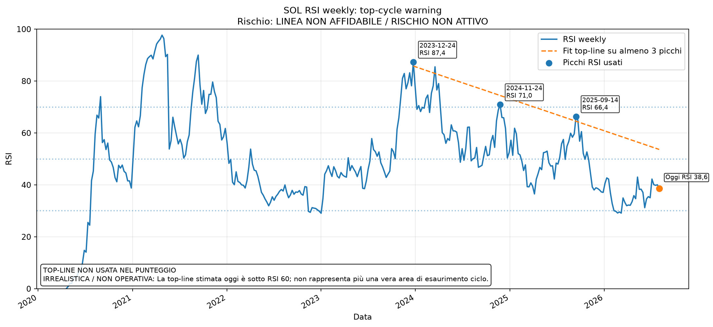
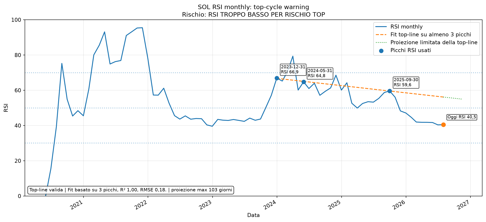

# RSI top-cycle warning - SOL

Generato: **2026-07-31 07:14:31 CEST**  
UTC: **2026-07-31 05:14:31 UTC**

Questo report usa l'RSI soltanto come filtro di possibile esaurimento ciclo.
La vicinanza matematica a una retta non basta: la linea deve essere costruita su almeno tre picchi, superare i controlli di qualità e trovarsi in una vera zona RSI da top.

## Sintesi

| Voce | RSI attuale | Linea stimata grezza | Distanza matematica | Vicinanza matematica | Rischio reale | Picchi | R² | RMSE | Qualità linea |
| --- | --- | --- | --- | --- | --- | --- | --- | --- | --- |
| Weekly RSI | 38,64 | 53,65 | 15,01 | LONTANO | LINEA NON AFFIDABILE / RISCHIO NON ATTIVO | 3 | 0,93 | 2,45 | IRREALISTICA / NON OPERATIVA |
| Monthly RSI | 40,49 | 56,16 | 15,67 | LONTANO | RSI TROPPO BASSO PER RISCHIO TOP | 3 | 1,00 | 0,18 | VALIDA / USO PRUDENTE |

## Confluenza con target ciclo SOL

| Voce | Valore |
| --- | --- |
| Prezzo SOL attuale | 74,00 $ |
| Target ciclo base | 442,11 $ |
| Avanzamento verso target base | +16,74% |
| Fase prezzo | inizio ciclo / lontano dal target macro |
| Rischio top-cycle RSI | BASSO |
| Score weekly | 0 |
| Score monthly | 0 |

**Lettura:** Nessun segnale top-cycle macro attivo. Prezzo ancora lontano dal target ciclo; il filtro RSI resta solo di monitoraggio.

## Controllo qualità delle top-line

| Periodo | Picchi usati | Pendenza RSI/anno | R² | RMSE | Stato | Motivo | Fine proiezione | Proiezione alla data ciclo |
| --- | --- | --- | --- | --- | --- | --- | --- | --- |
| Weekly | 3 | -12,31 | 0,93 | 2,45 | IRREALISTICA / NON OPERATIVA | La top-line stimata oggi è sotto RSI 60; non rappresenta più una vera area di esaurimento ciclo. | None | non disponibile |
| Monthly | 3 | -4,10 | 1,00 | 0,18 | VALIDA / USO PRUDENTE | Fit basato su 3 picchi, R² 1,00, RMSE 0,18. | 2026-11-11 | non proiettata fino al 2029-04-21: limite massimo 103 giorni |

Regole applicate:

- servono almeno **3 picchi RSI validi**;
- R² minimo **0.45** e RMSE massimo **8.0**;
- weekly top-line operativa solo da RSI **60** in su;
- monthly top-line operativa solo da RSI **55** in su;
- nessuna proiezione oltre **12 mesi**;
- se RSI attuale è sotto la soglia di warning, il rischio resta **0** anche se la distanza matematica è piccola.

## Picchi RSI usati

| Periodo | Data | RSI | Prezzo SOL |
| --- | --- | --- | --- |
| Weekly | 2023-12-24 | 87,36 | 112,49 $ |
| Weekly | 2024-11-24 | 70,95 | 252,92 $ |
| Weekly | 2025-09-14 | 66,36 | 240,56 $ |
| Monthly | 2023-12-31 | 66,93 | 101,51 $ |
| Monthly | 2024-05-31 | 64,80 | 165,64 $ |
| Monthly | 2025-09-30 | 59,63 | 208,74 $ |

## Come leggerlo

- **Vicinanza matematica** descrive soltanto la distanza dalla retta.
- **Rischio reale** considera qualità della linea, livello assoluto dell'RSI e contesto prezzo.
- RSI tra 40 e 50 non è una zona top-cycle e non deve generare penalità nel Global.
- Una linea che scende verso RSI 50 o meno non viene più trattata come top-line macro.
- Il target 2029 non viene usato per prolungare una retta oltre il suo orizzonte statistico ragionevole.

## Grafici

### SOL weekly RSI top-line

### SOL monthly RSI top-line

## Stato attuale

- **Weekly:** La top-line weekly non supera i controlli di qualità. Non viene usata per generare rischio top-cycle.
- **Monthly:** RSI monthly è 40,5, sotto la soglia prudente 55. Anche se fosse vicino alla linea, non è una vera zona di esaurimento ciclo.
- **Rischio top-cycle attuale:** BASSO

Traduzione pratica: questo modulo serve soprattutto quando RSI weekly/monthly tornano davvero in area alta. Con RSI basso o con una top-line non affidabile resta neutrale e non sottrae punti al Global Confluence.
