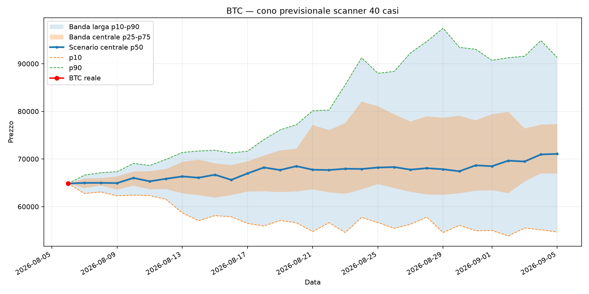
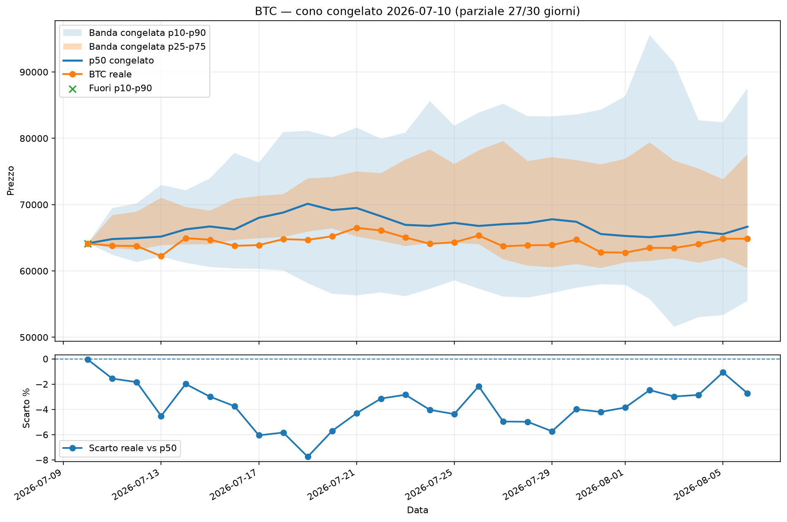
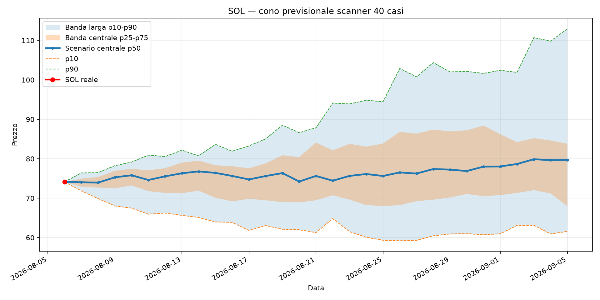
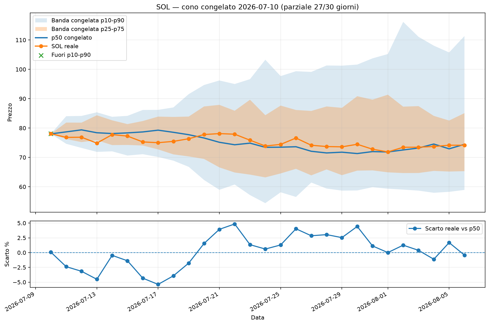
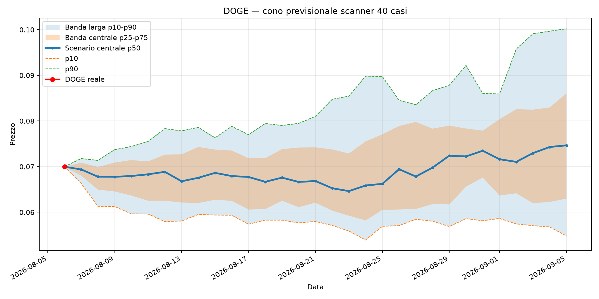
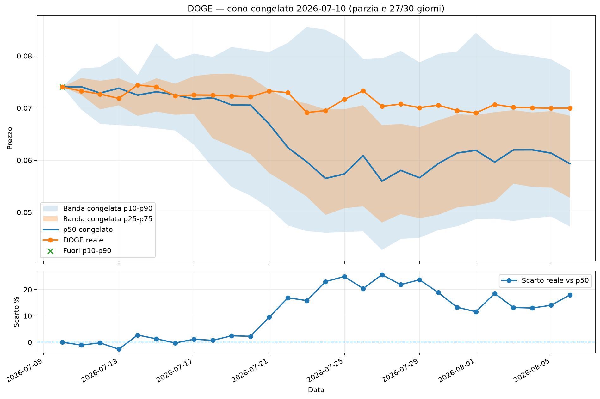

<!-- SCANNER_FORECAST_TRACKER_START -->
# Scanner forecast path / cono probabilistico

Generato: 2026-08-06 05:14:36 UTC

Questo report trasforma i 40 casi simili dello scanner in un cono previsionale leggibile.

Per ogni asset crea:

- banda larga p10-p90
- banda centrale p25-p75
- scenario centrale p50
- prezzo reale sovrapposto quando sono disponibili dati successivi

Correzione importante: il cono ora viene calcolato dai percorsi reali dei match storici, non solo dai percentili finali a 30 giorni. Quindi il grafico non deve più mostrare solo due puntini.

## Ultimo cono previsionale salvato

| Asset   | Data       | Prezzo iniziale   | Direzione scanner   | Casi positivi   | P10 30g     | P25 30g     | P50 30g     | P75 30g     | P90 30g     |
|:--------|:-----------|:------------------|:--------------------|:----------------|:------------|:------------|:------------|:------------|:------------|
| BTC | 2026-08-06 | 64.848 $ | SALITA | 80,00% | 54.661,19 $ | 66.933,46 $ | 71.069,51 $ | 77.330,35 $ | 91.297,31 $ |
| SOL | 2026-08-06 | 74,13 $ | SALITA | 67,50% | 61,56 $ | 67,95 $ | 79,70 $ | 83,79 $ | 112,96 $ |
| DOGE | 2026-08-06 | 0.06998 $ | INCERTO | 55,00% | 0.05482 $ | 0.06298 $ | 0.07466 $ | 0.08602 $ | 0.10022 $ |

## Grafici

### BTC

#### Verifica storica e discrepanza

- Cono congelato il **2026-07-10**; verificato fino al **2026-08-06**; stato **PARZIALE 27/30g**.
- Reale **64.857,41 $**; p50 previsto **66.670,70 $**; scarto **-2,72%**.
- Errore medio assoluto **3,67%**; massimo **7,75%**; DENTRO p10-p90; DENTRO p25-p75.

### SOL

#### Verifica storica e discrepanza

- Cono congelato il **2026-07-10**; verificato fino al **2026-08-06**; stato **PARZIALE 27/30g**.
- Reale **74,15 $**; p50 previsto **74,47 $**; scarto **-0,42%**.
- Errore medio assoluto **2,28%**; massimo **5,38%**; DENTRO p10-p90; DENTRO p25-p75.

### DOGE

#### Verifica storica e discrepanza

- Cono congelato il **2026-07-10**; verificato fino al **2026-08-06**; stato **PARZIALE 27/30g**.
- Reale **0.06997 $**; p50 previsto **0.05932 $**; scarto **17,96%**.
- Errore medio assoluto **11,33%**; massimo **25,63%**; DENTRO p10-p90; FUORI p25-p75.

## Accuratezza percorso scanner

| Asset   | Giorno   |   Controlli | Dentro p10-p90   | Dentro p25-p75   | Errore medio abs vs p50   | Errore medio vs p50   |
|:--------|:---------|------------:|:-----------------|:-----------------|:--------------------------|:----------------------|
| BTC | 1g | 27 | 100,00% | 59,26% | 1,71% | 0,04% |
| BTC | 3g | 25 | 100,00% | 72,00% | 2,22% | -0,43% |
| BTC | 7g | 21 | 100,00% | 85,71% | 2,47% | 0,98% |
| BTC | 14g | 14 | 100,00% | 78,57% | 2,30% | 1,52% |
| BTC | 30g | 0 | n/a | n/a | n/a | n/a |
| SOL | 1g | 27 | 77,78% | 59,26% | 2,03% | -0,45% |
| SOL | 3g | 25 | 100,00% | 72,00% | 2,25% | -0,99% |
| SOL | 7g | 21 | 100,00% | 90,48% | 2,19% | -0,05% |
| SOL | 14g | 14 | 100,00% | 92,86% | 2,33% | 1,42% |
| SOL | 30g | 0 | n/a | n/a | n/a | n/a |
| DOGE | 1g | 27 | 96,30% | 62,96% | 2,53% | -0,19% |
| DOGE | 3g | 25 | 100,00% | 84,00% | 2,18% | 0,18% |
| DOGE | 7g | 21 | 90,48% | 90,48% | 5,93% | 3,30% |
| DOGE | 14g | 14 | 100,00% | 57,14% | 9,51% | 8,83% |
| DOGE | 30g | 0 | n/a | n/a | n/a | n/a |

## Calibratore shadow

Il cono ufficiale resta grezzo e invariato. Il calibratore usa soltanto previsioni passate già mature, campionate una volta a settimana per ridurre la falsa indipendenza. Ogni orizzonte si attiva a 30 controlli indipendenti: parte al 25% della correzione stimata e cresce gradualmente fino al 100% a 100 controlli.

| Asset   | Orizzonte   |   Controlli indipendenti |   Soglia | Stato                  | Forza correzione   | Shift p50   |   Scala p10-p90 |
|:--------|:------------|-------------------------:|---------:|:-----------------------|:-------------------|:------------|----------------:|
| BTC | 1g | 5 | 30 | RACCOLTA (25 mancanti) | 0,0% | 0,00% | 1,000 |
| BTC | 3g | 5 | 30 | RACCOLTA (25 mancanti) | 0,0% | 0,00% | 1,000 |
| BTC | 7g | 4 | 30 | RACCOLTA (26 mancanti) | 0,0% | 0,00% | 1,000 |
| BTC | 14g | 3 | 30 | RACCOLTA (27 mancanti) | 0,0% | 0,00% | 1,000 |
| BTC | 30g | 0 | 30 | RACCOLTA (30 mancanti) | 0,0% | 0,00% | 1,000 |
| SOL | 1g | 5 | 30 | RACCOLTA (25 mancanti) | 0,0% | 0,00% | 1,000 |
| SOL | 3g | 5 | 30 | RACCOLTA (25 mancanti) | 0,0% | 0,00% | 1,000 |
| SOL | 7g | 4 | 30 | RACCOLTA (26 mancanti) | 0,0% | 0,00% | 1,000 |
| SOL | 14g | 3 | 30 | RACCOLTA (27 mancanti) | 0,0% | 0,00% | 1,000 |
| SOL | 30g | 0 | 30 | RACCOLTA (30 mancanti) | 0,0% | 0,00% | 1,000 |
| DOGE | 1g | 5 | 30 | RACCOLTA (25 mancanti) | 0,0% | 0,00% | 1,000 |
| DOGE | 3g | 5 | 30 | RACCOLTA (25 mancanti) | 0,0% | 0,00% | 1,000 |
| DOGE | 7g | 4 | 30 | RACCOLTA (26 mancanti) | 0,0% | 0,00% | 1,000 |
| DOGE | 14g | 3 | 30 | RACCOLTA (27 mancanti) | 0,0% | 0,00% | 1,000 |
| DOGE | 30g | 0 | 30 | RACCOLTA (30 mancanti) | 0,0% | 0,00% | 1,000 |

### Confronto fuori campione: grezzo vs shadow

| Asset   | Orizzonte   |   Controlli OOS | MAE grezzo   | MAE shadow   | Miglioramento   | Shadow vince   | Copertura larga grezza   | Copertura larga shadow   |
|:--------|:------------|----------------:|:-------------|:-------------|:----------------|:---------------|:-------------------------|:-------------------------|
| BTC | 1g | 0 | n/a | n/a | n/a | n/a | n/a | n/a |
| BTC | 3g | 0 | n/a | n/a | n/a | n/a | n/a | n/a |
| BTC | 7g | 0 | n/a | n/a | n/a | n/a | n/a | n/a |
| BTC | 14g | 0 | n/a | n/a | n/a | n/a | n/a | n/a |
| BTC | 30g | 0 | n/a | n/a | n/a | n/a | n/a | n/a |
| DOGE | 1g | 0 | n/a | n/a | n/a | n/a | n/a | n/a |
| DOGE | 3g | 0 | n/a | n/a | n/a | n/a | n/a | n/a |
| DOGE | 7g | 0 | n/a | n/a | n/a | n/a | n/a | n/a |
| DOGE | 14g | 0 | n/a | n/a | n/a | n/a | n/a | n/a |
| DOGE | 30g | 0 | n/a | n/a | n/a | n/a | n/a | n/a |
| SOL | 1g | 0 | n/a | n/a | n/a | n/a | n/a | n/a |
| SOL | 3g | 0 | n/a | n/a | n/a | n/a | n/a | n/a |
| SOL | 7g | 0 | n/a | n/a | n/a | n/a | n/a | n/a |
| SOL | 14g | 0 | n/a | n/a | n/a | n/a | n/a | n/a |
| SOL | 30g | 0 | n/a | n/a | n/a | n/a | n/a | n/a |

## Come leggerlo

- Se il prezzo resta dentro p10-p90, lo scanner sta ancora descrivendo bene il range largo.
- Se il prezzo resta dentro p25-p75, lo scanner sta descrivendo bene anche il range centrale.
- Se il prezzo segue p50, il percorso reale è vicino allo scenario normale.
- Se il prezzo esce da p10-p90, il modello statistico dei 40 casi sta perdendo aderenza.
- Questo non sostituisce drawdown e max gain: serve soprattutto a vedere il percorso del return previsto.

Nota: servono almeno 5 controlli prima di dare un peso minimo al cono. Sotto 5 controlli resta solo osservazione.
<!-- SCANNER_FORECAST_TRACKER_END -->